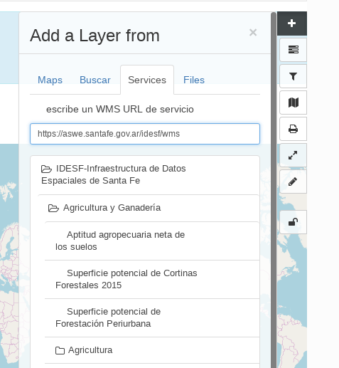
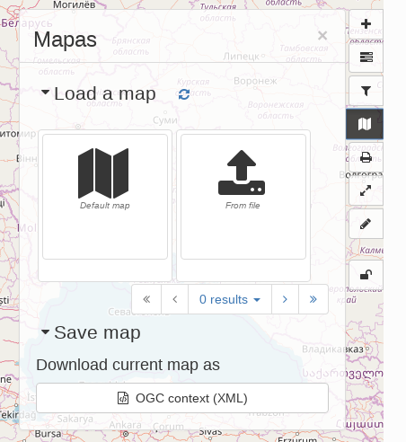

# Maps and dataset visualisation {#customizing-the-map}

The map component in GeoNetwork serves two goals:

-   As part of the evaluation of relevance users can visualise a resource discovered in the catalogue in an interactive map viewer to preview the contents.
-   GeoNetwork can be used as a mapping application to create maps that can be printed or shared with others. The maps itself can even be registered in the catalogue as assets.

!!! note

    Instead of using the embedded map viewer, GeoNetwork offers functionality to use an external map viewer (for example an existing WebGIS framework in your organisation). An administrator can configure GeoNetwork in such a way that it is connected to an external web map application. In such a configuration all map interaction is delegated to the external application.

## Map viewer

From the Search tab, click on the card for *Hydrological Basins in Africa* to view the metadata. Move down the results page until the *Download and links* section is visible.

The Download and links section shows external resources associated with the metadata record, such as:

-   A file download of the data,
-   Further information such as a web page,
-   A Web Mapping Service (WMS) or Web Feature Service (WFS) link to the data.

!!! abstract "Exercise"

    Locate the link labelled as *This dataset is published to the view service (WMS) available at http://data.fao.org/maps/wms with layer name GEONETWORK:basins_296* and select *Add to map*. This step will switch you to the Map tab in the catalog, and after a short delay the WMS layer will be added to the map.

Tools for using the Map are arranged in two groups in the right-hand side of the map. The top group looks like this:

-   Add new layers to the map. You can search the catalog, add layers from web services, or kml.
-   Manage existing layers or change the background map (the default is openstreetmap).
-   Filter layers on the map (if configured).
-   Manage the Map, by setting it back to default settings, loading a new map definition, downloading the current map, or saving the map configuration as a layer in the catalog.
-   Print the map.
-   Synchronise layers with the small map on the Search tab.
-   Measure distances on the map.
-   Draw annotations on the map.

Additionally there is a geographic search tool in the top left.

!!! abstract "Exercise"

    Use the Add Layers tool and type *Physiographic* in the Search box. Three results will be returned, for the three Physiographic records in the catalog. Click the + button next to the Physiography of North and Central Eurasia Landform result to add it to the map.
    
    Using the Manage Layers tool, select the cog symbol next to Physiography of North and Central Eurasia Landform and select Zoom to layer. The map will zoom to the extent of this layer. Select the paintbrush tool next to this layer to see the legend, showing you the classification used for the display.

Layers in the map viewer can be managed from the layer panel: Reorder, change opacity, show legend and set alternative style. The map viewer has some advanced features such as map printing, distance measure and red lining.

The map viewer supports Featureinfo, to retrieve information by clicking on a location in the map. An administrator can activate WFS-indexing. If activated, users can filter the contents of a dataset.

It is possible to add directly WMS, WFS or WMTS layers by entering the endpoint and selecting the layer from the capabilities response.

{width="300px"}

The default projection of maps in GeoNetwork is EPSG:3857 pseudo mercator. However the administrator can add a projection switcher that allows alternative projections.

## Store and share maps

A map consists of a background layer and a number of thematic overlays. A format to combine layers, projection and bounds (area of interest) has been adopted by OGC as the OWS Context standard. Besides GeoNetwork there are a number of other applications supporting this standard.

GeoNetwork uses OWSContext to store, share and load maps:

-   Export a context to a local file, to restore the map later or share by email.
-   The administrator can introduce a context file as default configuration for the catalog.
-   Open a local context file by dragging it on to the map viewer (or open from context menu).
-   Register a context as asset in the catalogue, the context itself will be added as attachement.
-   Records that have an OWS context file attached will display a button to open the context file.

{width="400px"}
