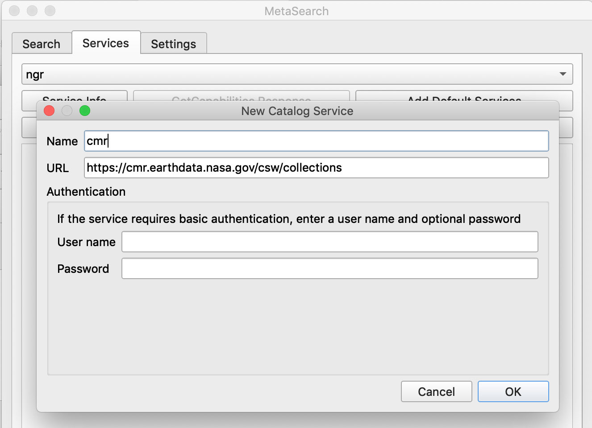

# Multi schema support {#internals.rst}

This paragraph explains how GeoNetwork leverages metadata records formatted in various schemas (metadata models). Over time various communities adopted a number of metadata standards and profiles for metadata records.

Metadata models define which properties can be registered for an asset, such as title, author, creation date. In the spatial domain TC211 together with OGC are the standardisation bodies which define the standards. In 2005 TC211 released ISO19139, a standard for metadata to describe spatial assets which is still widely used. In 2014 TC211 released a big update to this standard, named ISO19115-1. GeoNetwork is able to manage records in either schema (and other schemas, such as Dublin Core, DCAT).

## Indexing records

In GeoNetwork records in various schemas are stored as XML-documents in the database. To manage records that follow a certain schema a series of "schema-plugins" is available, which define rules how to manage records formatted according to that schema. One aspect of a schema-plugin is that it defines which parts of the xml document contain relevant information for the search mechanism. The process of extracting this information and storing it in a unified search index is called 'indexing'. This process is triggered when a record is updated or imported in the database.

!!! note

    The search index of GeoNetwork is based on an external component, called "Elastic Search".

## Authoring Records

GeoNetwork provides an option to create and modify records in an advanced web form. The web form is created and validated from rules that are defined in the relevant "schema-plugin". Saving the form results in an updated xml-document in the database. Read more on this topic on the next page.

## Transforming Records

GeoNetwork has functionality to extract from or insert a record into the catalogue using an alternative schema. GeoNetwork will then perform a transformation from the source schema to the target schema. These transformations are defined using a technique called XSLT and are available in the relevant schema-plugin.

## Standardised exchange of records

To facilitate exchange of catalogue records between applications TC211 and OGC have defined a standard for metedata exchange. The standard "Catalogue Service for the web" (CSW) is a standardised protocol to exchange and query records over the web. This standard facilitated the development of multiple catalogue clients which nowedays allow to query any spatial catalogue from a range of GIS clients, such as OpenLayers, ArcGIS and QGIS. These days OGC is working on a successor of CSW, called OGC API-Records. An experimental implementation of OGC API-Records for GeoNetwork is available via github.

Other communities do have similar standards for metadata exchange, such as OpenSearch (Earth Observation), OAI-PMH (libraries), schema.org (search engines). GeoNetwork allows to set up these alternative endpoints to facilitate data consumption by these communities.

!!! abstract "Exercise"

    In this exercise you'll query a spatial catalogue from within a desktop GIS using CSW. If you have QGIS installed, open QGIS and look under "web" menu for a plugin called "metasearch" (else install it from plugins). In the metasearch configuration add a new server with this url: <https://cmr.earthdata.nasa.gov/csw/collections>. Use the plugin to search through the catalogue, and visualise some data in the map. As soon as you've set up your own GoNetwork instance you can try it in metasearch, add it as: <https://example.com/geonetwork/srv/eng/csw>

{width="500px"}
