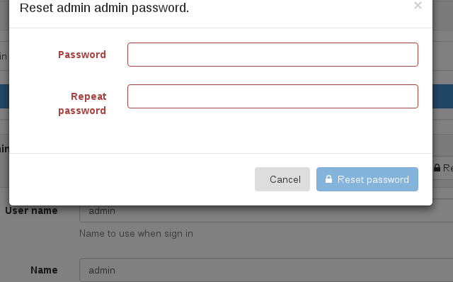
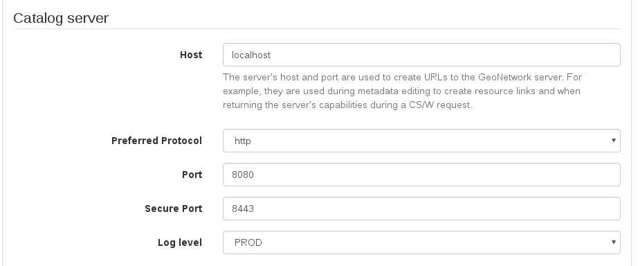
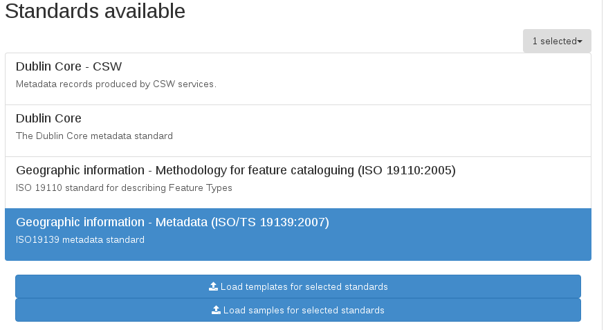
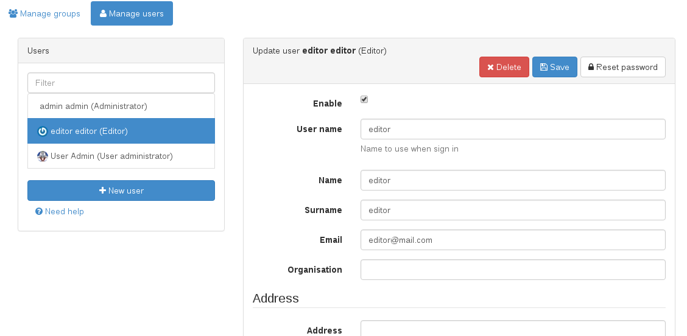
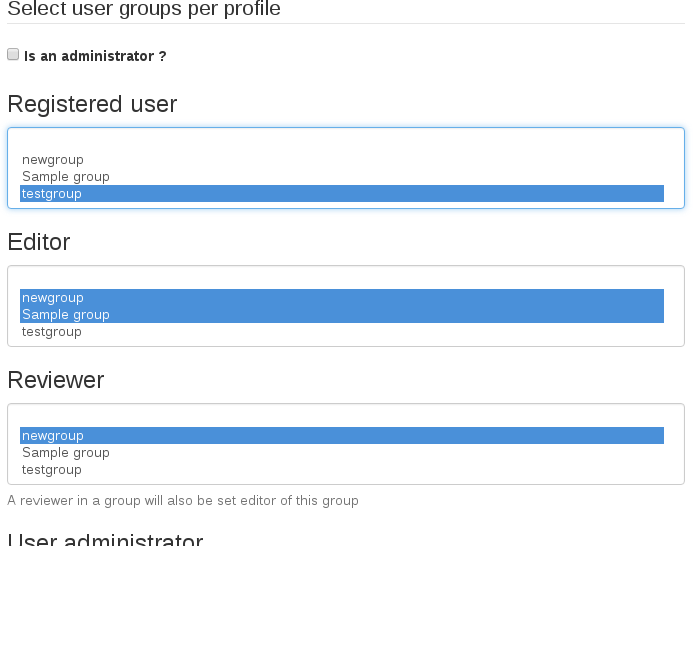

# Setup {#tuto-introduction-setup}

## Change Administrator Password

The first step you should do after deploying GeoNetwork is login with the administrator user and change the administrator password. The default administrator user is called *admin* and the password is *admin*. Once you have logged in, you have to enter the administration console to configure the basics.

Change your admin password here:

<http://localhost:8080/geonetwork/srv/eng/admin.console#/organization/users?userOrGroup=admin>

## Basic Settings

Then, go to the settings page:

<http://localhost:8080/geonetwork/srv/eng/admin.console#/settings>

There are a few configuration values here that should be changed like the url domain for your catalog, if it is going to use https or the title for your catalog.

Make sure you use the hostname, port and protocol that your users will use to access the geoportal as this settings will be used to generate default urls like the ones shown on the sitemap.

Preferred protocol should be https as that will mean a secure navigation for your users but http is the default one for easy deployment and development. **No login should be made outside the https protocol** for security reasons. Using https protocol on a strict browser policy like on Firefox may mean that some http map services will be blocked and display an error if trying to be loaded on the map. This can be solved by using only https map services. As http is a deprecated protocol, this problem will be solved in time. Check with your map service provider to use https with a valid certificate for the map services.

The Catalogue Identifier should be a unique name on the whole internet. The default identifier is generated automatically by GeoNetwork and should be safe to use. Unless you have a better identifier, you can leave the one generated by default.

## Loading Schemas

The last important thing to configure is what schemas are we going to use in our catalog. By default, GeoNetwork has already installed some of the most used schemas. These schemas have usually samples and templates you can easily add to your catalog on the administration console:

<http://localhost:8080/geonetwork/srv/eng/admin.console#/metadata>

Sample data has no use on real world catalogues, it is just used to show how the metadata should be filled in and how it will look like once the data is inserted on the catalog.

Templates, on the other hand, are needed if you want to edit metadata. Instead of using empty xml files for the metadata creation, a template is used when creating a new record. You can always import or harvest already created metadata instead of using the editor to create manually records if that fits your usecase.

One you add some templates, your catalog is ready to be used.

## Creating Users

Although you can enable user self-registration, it is more usual to create the users manually, so you control exactly who have access to what. The catalog uses the concept of Users, Groups and User Profiles.

-   A User can be part of one or more Groups.
-   A User has a Role in a Group.
-   The Administrator Role is not related to a Group as it relates to the whole platform.

Users can have different roles in different groups. A role defines what tasks the user can perform:

-   Guest is a user that can see records on the group, but cannot modify them.
-   Editor is a user that can create or edit records on the group.
-   Reviewer is a user that can edit and publish records on the group.
-   UserAdmin is a user that has administrative privileges over the records and users on the group.

To add a new user to the GeoNetwork system you do the following:

-   Select the Administration button in the menu
-   On the Administration page, select User management
-   Click the button Add a new user
-   Provide the information required for the new user
-   Assign the correct profile
-   Assign the user to a group
-   Click on Save

For each possible role, there is a list of groups. This way, a user can have different roles for different groups, allowing a user being a readonly guest on some group while being able to edit and review records on another group.

## Creating Groups

To create new groups you should be logged on with an account that has Administrative privileges.

-   Select the Administration button in the menu. On the Administration page, select Group management.
-   Select Add a new group. You may want to remove the Sample group;
-   Fill out the details. The email address will be used to send feedback on data downloads when they occur for resources that are part of the Group.
-   Click on Save

Access privileges can be set per metadata record. You can define privileges on a per Group basis.

See more on [Configuring the catalog](../../../administrator-guide/configuring-the-catalog/index.md).
