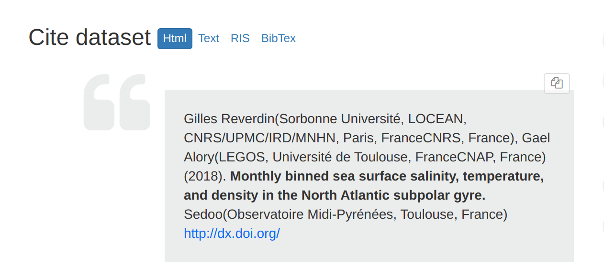
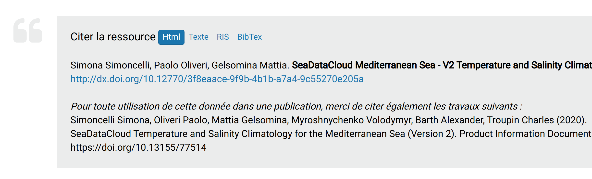
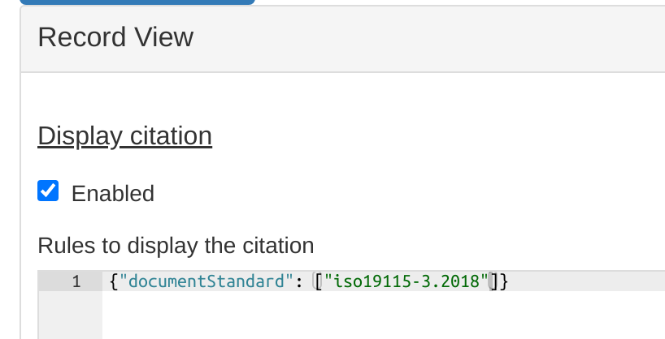

# Cite a resource {#cite}

The catalogue can provide an automatic citation based on information provided in the metadata record.

The citation can be use to cite a dataset in publications.

## Citation text

The citation generated by default follows general conventions on how to cite a dataset but can be customized.

The default is: * list of authors (and organisation) * publication year * title * list of publisher * DOI URL or landing page URL.

These are the data needed to create DOI (see [Digital Object Identifier (DOI)](doi.md)).

Customization of the citation can be done in `schemas/iso19115-3.2018/src/main/plugin/iso19115-3.2018/formatter/citation/common.xsl`.

An additional text may be stored in an online resource description with protocol `WWW:LINK-1.0-http--publication-URL`.

Example: <https://doi.org/10.12770/ad07a55f-5de7-4abc-ba89-8899b16c4b59>

## Configuration

The citation can be displayed or not in the record view. Check the user interface configuration to customize it:

## Format

Citation can be provided in various formats:

-   HTML
-   Plain text
-   RIS
-   BibTex

## API

The citation can be displayed in the default XSL formatter used for the full view using: <http://localhost:8080/geonetwork/srv/api/records/a46af25c-f949-48a2-9b7e-ac472230cda8?language=all&citation=true>

The formatter producing the citation can be accessed directly using: <http://localhost:8080/geonetwork/srv/api/records/31255efc-c5c1-7787-2ae6-b8fc4bcd6e55/formatters/citation?format=ris>

To list available formats use: <http://localhost:8080/geonetwork/srv/api/records/31255efc-c5c1-7787-2ae6-b8fc4bcd6e55/formatters/citation?format=>?
