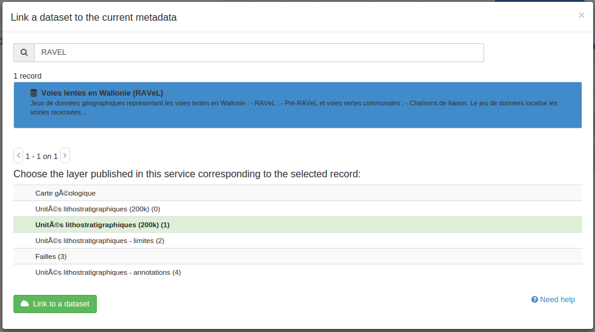

# Linking a dataset with a service {#linking-dataset-or-service}

Metadata on dataset can be associated to metadata on services.

!!! info "Todo"

    Add more details on how/why/encoding


``` xml
<srv:operatesOn uuidref="b795de68-726c-4bdf-a62a-a42686aa5b6f"
                      xlink:href="http://metawal.wallonie.be/geonetwork/srv/fre/csw?service=CSW&amp;request=GetRecordById&amp;version=2.0.2&amp;outputSchema=http://www.isotc211.org/2005/gmd&amp;elementSetName=full&amp;id=b795de68-726c-4bdf-a62a-a42686aa5b6f"/>
```

In a service metadata record, click the `Link to a dataset` button to open the record selector which list all datasets in the catalog. Optionally, the layer name may be define manually or from the list of the layers retrieved from the service (using the GetCapabilities).



In a dataset metadata record, click the `Link to a service` button to open the record selector which list all services in the catalog.


When confirming the association, both records will be affected by the change (depending on user privileges - ie. current user may not be allowed to modify the target record).
