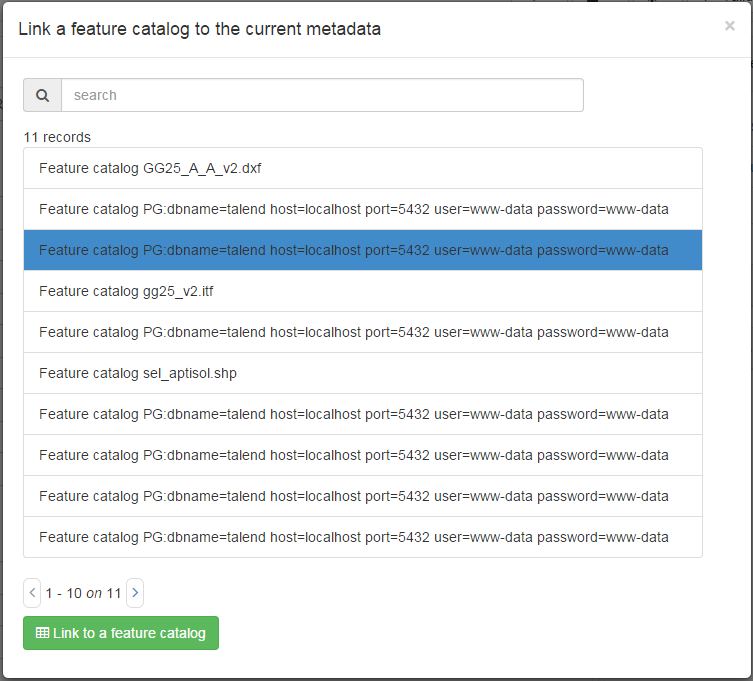

# Describing attributes table in a feature Catalog {#linking-feature-catalog}

A feature catalog describes the data model of the dataset with the list of tables, attributes, definitions, list of values, \... Feature catalogs could be described:

-   as a document (eg. PDF) and linked to the metadata record (see [Linking a document](linking-online-resources.md#linking-online-resources-doc))
-   as a record and described using the ISO19110 standards.

Click on `Link to a feature catalog` to open the record selector listing all feature catalog described in the catalog. Choose one and submit to associate the 2 documents.

In ISO19115-3, the feature catalog can also be described directly in the metadata record in the `content` section.

!!! info "Todo"

    Add encoding

