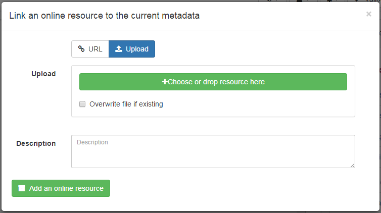

# Linking website, web services, \... using URL {#linking-online-resources}

This section applies mainly to ISO19139 records and partially to Dublin Core (ie. only documents can be associated in Dublin Core) standards.

## Linking a document {#linking-online-resources-doc}

2 approaches can be used to link documents:

-   by providing a URL
-   by uploading a document

To add a new one, click on the + caret button then `Add an online resource` button or, if already one exists, just click on the title of the `Online resources`.


To link a URL, set the following properties:

-   `Protocol` to describe the type of document attached (`Web address (URL)` is the default)
-   `Linkage` to point to the target document. It can be any type of links like <http://>, <ftp://>, <file:///>, \...
-   `Name` is optional and provides a label for making an hyperlink
-   `Description` is optional and provides more details about the link

To upload a document, switch to the `Upload` tab and choose a document, or drag and drop it in the pop up. In that case, the protocol is hidden and is set to `WWW:DOWNLOAD`.



Depending on your needs, more specific links could be added and will be associated to different actions and display in the applications.

## Linking a WMS layer {#linking-wms-layer}

To be able to view a record on the map viewer, it may be relevant to add a reference to one or more WMS services publishing the dataset. An online resource is encoded using the following in ISO19139:

``` xml
<gmd:onLine xmlns:gmd="http://www.isotc211.org/2005/gmd"
            xmlns:gco="http://www.isotc211.org/2005/gco">
   <gmd:CI_OnlineResource>
      <gmd:linkage>
         <gmd:URL>https://download.data.grandlyon.com/wms/grandlyon</gmd:URL>
      </gmd:linkage>
      <gmd:protocol>
         <gco:CharacterString>OGC:WMS</gco:CharacterString>
      </gmd:protocol>
      <gmd:name>
         <gco:CharacterString>cad_cadastre.cadsubdivisionsection</gco:CharacterString>
      </gmd:name>
      <gmd:description>
         <gco:CharacterString>Subdivision de section cadastrale (Plan cadastral informatisé du Grand Lyon)(OGC:WMS)</gco:CharacterString>
      </gmd:description>
   </gmd:CI_OnlineResource>
</gmd:onLine>
```

To add a WMS layer:

-   choose the protocol `OGC:WMS Web Map Service`,
-   set the URL of the service,
-   then the wizard query the service to retrieve the list of layers
-   choose one or more layer in the list or set it manually.


## Linking a database table or a GIS file on the network {#linking-online-resources-georesource}

To reference a GIS file or a database table, user can upload or link to a that resource (see [Linking a document](linking-online-resources.md#linking-online-resources-doc)). The type of protocol depends on the type of resource associated:

| Type of resource | Vector file uploaded (eg. zipped Shapefile)                                                                                                     |
|------------------|-------------------------------------------------------------------------------------------------------------------------------------------------|
| URL              | File URL created after upload on the catalog. eg. <http://localhost:8080/geonetwork/srv/eng/resources.get?id=1631&fname=CCM.zip&access=private> |
| Protocol         | WWW:DOWNLOAD                                                                                                                                    |
| Name             | File name (readonly)                                                                                                                            |

| Type of resource | Vector file on the network                                         |
|------------------|--------------------------------------------------------------------|
| URL              | File path. eg. <file:///shared/geodata/world/hydrology/rivers.shp> |
| Protocol         | <FILE:GEO> or <FILE:RASTER>                                        |
| Name             | File description                                                   |

| Type of resource | Vector (Table PostGIS)                               |
|------------------|------------------------------------------------------|
| URL              | jdbc:postgresql://localhost:5432/login:<password@db> |
| Protocol         | DB:POSTGIS                                           |
| Name             | Table name                                           |

When having information about the database or file on the local network, it may be relevant to hide those informations for public users (see [Restricting information to metadata sections](../publishing/restricting-information-to-metadata-sections.md)).

!!! info "Todo"

    Add doc & link to geopublisher


## Linking data using ATOM feeds {#linking-data-using-atom-feed}

If your organisation provides ATOM feeds to facilitate access to the data, metadata records can link to these feeds. Users can link to a service feed in a service record and to a dataset feed in a dataset record.

``` xml
<gmd:MD_DigitalTransferOptions>
 <gmd:onLine>
  <gmd:CI_OnlineResource>
   <gmd:linkage>
    <gmd:URL>http://www.broinspireservices.nl/atom/awp.atom</gmd:URL>
   </gmd:linkage>
   <gmd:protocol>
    <gco:CharacterString>INSPIRE Atom</gco:CharacterString>
   </gmd:protocol>
   <gmd:name>
    <gco:CharacterString>gdn.Aardwarmtepotentie</gco:CharacterString>
   </gmd:name>
  </gmd:CI_OnlineResource>
 </gmd:onLine>
</gmd:MD_DigitalTransferOptions>
```

Once registered in the metadata, the ATOM feed will be displayed on the record view:


Users can choose a service, the list of datasets available are retrieved and the download links displayed to the user. A dataset feed can have one or more downloads:


Examples:

-   [NGR National Georegister](https://www.nationaalgeoregister.nl/geonetwork/srv/dut/catalog.search#/search?any=atom&fast=index), [Statistics Netherlands Land Use 2015 ATOM](https://www.nationaalgeoregister.nl/geonetwork/srv/dut/catalog.search#/metadata/a657f732-e1b3-4638-9933-67cab10d9081)

The catalog also provides the capability to produce ATOM feeds for services and datasets from metadata records. To enable this, check the ATOM API (see [OpenSearch and INSPIRE ATOM](../../api/opensearch.md)). A GML dataset can be exposed using the following encoding in order to be published in a dataset ATOM feed:

``` xml
<gmd:transferOptions>
   <gmd:MD_DigitalTransferOptions>
      <gmd:unitsOfDistribution>
         <gco:CharacterString>B</gco:CharacterString>
      </gmd:unitsOfDistribution>
      <gmd:transferSize>
         <gco:Real>428973180</gco:Real>
      </gmd:transferSize>
      <gmd:onLine>
         <gmd:CI_OnlineResource>
            <gmd:linkage>
               <gmd:URL>https://download.data.public.lu/resources/inspire-annex-i-theme-addresses-addresses/20191118-115245/ad.address.gml</gmd:URL>
            </gmd:linkage>
            <gmd:protocol>
               <gco:CharacterString>WWW:DOWNLOAD-1.0-http--download</gco:CharacterString>
            </gmd:protocol>
            <gmd:applicationProfile>
               <gco:CharacterString>INSPIRE-Download-Atom</gco:CharacterString>
            </gmd:applicationProfile>
            <gmd:name>
               <gmx:MimeFileType type="application/octet-stream">AD.Address.gml</gmx:MimeFileType>
            </gmd:name>
            <gmd:description>
               <gco:CharacterString></gco:CharacterString>
            </gmd:description>
            <gmd:function>
               <gmd:CI_OnLineFunctionCode codeList="http://standards.iso.org/ittf/PubliclyAvailableStandards/ISO_19139_Schemas/resources/codelist/ML_gmxCodelists.xml#CI_OnLineFunctionCode"
                                          codeListValue="download">download</gmd:CI_OnLineFunctionCode>
            </gmd:function>
         </gmd:CI_OnlineResource>
      </gmd:onLine>
   </gmd:MD_DigitalTransferOptions>
</gmd:transferOptions>
```

Examples:

-   INSPIRE Portal of the Grand-Duchy of Luxembourg / [INSPIRE - Annex I Theme Addresses - Addresses](https://catalog.inspire.geoportail.lu/geonetwork/srv/fre/catalog.search#/metadata/F22B07FC-E961-4985-BB75-6A1548319C8A)

Reference documents:

-   [INSPIRE technical guidelines for download services](http://inspire.ec.europa.eu/documents/technical-guidance-implementation-inspire-download-services).
