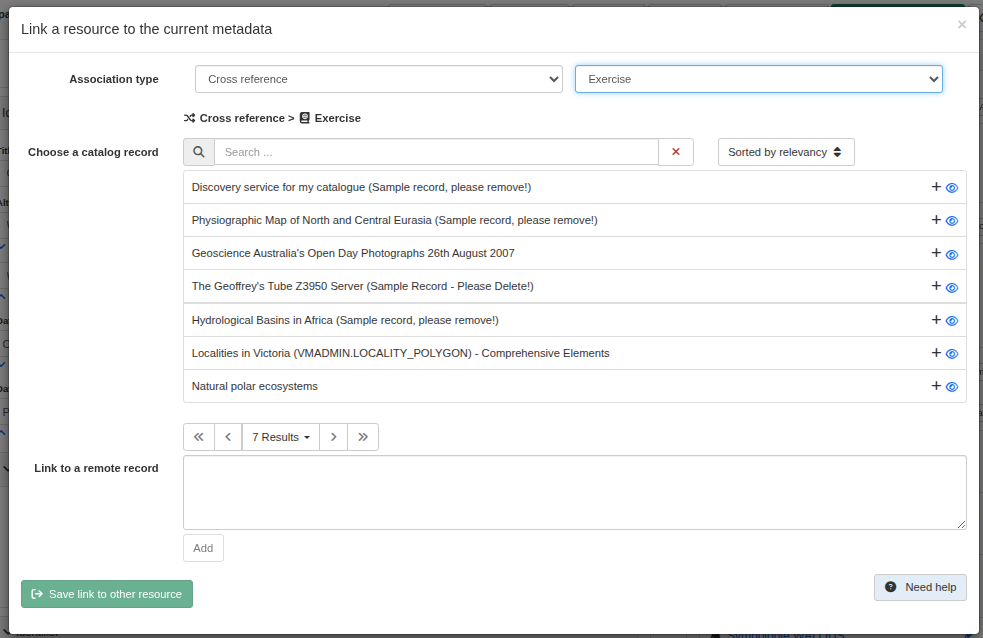

# Other types of resources (eg. sensor, publication) {#linking-others}

In ISO, associated resource allows to link to record defining the type of relation with:
* association type (mandatory)
* initiative type

Codelist values for association types are:

* Cross reference
* Larger work citation
* Part of seamless database
* Stereo mate
* Is composed of
* Collective Title
* Series
* Dependency
* Revision Of

In ISO19115-3, by default parent relations are defined with association type set to `partOfSeamlessDatabase`. This can be customized with [the panel configuration](linking-panel-configuration.md).

