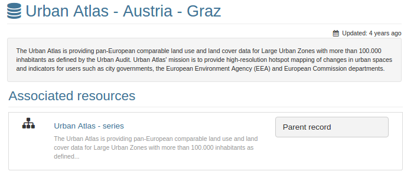
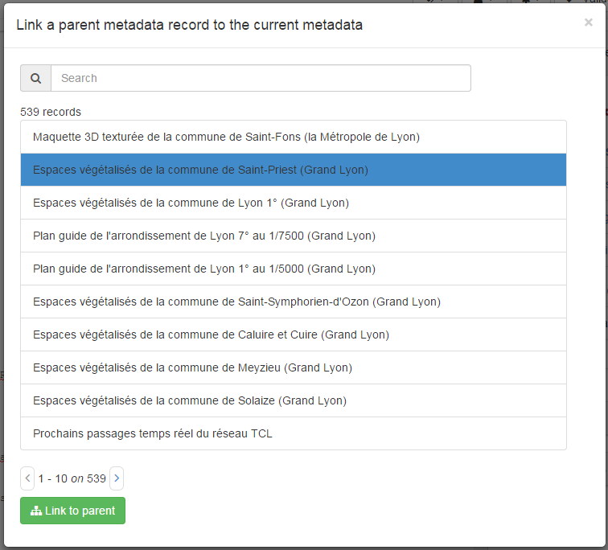

# Grouping datasets in a series (ie. parent/child relation) {#linking-parent}

In some situations, a dataset is part of a temporal or spatial collections of records which could share the same specification (eg. Land cover for different years). In order to group this set of records, a general description of the collection may be done in the parent metadata which can then be attached to each dataset of the series.

-   Corine Land Cover
    -   Corine Land Cover 2002
    -   Corine Land Cover 2012
    -   \...

Parent/child relations can be set on ISO19139 and Dublin Core records. In ISO19139, the link to a parent record is encoded in the child record using the following:

``` xml
<gmd:parentIdentifier>
   <gco:CharacterString>78f93047-74f8-4419-ac3d-fc62e4b0477b</gco:CharacterString>
</gmd:parentIdentifier>
```

Parent/Child relation in ISO19139 may also be encoded using aggregates (see [Other types of resources (eg. sensor, publication)](linking-others.md)).

When creating such relationship, users will be able to navigate between the records in the search and record view.



Click on `Link to parent` to access the panel providing a simple search to select the target parent metadata


