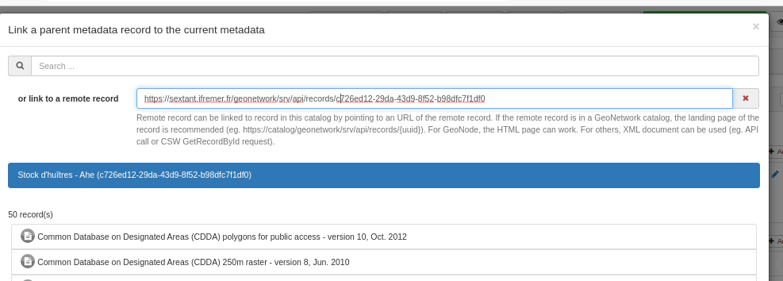
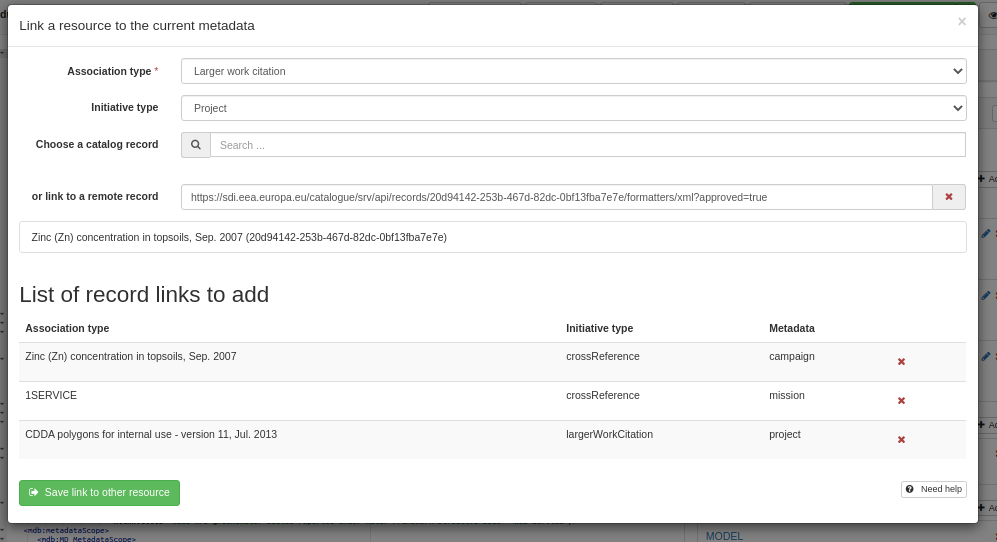
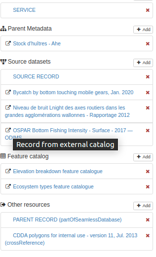
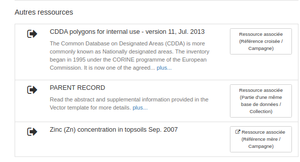

# Linking to a remote record {#linking-remote-record}

## Adding the link

While encoding a relation (ie. parent, source, feature catalogue, sibling, dataset, service), user has the possibility to point to a page describing the remote record.



Remote record can be linked to record in this catalog by pointing to an URL of the remote record. If the remote record is in a GeoNetwork catalog, the landing page of the record is recommended (eg. <https://catalog/geonetwork/srv/api/records/%7Buuid%7D>) - which returns XML if the Accept header is set to application/xml. For GeoNode, the HTML page can work but the UUID will not be identified. The title will be the HTML title of the page. For others, XML document can be used (eg. API call or CSW GetRecordById request).

For sibling, which allows to add multiple links in one call, the panel is modified to list links in a table mode.



\... instead of a simple list

Once added, the remote records are identified by a specific icon:



Same icon is used in view mode:



## XML Encoding

Old implementation encodes link to other record as

-   uuidref

``` xml
<gmd:source uuidref="704c6337-aaad-47a9-b300-08f28c0e48e9"/>
```

-   or gco:CharacterString

``` xml
<gmd:parentIdentifier><gco:CharacterString>704c6337-aaad-47a9-b300-08f28c0e48e9<...
```

-   or using attributes uuidref, xlink:href like for service/dataset links.

When linking to a remote record, the editor tries to collect information about the remote record:

-   title
-   UUID

Currently is supported:

-   ISO19139
-   ISO19119
-   ISO19110
-   ISO19115-3
-   GeoNode HTML format

At some point, it may be relevant to also support [schema.org](https://schema.org/) tags in HTML page or JSON+LD. Once remote record properties extracted, the link will be added as usual (same processes but with 2 extras optional parameters) with the following:

``` xml
<gmd:source uuidref="fff43204-793a-4a44-96f7-918672a2047d"
            xlink:href="https://sdi.eea.europa.eu/catalogue/srv/api/records/fff43204-793a-4a44-96f7-918672a2047d"
            xlink:title="Bycatch by bottom touching mobile gears, Jan. 2020"/>
```

## Standards supported

Source document

-   ISO19139
-   ISO19115-3 implementation made in metadata101/iso19115-3.2018#81

Target document

-   internal record: Any standards supported by GeoNetwork
-   remote record: ISO standards or HTML page (eg. GeoNode)
