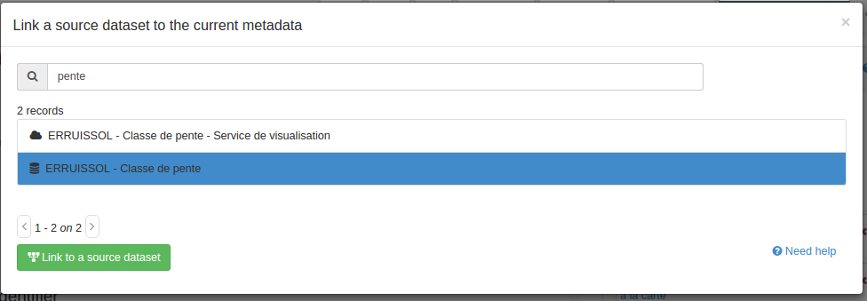

# Referencing sources of a dataset {#linking-source}

When a dataset is created from another or when a map is composed of datasets, editors could indicate this relationship in the quality section of the record (using standard ISO19139 or ISO19115-3) by adding sources.

