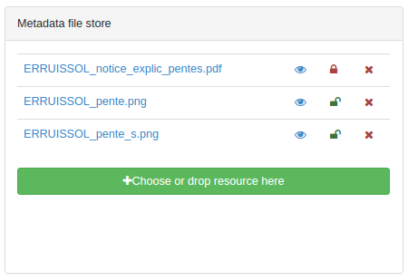

# Uploading attachments {#associating_resources_filestore}

!!! info "Version Added"

    3.2

If documents are not available, editors can upload attachments to a metadata record. The document is added to the filestore. The filestore can contains any kind of files.

To upload a file, click the button and choose a file or drag&drop a file on the button. Files are stored in a folder in the data directory (see [Customizing the data directory](../../install-guide/customizing-data-directory.md)). There is one folder per metadata containing:

-   `public` folder with files accessible to all users
-   `private` folder with files accessible to identified user with download privilege (see [Managing privileges](../publishing/managing-privileges.md))

From the filestore:

-   click the file name to set the URL for the current document to attach
-   click the eye icon to view the document
-   click the locker to change the document visibility
-   click the cross to remove the file.

A file uploaded in this way will be exported in the metadata export file (MEF). Therefore, its URL will not be automatically added to the metadata. The URL is added when attaching the document to a specific element in the metadata (eg. overview, quality report, legend).

## Filestore configuration

By default, the maximum file size is set to 100Mb. This limit is set in `/services/src/main/resources/config-spring-geonetwork.xml` with the parameter `maxUploadSize`.

Types of attachments allowed to be uploaded can be configured in the system settings.  
See [Metadata configuration](../../administrator-guide/configuring-the-catalog/system-configuration.md#metadata_configuration) for more details.
