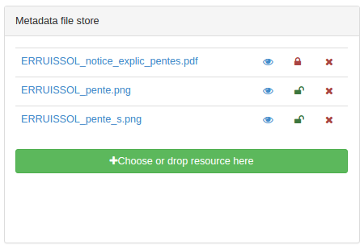

# Uploading attachments {#associating_resources_filestore}

!!! info "Version Added"

    3.2


If documents are not available, editors can upload attachments to a metadata record. The attachment is added to the filestore. The filestore can contain any kind of files.



!!! note

    This screenshot predates the folder browsing described below - the underlying list of
    files, and the view/visibility/rename/remove actions on each one, work the same way.

To upload a file, click the button and choose a file or drag&drop a file on the button. Files are stored in a folder in the data directory (see [Customizing the data directory](../../install-guide/customizing-data-directory.md)) - one folder per metadata record.

Each file's visibility (public or private) is tracked independently of where it's stored, and can be changed at any time - see below. It does not depend on which folder the file is uploaded into.

From the filestore:

-   click the file name to set the URL for the current document to attach
-   click the eye icon to view the document
-   click the locker to change the document visibility (public: accessible to all users; private: accessible to identified users with download privilege - see [Managing privileges](../publishing/managing-privileges.md))
-   click the edit icon to rename the file
-   click the cross to remove the file.

A file uploaded in this way will be exported in the metadata export file (MEF). Therefore, its URL will not be automatically added to the metadata. The URL is added when attaching the document to a specific element in the metadata (eg. overview, quality report, legend).

## Organizing attachments into folders

!!! info "Version Added"

    4.4.13

Attachments can be organized into subfolders for easier browsing, independently of a file's public/private visibility:

-   Click a folder to open it. A `..` row at the top takes you back up one level.
-   To upload into a folder, first open it (or type a name in the "new folder" box and set it as
    the upload destination), then upload as usual - the file is added to that folder.
-   Renaming a file only ever changes its name, not its folder - the rename box shows and edits
    just the file's name, not its full folder path.
-   A folder exists only as long as it contains at least one file - there is no separate action to
    create an empty folder that persists on its own, and a folder that loses its last file
    disappears from the listing.

When the filestore panel is configured to only show files matching a specific pattern (eg. only
images, when attaching a thumbnail), matching files from every folder are shown together in a
single flat list instead of grouped by folder, so a match isn't hidden inside a folder that isn't
currently open.

## Filestore configuration

By default, the maximum file size is set to 100Mb. This limit is set in `/services/src/main/resources/config-spring-geonetwork.xml` with the parameter `maxUploadSize`.

During startup of the application, this limit can be adjusted by adding the following option to **CATALINA_OPTS**. The value is to be specified in bytes, thus, the following example configures a max upload size of 1 GB:

```
-Dapi.params.maxUploadSize=1000000000
```

Types of attachments allowed to be uploaded can be configured in the system settings.  
See [Metadata configuration](../../administrator-guide/configuring-the-catalog/system-configuration.md#metadata_configuration) for more details.

