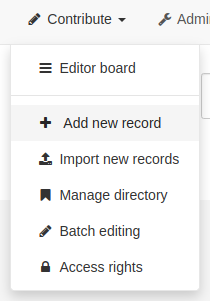

# Creating a new record {#creating-metadata}

This topic guides you through the process of adding new metadata records with associated data and/or services into the catalog.

## Before you begin

To add or edit metadata, the user:

-   Must have an `editor` profile or higher.
-   Should be a member of the [Workspace Group](../../administrator-guide/managing-users-and-groups/creating-group.md#1-workspace-group) you want to add information for.

Contact your administrator if you don't have the correct profile.

1.  From the home page, go to the *contribute* section or directly click on `add new record` menu.

    

2.  From the metadata template list, select a template (see [Managing templates](managing-templates.md)), choose a group from the dropdown and click *Create*.

    

!!! Note

    If only one group is defined in the catalog, the default group is selected. If a group is not a [Workspace Group](../../administrator-guide/managing-users-and-groups/creating-group.md#1-workspace-group) it will not be shown as an option in the list.

Next steps:

-   Complete the fields provided by default in the template and probably
-   Create an image of your data to illustrate it in the search results.
