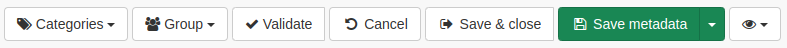
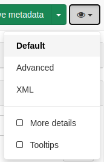
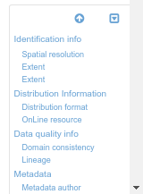
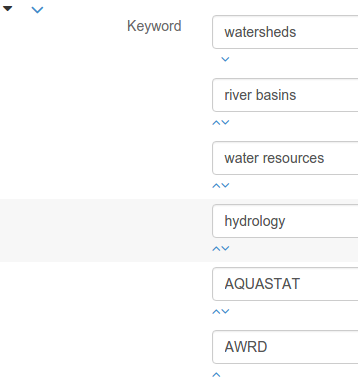

# Editing metadata

This topic describes how to use the metadata editor.

## Using the editor toolbar

The top toolbar provides the most important functionality available to the editor:

From left to right:

-   Set metadata categories
-   Set metadata group
-   Advanced features (e.g. versioning)
-   `Validate` to run metadata validation
-   `Cancel` to cancel all changes made since the beginning of the editing session
-   `Save & Close` to save and close the editor
-   `Save` to save the metadata or the template. The dropdown also allows to set if the edits are minor or not (i.e. the change date of the metadata will not be updated if case of minor edits).
-   Change view mode for the editor form, enable tooltips or switch to advanced editor mode

## Navigating the form

To describe the resource, an editor can use the form, which provides different views. By default, the editor provides:

-   a `Default` view displaying all fields from the metadata
-   an `Advanced` view based on the metadata standard and providing access to all descriptors from the metadata standard in use
-   an `XML` view displaying the record as an XML document

To switch from one view to another, use the following menu:

Once the view is selected, the editor can browse the list of fields to populate. He can also use the scroll-spy in the lower right corner to quickly access a section.

The scroll-spy highlights the visible sections, helps user to return to the top of the form and can be minimized if needed.

## Populating fields

!!! info "Todo"

    Add details about add/remove/directory controls

!!! info "Todo"

    Add details about directory / thesaurus

Depending on the view configuration (see [Customizing editor](../../customizing-application/editor-ui/creating-custom-editor.md)), editors can reorder elements using up and down controls.

