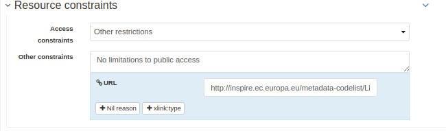

# Describing resources for the INSPIRE directive {#inspire-editing}

When describing information in the scope of the INSPIRE Directive, editors must follows the [Technical Guidance for the implementation of INSPIRE dataset and service metadata based on ISO/TS 19139:2007 (INSPIRE TG2)](https://inspire.ec.europa.eu/id/document/tg/metadata-iso19139).

To follow the technical guideline, the catalogue administrator has to setup INSPIRE configuration for the catalogue (see [Configuring for the INSPIRE Directive](../../administrator-guide/configuring-the-catalog/inspire-configuration.md))

## Metadata information

File identifier is automatically set by the catalogue. The metadata last update date is also set every time editor save the record.

## Languages

The metadata language is mandatory. This information usually does not change in records part of the same catalogue. So it is recommended to properly set the value in the template used. The language code is a 3 letter code from the list of [official languages of the European Union](https://ec.europa.eu/languages/policy/linguistic-diversity/official-languages-eu_en.htm). A record can be multilingual (see [Multilingual editing](multilingual-editing.md)).

The resource language is also mandatory and follow the same rule. The catalogue provides a list of languages to easily choose the language code.


In your template, set the character encoding to simplify editing. The value is in general similar in most of the records. `utf8` can be a good default value.

## Contact information

The minimum information to set for contact are an organisation name and an email. At least one point of contact for the resource and one for the metadata is required.


## Categorizing with keywords

Once the configuration done, editors will be able to add keywords for:

-   INSPIRE themes (mandatory)
-   Spatial scope (optional)
-   Priority datasets (optional)
-   GEMET keywords (optional)


When adding keyword, the catalogue propose to configure how to encode the value in the XML document. By default, text encoding is used:


This means that a `gco:CharacterString` is used to encode the value:

``` xml
<gmd:descriptiveKeywords>
    <gmd:MD_Keywords>
       <gmd:keyword>
          <gco:CharacterString>Installations agricoles et aquacoles</gco:CharacterString>
       </gmd:keyword>
       <gmd:type>
          <gmd:MD_KeywordTypeCode codeList="http://standards.iso.org/iso/19139/resources/gmxCodelists.xml#MD_KeywordTypeCode"
                                  codeListValue="theme"/>
       </gmd:type>
       <gmd:thesaurusName>
          <gmd:CI_Citation>
             <gmd:title>
                <gco:CharacterString>GEMET - INSPIRE themes, version 1.0</gco:CharacterString>
             </gmd:title>
```

The INSPIRE TG2 recommend to use an anchor. To use this, editor can choose the `anchor` type:

``` xml
<gmd:descriptiveKeywords>
    <gmd:MD_Keywords>
       <gmd:keyword>
          <gmx:Anchor xlink:href="http://inspire.ec.europa.eu/theme/af">Installations agricoles et aquacoles</gmx:Anchor>
       </gmd:keyword>
       <gmd:type>
          <gmd:MD_KeywordTypeCode codeList="http://standards.iso.org/iso/19139/resources/gmxCodelists.xml#MD_KeywordTypeCode"
                                  codeListValue="theme"/>
       </gmd:type>
       <gmd:thesaurusName>
          <gmd:CI_Citation>
             <gmd:title>
                <gmx:Anchor xlink:href="http://inspire.ec.europa.eu/theme#">GEMET - INSPIRE themes, version 1.0</gmx:Anchor>
             </gmd:title>
```

The encoding is preserved once set and it can be different from one record to another. It can be forced globally in the editor by setting the `transformations` parameter for this thesaurus:

``` xml
<thesaurusList>
  <thesaurus key="external.theme.httpinspireeceuropaeutheme-theme"
             fieldset="false"
             transformations="to-iso19139-keyword-with-anchor"/>
</thesaurusList>
```

Keywords can also be encoded in multilingual mode:

``` xml
<gmd:descriptiveKeywords>
    <gmd:MD_Keywords>
       <gmd:keyword xsi:type="gmd:PT_FreeText_PropertyType">
          <gmx:Anchor xlink:href="http://inspire.ec.europa.eu/metadata-codelist/SpatialScope/national">Nationales</gmx:Anchor>
          <gmd:PT_FreeText>
             <gmd:textGroup>
                <gmd:LocalisedCharacterString locale="#FR">Nationales</gmd:LocalisedCharacterString>
             </gmd:textGroup>
             <gmd:textGroup>
                <gmd:LocalisedCharacterString locale="#EN">National</gmd:LocalisedCharacterString>
             </gmd:textGroup>
          </gmd:PT_FreeText>
       </gmd:keyword>
       <gmd:type>
          <gmd:MD_KeywordTypeCode codeList="http://standards.iso.org/iso/19139/resources/gmxCodelists.xml#MD_KeywordTypeCode"
                                  codeListValue="theme"/>
       </gmd:type>
       <gmd:thesaurusName>
          <gmd:CI_Citation>
             <gmd:title gco:nilReason="missing" xsi:type="gmd:PT_FreeText_PropertyType">
                <gmx:Anchor xlink:href="http://inspire.ec.europa.eu/metadata-codelist/SpatialScope#">Spatial scope</gmx:Anchor>
                <gmd:PT_FreeText>
                   <gmd:textGroup>
                      <gmd:LocalisedCharacterString locale="#FR"/>
                   </gmd:textGroup>
                </gmd:PT_FreeText>
             </gmd:title>
```

Therefore multilingual support for the thesaurus title is not available for now.

## Temporal references

At least one date is required. It can be a creation, publication or revision date:


and can also be a more detailed description of the temporal coverage of the data eg. for a period from 1st January 2019 to now:


## Resource constraints

Resource constraints should be set from the [Limitation on public access](https://inspire.ec.europa.eu/metadata-codelist/LimitationsOnPublicAccess) codelist:



XML encoding is the following:

``` xml
<gmd:resourceConstraints>
   <gmd:MD_LegalConstraints>
      <gmd:accessConstraints>
         <gmd:MD_RestrictionCode codeList="http://standards.iso.org/iso/19139/resources/gmxCodelists.xml#MD_RestrictionCode"
                                 codeListValue="otherRestrictions"/>
      </gmd:accessConstraints>
      <gmd:otherConstraints>
         <gmx:Anchor xlink:href="http://inspire.ec.europa.eu/metadata-codelist/LimitationsOnPublicAccess/noLimitations">No limitations to public access</gmx:Anchor>
      </gmd:otherConstraints>
   </gmd:MD_LegalConstraints>
</gmd:resourceConstraints>
```

## Resource extent

A minimal containing geographic bounding box of the data set or data set series shall be described. The map component allows to easily define the bounding box of the dataset. Multiple bounding box can be defined if needed.

On the coordinate of the bounding box, the INSPIRE validator may report errors due to missing decimals. Open the affected record with the editor and saving it should solve the issue. Even if the north coordinate is 50.8°, it will be encoded as 50.80° to comply with the validation rule.


``` xml
<gmd:EX_GeographicBoundingBox>
   <gmd:northBoundLatitude>
      <gco:Decimal>50.80</gco:Decimal>
   </gmd:northBoundLatitude>
```

## Coordinate system

Coordinate system using URI like <http://www.opengis.net/def/crs/EPSG/0/3035>. For example:

``` xml
<gmd:referenceSystemInfo>
   <gmd:MD_ReferenceSystem>
      <gmd:referenceSystemIdentifier>
         <gmd:RS_Identifier>
            <gmd:code>
               <gco:CharacterString>http://www.opengis.net/def/crs/EPSG/0/3035</gco:CharacterString>
            </gmd:code>
         </gmd:RS_Identifier>
      </gmd:referenceSystemIdentifier>
   </gmd:MD_ReferenceSystem>
</gmd:referenceSystemInfo>
<gmd:referenceSystemInfo>
   <gmd:MD_ReferenceSystem>
      <gmd:referenceSystemIdentifier>
         <gmd:RS_Identifier>
            <gmd:code>
               <gmx:Anchor xlink:title="WGS 84 (EPSG:4326)"
                           xlink:href="http://www.opengis.net/def/crs/EPSG/0/4326">EPSG:4326</gmx:Anchor>
            </gmd:code>
         </gmd:RS_Identifier>
      </gmd:referenceSystemIdentifier>
   </gmd:MD_ReferenceSystem>
</gmd:referenceSystemInfo>
```

Editor can choose a CRS from the suggestion list:


If this value is similar to most of the catalogue's records, it is recommended to set it in the base template.

## Data quality

The degree of conformity of the described resource with an INSPIRE Implementing Rule, specification document or Conformance Class, shall be given.

``` xml
<gmd:dataQualityInfo>
  <gmd:DQ_DataQuality>
     <gmd:scope>
        <gmd:DQ_Scope>
           <gmd:level>
              <gmd:MD_ScopeCode codeList="http://standards.iso.org/iso/19139/resources/gmxCodelists.xml#MD_ScopeCode"
                                codeListValue="dataset"/>
           </gmd:level>
        </gmd:DQ_Scope>
     </gmd:scope>
     <gmd:report>
        <gmd:DQ_DomainConsistency>
           <gmd:result>
              <gmd:DQ_ConformanceResult>
                 <gmd:specification>
                    <gmd:CI_Citation>
                       <gmd:title>
                          <gmx:Anchor xlink:href="http://data.europa.eu/eli/reg/2010/1089/2014-12-31">COMMISSION REGULATION (EU) No 1089/2010 of 23 November 2010 implementing Directive 2007/2/EC of the European Parliament and of the Council as regards interoperability of spatial data sets and services</gmx:Anchor>
                       </gmd:title>
                       <gmd:date>
                          <gmd:CI_Date>
                             <gmd:date>
                                <gco:Date>2010-12-08</gco:Date>
                             </gmd:date>
                             <gmd:dateType>
                                <gmd:CI_DateTypeCode codeList="http://standards.iso.org/iso/19139/resources/gmxCodelists.xml#CI_DateTypeCode"
                                                     codeListValue="publication"/>
                             </gmd:dateType>
                          </gmd:CI_Date>
                       </gmd:date>
                    </gmd:CI_Citation>
                 </gmd:specification>
                 <gmd:explanation>
                    <gco:CharacterString>Voir la spécification référencée</gco:CharacterString>
                 </gmd:explanation>
                 <gmd:pass gco:nilReason="unknown"/>
              </gmd:DQ_ConformanceResult>
           </gmd:result>
        </gmd:DQ_DomainConsistency>
     </gmd:report>
```

## Metadata on data sets and series

Editors must set:

-   the resource type in the hierarchy level
-   a unique resource identifier in the citation section
-   a spatial representation type
-   a spatial resolution
-   a topic category
-   at least one URL to download or to get more information about the resource in the distribution section and a distribution format
-   a lineage in the data quality section

## Validating

During editing, user can trigger validation using the [commonly agreed validator](https://inspire.ec.europa.eu/validator/). The catalogue will send the record the validator and display a link to the report once done:


## Testing with a valid template

Below is a valid template that can be used to start with:

``` xml
<?xml version="1.0" encoding="UTF-8"?>
<gmd:MD_Metadata xmlns:gmd="http://www.isotc211.org/2005/gmd"
                 xmlns:gco="http://www.isotc211.org/2005/gco"
                 xmlns:gmx="http://www.isotc211.org/2005/gmx"
                 xmlns:xlink="http://www.w3.org/1999/xlink">
  <gmd:fileIdentifier>
    <gco:CharacterString>48c6f2bb-4828-46eb-a2cc-d5bcb94340dc</gco:CharacterString>
  </gmd:fileIdentifier>
  <gmd:language>
    <gmd:LanguageCode codeList="http://www.loc.gov/standards/iso639-2/" codeListValue="eng"/>
  </gmd:language>
  <gmd:characterSet>
    <gmd:MD_CharacterSetCode codeListValue="utf8"
                             codeList="http://www.isotc211.org/namespace/resources/codeList.xml#MD_CharacterSetCode"/>
  </gmd:characterSet>
  <gmd:hierarchyLevel>
    <gmd:MD_ScopeCode codeList="http://standards.iso.org/iso/19139/resources/gmxCodelists.xml#MD_ScopeCode"
                      codeListValue="dataset"/>
  </gmd:hierarchyLevel>
  <gmd:contact>
    <gmd:CI_ResponsibleParty>
      <gmd:organisationName>
        <gco:CharacterString>Organisation</gco:CharacterString>
      </gmd:organisationName>
      <gmd:contactInfo>
        <gmd:CI_Contact>
          <gmd:address>
            <gmd:CI_Address>
              <gmd:electronicMailAddress>
                <gco:CharacterString>mail@organisation.org</gco:CharacterString>
              </gmd:electronicMailAddress>
            </gmd:CI_Address>
          </gmd:address>
        </gmd:CI_Contact>
      </gmd:contactInfo>
      <gmd:role>
        <gmd:CI_RoleCode codeList="http://standards.iso.org/iso/19139/resources/gmxCodelists.xml#CI_RoleCode"
                         codeListValue="pointOfContact">
        </gmd:CI_RoleCode>
      </gmd:role>
    </gmd:CI_ResponsibleParty>
  </gmd:contact>
  <gmd:dateStamp>
    <gco:DateTime>2019-09-20T15:52:19</gco:DateTime>
  </gmd:dateStamp>
  <gmd:metadataStandardName>
    <gco:CharacterString>ISO 19115</gco:CharacterString>
  </gmd:metadataStandardName>
  <gmd:metadataStandardVersion>
    <gco:CharacterString>2003/Cor 1:2006</gco:CharacterString>
  </gmd:metadataStandardVersion>
  <gmd:referenceSystemInfo>
    <gmd:MD_ReferenceSystem>
      <gmd:referenceSystemIdentifier>
        <gmd:RS_Identifier>
          <gmd:code>
            <gco:CharacterString>http://www.opengis.net/def/crs/EPSG/0/3035</gco:CharacterString>
          </gmd:code>
        </gmd:RS_Identifier>
      </gmd:referenceSystemIdentifier>
    </gmd:MD_ReferenceSystem>
  </gmd:referenceSystemInfo>
  <gmd:identificationInfo>
    <gmd:MD_DataIdentification>
      <gmd:citation>
        <gmd:CI_Citation>
          <gmd:title>
            <gco:CharacterString>INSPIRE - TG2 - Template</gco:CharacterString>
          </gmd:title>
          <gmd:date>
            <gmd:CI_Date>
              <gmd:date>
                <gco:Date>2019-10-01</gco:Date>
              </gmd:date>
              <gmd:dateType>
                <gmd:CI_DateTypeCode
                  codeList="http://standards.iso.org/iso/19139/resources/gmxCodelists.xml#CI_DateTypeCode"
                  codeListValue="creation">
                </gmd:CI_DateTypeCode>
              </gmd:dateType>
            </gmd:CI_Date>
          </gmd:date>
          <gmd:identifier>
            <gmd:RS_Identifier>
              <gmd:code>
                <gco:CharacterString>48c6f2bb-4828-46eb-a2cc-d5bcb94340dc</gco:CharacterString>
              </gmd:code>
              <gmd:codeSpace>
                <gco:CharacterString>https://registry.organisation.fr/datasets</gco:CharacterString>
              </gmd:codeSpace>
            </gmd:RS_Identifier>
          </gmd:identifier>
        </gmd:CI_Citation>
      </gmd:citation>
      <gmd:abstract>
        <gco:CharacterString>Abstract</gco:CharacterString>
      </gmd:abstract>
      <gmd:status>
        <gmd:MD_ProgressCode codeList="http://standards.iso.org/iso/19139/resources/gmxCodelists.xml#MD_ProgressCode"
                             codeListValue="onGoing">
        </gmd:MD_ProgressCode>
      </gmd:status>
      <gmd:pointOfContact>
        <gmd:CI_ResponsibleParty>
          <gmd:organisationName>
            <gco:CharacterString>Organisation</gco:CharacterString>
          </gmd:organisationName>
          <gmd:contactInfo>
            <gmd:CI_Contact>
              <gmd:address>
                <gmd:CI_Address>
                  <gmd:electronicMailAddress>
                    <gco:CharacterString>mail@organisation.org</gco:CharacterString>
                  </gmd:electronicMailAddress>
                </gmd:CI_Address>
              </gmd:address>
            </gmd:CI_Contact>
          </gmd:contactInfo>
          <gmd:role>
            <gmd:CI_RoleCode codeList="http://standards.iso.org/iso/19139/resources/gmxCodelists.xml#CI_RoleCode"
                             codeListValue="pointOfContact">
            </gmd:CI_RoleCode>
          </gmd:role>
        </gmd:CI_ResponsibleParty>
      </gmd:pointOfContact>
      <gmd:resourceMaintenance>
        <gmd:MD_MaintenanceInformation>
          <gmd:maintenanceAndUpdateFrequency>
            <gmd:MD_MaintenanceFrequencyCode
              codeList="http://standards.iso.org/iso/19139/resources/gmxCodelists.xml#MD_MaintenanceFrequencyCode"
              codeListValue="asNeeded"/>
          </gmd:maintenanceAndUpdateFrequency>
        </gmd:MD_MaintenanceInformation>
      </gmd:resourceMaintenance>
     <gmd:descriptiveKeywords>
        <gmd:MD_Keywords>
          <gmd:keyword>
            <gco:CharacterString>Protected sites</gco:CharacterString>
          </gmd:keyword>
          <gmd:type>
            <gmd:MD_KeywordTypeCode
              codeList="http://standards.iso.org/iso/19139/resources/gmxCodelists.xml#MD_KeywordTypeCode"
              codeListValue="theme"/>
          </gmd:type>
          <gmd:thesaurusName>
            <gmd:CI_Citation>
              <gmd:title>
                <gco:CharacterString>GEMET - INSPIRE themes, version 1.0</gco:CharacterString>
              </gmd:title>
              <gmd:date>
                <gmd:CI_Date>
                  <gmd:date>
                    <gco:Date>2008-06-01</gco:Date>
                  </gmd:date>
                  <gmd:dateType>
                    <gmd:CI_DateTypeCode
                      codeList="http://standards.iso.org/iso/19139/resources/gmxCodelists.xml#CI_DateTypeCode"
                      codeListValue="publication">
                    </gmd:CI_DateTypeCode>
                  </gmd:dateType>
                </gmd:CI_Date>
              </gmd:date>
              <gmd:identifier>
                <gmd:MD_Identifier>
                   <gmd:code>
                      <gmx:Anchor xlink:href="http://localhost:8080/geonetwork/srv/api/registries/vocabularies/external.theme.httpinspireeceuropaeutheme-theme">geonetwork.thesaurus.external.theme.httpinspireeceuropaeutheme-theme</gmx:Anchor>
                   </gmd:code>
                </gmd:MD_Identifier>
              </gmd:identifier>
            </gmd:CI_Citation>
          </gmd:thesaurusName>
       </gmd:MD_Keywords>
     </gmd:descriptiveKeywords>
     <gmd:descriptiveKeywords>
        <gmd:MD_Keywords>
           <gmd:keyword>
              <gmx:Anchor xlink:href="http://inspire.ec.europa.eu/metadata-codelist/PriorityDataset/Agglomerations-IndustrialNoiseExposureDelineationNight-dir-2002-49">Agglomerations – industrial noise exposure delineation - night (Noise Directive)</gmx:Anchor>
           </gmd:keyword>
           <gmd:keyword>
              <gmx:Anchor xlink:href="http://inspire.ec.europa.eu/metadata-codelist/PriorityDataset/Agglomerations-IndustrialNoiseExposureDelineationDEN-dir-2002-49">Agglomerations - industrial noise exposure delineation day-evening-night (Noise Directive)</gmx:Anchor>
           </gmd:keyword>
           <gmd:type>
              <gmd:MD_KeywordTypeCode codeList="http://standards.iso.org/iso/19139/resources/gmxCodelists.xml#MD_KeywordTypeCode"
                                      codeListValue="theme"/>
           </gmd:type>
           <gmd:thesaurusName>
              <gmd:CI_Citation>
                 <gmd:title>
                    <gmx:Anchor xlink:href="http://inspire.ec.europa.eu/metadata-codelist/PriorityDataset">INSPIRE priority data set</gmx:Anchor>
                 </gmd:title>
                 <gmd:date>
                    <gmd:CI_Date>
                       <gmd:date>
                          <gco:Date>2018-04-04</gco:Date>
                       </gmd:date>
                       <gmd:dateType>
                          <gmd:CI_DateTypeCode codeList="http://standards.iso.org/iso/19139/resources/gmxCodelists.xml#CI_DateTypeCode"
                                               codeListValue="publication"/>
                       </gmd:dateType>
                    </gmd:CI_Date>
                 </gmd:date>
                 <gmd:identifier>
                    <gmd:MD_Identifier>
                       <gmd:code>
                          <gmx:Anchor xlink:href="http://localhost:8080/geonetwork/srv/api/registries/vocabularies/external.theme.httpinspireeceuropaeumetadatacodelistPriorityDataset-PriorityDataset">geonetwork.thesaurus.external.theme.httpinspireeceuropaeumetadatacodelistPriorityDataset-PriorityDataset</gmx:Anchor>
                       </gmd:code>
                    </gmd:MD_Identifier>
                 </gmd:identifier>
              </gmd:CI_Citation>
           </gmd:thesaurusName>
        </gmd:MD_Keywords>
     </gmd:descriptiveKeywords>
     <gmd:descriptiveKeywords>
        <gmd:MD_Keywords>
           <gmd:keyword>
              <gco:CharacterString>Regional</gco:CharacterString>
           </gmd:keyword>
           <gmd:type>
              <gmd:MD_KeywordTypeCode codeList="http://standards.iso.org/iso/19139/resources/gmxCodelists.xml#MD_KeywordTypeCode"
                                      codeListValue="theme"/>
           </gmd:type>
           <gmd:thesaurusName>
              <gmd:CI_Citation>
                 <gmd:title>
                    <gco:CharacterString>Spatial scope</gco:CharacterString>
                 </gmd:title>
                 <gmd:date>
                    <gmd:CI_Date>
                       <gmd:date>
                          <gco:Date>2019-05-22</gco:Date>
                       </gmd:date>
                       <gmd:dateType>
                          <gmd:CI_DateTypeCode codeList="http://standards.iso.org/iso/19139/resources/gmxCodelists.xml#CI_DateTypeCode"
                                               codeListValue="publication"/>
                       </gmd:dateType>
                    </gmd:CI_Date>
                 </gmd:date>
                 <gmd:identifier>
                    <gmd:MD_Identifier>
                       <gmd:code>
                          <gmx:Anchor xlink:href="http://localhost:8080/geonetwork/srv/api/registries/vocabularies/external.theme.httpinspireeceuropaeumetadatacodelistSpatialScope-SpatialScope">geonetwork.thesaurus.external.theme.httpinspireeceuropaeumetadatacodelistSpatialScope-SpatialScope</gmx:Anchor>
                       </gmd:code>
                    </gmd:MD_Identifier>
                 </gmd:identifier>
              </gmd:CI_Citation>
           </gmd:thesaurusName>
        </gmd:MD_Keywords>
     </gmd:descriptiveKeywords>
      <gmd:resourceConstraints>
        <gmd:MD_LegalConstraints>
          <gmd:accessConstraints>
            <gmd:MD_RestrictionCode
              codeList="http://standards.iso.org/iso/19139/resources/gmxCodelists.xml#MD_RestrictionCode"
              codeListValue="otherRestrictions"/>
          </gmd:accessConstraints>
          <gmd:otherConstraints>
            <gmx:Anchor
              xlink:href="http://inspire.ec.europa.eu/metadata-codelist/LimitationsOnPublicAccess/noLimitations">No
              limitations to public access
            </gmx:Anchor>
          </gmd:otherConstraints>
        </gmd:MD_LegalConstraints>
      </gmd:resourceConstraints>
      <gmd:resourceConstraints>
        <gmd:MD_LegalConstraints>
          <gmd:useLimitation>
            <gco:CharacterString>Conditions d'accès et d'utilisation</gco:CharacterString>
          </gmd:useLimitation>
          <gmd:useConstraints>
            <gmd:MD_RestrictionCode
              codeList="http://standards.iso.org/iso/19139/resources/gmxCodelists.xml#MD_RestrictionCode"
              codeListValue="otherRestrictions"/>
          </gmd:useConstraints>
          <gmd:otherConstraints>
            <gco:CharacterString>Description des autres contraintes (eg. CGI, Licence)</gco:CharacterString>
          </gmd:otherConstraints>
        </gmd:MD_LegalConstraints>
      </gmd:resourceConstraints>
      <gmd:spatialRepresentationType>
        <gmd:MD_SpatialRepresentationTypeCode
          codeList="http://standards.iso.org/iso/19139/resources/gmxCodelists.xml#MD_SpatialRepresentationTypeCode"
          codeListValue="vector">
        </gmd:MD_SpatialRepresentationTypeCode>
      </gmd:spatialRepresentationType>
      <gmd:spatialResolution>
        <gmd:MD_Resolution>
          <gmd:equivalentScale>
            <gmd:MD_RepresentativeFraction>
              <gmd:denominator>
                <gco:Integer>25000</gco:Integer>
              </gmd:denominator>
            </gmd:MD_RepresentativeFraction>
          </gmd:equivalentScale>
        </gmd:MD_Resolution>
      </gmd:spatialResolution>
      <gmd:language>
        <gmd:LanguageCode codeList="http://www.loc.gov/standards/iso639-2/" codeListValue="eng"/>
      </gmd:language>
      <gmd:characterSet>
        <gmd:MD_CharacterSetCode
          codeList="http://standards.iso.org/iso/19139/resources/gmxCodelists.xml#MD_CharacterSetCode"
          codeListValue="utf8">
        </gmd:MD_CharacterSetCode>
      </gmd:characterSet>
      <gmd:topicCategory>
        <gmd:MD_TopicCategoryCode>biota</gmd:MD_TopicCategoryCode>
      </gmd:topicCategory>
      <gmd:topicCategory>
        <gmd:MD_TopicCategoryCode>environment</gmd:MD_TopicCategoryCode>
      </gmd:topicCategory>
      <gmd:extent>
        <gmd:EX_Extent>
          <gmd:geographicElement>
            <gmd:EX_GeographicBoundingBox>
              <gmd:westBoundLongitude>
                <gco:Decimal>2.78</gco:Decimal>
              </gmd:westBoundLongitude>
              <gmd:eastBoundLongitude>
                <gco:Decimal>6.41</gco:Decimal>
              </gmd:eastBoundLongitude>
              <gmd:southBoundLatitude>
                <gco:Decimal>49.46</gco:Decimal>
              </gmd:southBoundLatitude>
              <gmd:northBoundLatitude>
                <gco:Decimal>50.85</gco:Decimal>
              </gmd:northBoundLatitude>
            </gmd:EX_GeographicBoundingBox>
          </gmd:geographicElement>
        </gmd:EX_Extent>
      </gmd:extent>
    </gmd:MD_DataIdentification>
  </gmd:identificationInfo>
  <gmd:distributionInfo>
    <gmd:MD_Distribution>
      <gmd:distributionFormat>
        <gmd:MD_Format>
          <gmd:name>
            <gco:CharacterString>ESRI Shapefile</gco:CharacterString>
          </gmd:name>
          <gmd:version>
            <gco:CharacterString>1.0</gco:CharacterString>
          </gmd:version>
        </gmd:MD_Format>
      </gmd:distributionFormat>
      <gmd:transferOptions>
        <gmd:MD_DigitalTransferOptions>
          <gmd:onLine>
            <gmd:CI_OnlineResource>
              <gmd:linkage>
                <gmd:URL>https://geoservices.wallonie.be/inspire/atom/PS_Service.xml</gmd:URL>
              </gmd:linkage>
              <gmd:protocol>
                <gco:CharacterString>atom:feed</gco:CharacterString>
              </gmd:protocol>
              <gmd:name>
                <gco:CharacterString>Service de téléchargement ATOM Feed - Inspire</gco:CharacterString>
              </gmd:name>
              <gmd:description>
                <gco:CharacterString>Ce service de téléchargement ATOM Feed permet de télécharger la série de couches de
                  données conforme au thème INSPIRE "Sites protégés". Cliquez sur le lien correspondant aux couches de
                  données Natura 2000 pour télécharger les informations relatives à ce mécanisme de désignation.
                </gco:CharacterString>
              </gmd:description>
              <gmd:function>
                <gmd:CI_OnLineFunctionCode
                  codeList="http://standards.iso.org/iso/19139/resources/gmxCodelists.xml#CI_OnLineFunctionCode"
                  codeListValue="information"/>
              </gmd:function>
            </gmd:CI_OnlineResource>
          </gmd:onLine>
        </gmd:MD_DigitalTransferOptions>
      </gmd:transferOptions>
    </gmd:MD_Distribution>
  </gmd:distributionInfo>
  <gmd:dataQualityInfo>
    <gmd:DQ_DataQuality>
      <gmd:scope>
        <gmd:DQ_Scope>
          <gmd:level>
            <gmd:MD_ScopeCode codeList="http://standards.iso.org/iso/19139/resources/gmxCodelists.xml#MD_ScopeCode"
                              codeListValue="dataset"/>
          </gmd:level>
        </gmd:DQ_Scope>
      </gmd:scope>
      <gmd:report>
        <gmd:DQ_DomainConsistency>
          <gmd:result>
            <gmd:DQ_ConformanceResult>
              <gmd:specification>
                <gmd:CI_Citation>
                  <gmd:title>
                    <gmx:Anchor xlink:href="http://data.europa.eu/eli/reg/2010/1089/2014-12-31">COMMISSION REGULATION (EU) No 1089/2010 of 23 November 2010 implementing Directive 2007/2/EC of the European Parliament and of the Council as regards interoperability of spatial data sets and services</gmx:Anchor>
                  </gmd:title>
                  <gmd:date>
                    <gmd:CI_Date>
                      <gmd:date>
                        <gco:Date>2010-12-08</gco:Date>
                      </gmd:date>
                      <gmd:dateType>
                        <gmd:CI_DateTypeCode
                          codeList="http://standards.iso.org/iso/19139/resources/gmxCodelists.xml#CI_DateTypeCode"
                          codeListValue="publication">publication
                        </gmd:CI_DateTypeCode>
                      </gmd:dateType>
                    </gmd:CI_Date>
                  </gmd:date>
                </gmd:CI_Citation>
              </gmd:specification>
              <gmd:explanation>
                <gco:CharacterString>Voir la spécification référencée</gco:CharacterString>
              </gmd:explanation>
              <gmd:pass gco:nilReason="unknown">
              </gmd:pass>
            </gmd:DQ_ConformanceResult>
          </gmd:result>
        </gmd:DQ_DomainConsistency>
      </gmd:report>
      <gmd:lineage>
        <gmd:LI_Lineage>
          <gmd:statement>
            <gco:CharacterString>Généalogie du jeu de données</gco:CharacterString>
          </gmd:statement>
        </gmd:LI_Lineage>
      </gmd:lineage>
    </gmd:DQ_DataQuality>
  </gmd:dataQualityInfo>
</gmd:MD_Metadata>
```

It is also possible to use the [latest ISO standard ISO19115-3:2018](https://github.com/metadata101/iso19115-3.2018) to encode INSPIRE dataset. In such case, the record is converted back to ISO19139 before validation. This approach allows to benefit from the improvements provided by the standard and keep conformity to INSPIRE requirements.

``` xml
<mdb:MD_Metadata xmlns:mac="http://standards.iso.org/iso/19115/-3/mac/2.0"
               xmlns:mrc="http://standards.iso.org/iso/19115/-3/mrc/2.0"
               xmlns:mdq="http://standards.iso.org/iso/19157/-2/mdq/1.0"
               xmlns:srv="http://standards.iso.org/iso/19115/-3/srv/2.1"
               xmlns:mrd="http://standards.iso.org/iso/19115/-3/mrd/1.0"
               xmlns:mrl="http://standards.iso.org/iso/19115/-3/mrl/2.0"
               xmlns:gml="http://www.opengis.net/gml/3.2"
               xmlns:mri="http://standards.iso.org/iso/19115/-3/mri/1.0"
               xmlns:gfc="http://standards.iso.org/iso/19110/gfc/1.1"
               xmlns:mrs="http://standards.iso.org/iso/19115/-3/mrs/1.0"
               xmlns:cit="http://standards.iso.org/iso/19115/-3/cit/2.0"
               xmlns:mcc="http://standards.iso.org/iso/19115/-3/mcc/1.0"
               xmlns:mas="http://standards.iso.org/iso/19115/-3/mas/1.0"
               xmlns:gex="http://standards.iso.org/iso/19115/-3/gex/1.0"
               xmlns:xsi="http://www.w3.org/2001/XMLSchema-instance"
               xmlns:lan="http://standards.iso.org/iso/19115/-3/lan/1.0"
               xmlns:mda="http://standards.iso.org/iso/19115/-3/mda/1.0"
               xmlns:mco="http://standards.iso.org/iso/19115/-3/mco/1.0"
               xmlns:gco="http://standards.iso.org/iso/19115/-3/gco/1.0"
               xmlns:mds="http://standards.iso.org/iso/19115/-3/mds/2.0"
               xmlns:mdb="http://standards.iso.org/iso/19115/-3/mdb/2.0"
               xmlns:cat="http://standards.iso.org/iso/19115/-3/cat/1.0"
               xmlns:mex="http://standards.iso.org/iso/19115/-3/mex/1.0"
               xmlns:msr="http://standards.iso.org/iso/19115/-3/msr/2.0"
               xmlns:xlink="http://www.w3.org/1999/xlink"
               xmlns:mdt="http://standards.iso.org/iso/19115/-3/mdt/2.0"
               xmlns:mmi="http://standards.iso.org/iso/19115/-3/mmi/1.0"
               xmlns:gcx="http://standards.iso.org/iso/19115/-3/gcx/1.0"
               xmlns:mpc="http://standards.iso.org/iso/19115/-3/mpc/1.0">
   <mdb:metadataIdentifier>
      <mcc:MD_Identifier>
         <mcc:code>
            <gco:CharacterString>6d50311c-3ffd-4c09-aa0b-fe9ab1bb93fa</gco:CharacterString>
         </mcc:code>
         <mcc:codeSpace>
            <gco:CharacterString>urn:uuid</gco:CharacterString>
         </mcc:codeSpace>
      </mcc:MD_Identifier>
  </mdb:metadataIdentifier>
   <mdb:defaultLocale>
      <lan:PT_Locale id="EN">
         <lan:language>
            <lan:LanguageCode codeList="http://www.loc.gov/standards/iso639-2/" codeListValue="eng"/>
         </lan:language>
         <lan:characterEncoding>
            <lan:MD_CharacterSetCode codeList="http://standards.iso.org/iso/19139/resources/gmxCodelists.xml#MD_CharacterSetCode"
                                     codeListValue="utf8"/>
         </lan:characterEncoding>
      </lan:PT_Locale>
   </mdb:defaultLocale>
   <mdb:metadataScope>
      <mdb:MD_MetadataScope>
         <mdb:resourceScope>
            <mcc:MD_ScopeCode codeList="http://standards.iso.org/iso/19139/resources/gmxCodelists.xml#MD_ScopeCode"
                              codeListValue="dataset"/>
         </mdb:resourceScope>
      </mdb:MD_MetadataScope>
  </mdb:metadataScope>
   <mdb:contact>
      <cit:CI_Responsibility>
         <cit:role>
            <cit:CI_RoleCode codeList="http://standards.iso.org/iso/19139/resources/gmxCodelists.xml#CI_RoleCode"
                             codeListValue="pointOfContact"/>
         </cit:role>
         <cit:party>
            <cit:CI_Organisation>
               <cit:name>
                  <gco:CharacterString>Organisation</gco:CharacterString>
               </cit:name>
               <cit:contactInfo>
                  <cit:CI_Contact>
                     <cit:address>
                        <cit:CI_Address>
                           <cit:electronicMailAddress>
                              <gco:CharacterString>mail@organisation.org</gco:CharacterString>
                           </cit:electronicMailAddress>
                        </cit:CI_Address>
                     </cit:address>
                  </cit:CI_Contact>
               </cit:contactInfo>
            </cit:CI_Organisation>
         </cit:party>
      </cit:CI_Responsibility>
  </mdb:contact>
   <mdb:dateInfo>
      <cit:CI_Date>
         <cit:date>
            <gco:DateTime>2019-10-07T13:35:35</gco:DateTime>
         </cit:date>
         <cit:dateType>
            <cit:CI_DateTypeCode codeList="http://standards.iso.org/iso/19139/resources/gmxCodelists.xml#CI_DateTypeCode"
                                 codeListValue="revision"/>
         </cit:dateType>
      </cit:CI_Date>
  </mdb:dateInfo>
   <mdb:dateInfo>
      <cit:CI_Date>
         <cit:date>
            <gco:DateTime>2019-09-20T15:52:19</gco:DateTime>
         </cit:date>
         <cit:dateType>
            <cit:CI_DateTypeCode codeList="https://standards.iso.org/iso/19115/resources/Codelists/cat/codelists.xml#CI_DateTypeCode"
                                 codeListValue="creation">creation</cit:CI_DateTypeCode>
         </cit:dateType>
      </cit:CI_Date>
  </mdb:dateInfo>
   <mdb:metadataStandard>
      <cit:CI_Citation>
         <cit:title>
            <gco:CharacterString>ISO 19115</gco:CharacterString>
         </cit:title>
         <cit:edition>
            <gco:CharacterString>2003/Cor 1:2006</gco:CharacterString>
         </cit:edition>
      </cit:CI_Citation>
  </mdb:metadataStandard>
   <mdb:metadataLinkage>
      <cit:CI_OnlineResource>
         <cit:linkage>
            <gco:CharacterString>http://localhost:8080/geonetwork/srv/eng//metadata/6d50311c-3ffd-4c09-aa0b-fe9ab1bb93fa</gco:CharacterString>
         </cit:linkage>
         <cit:function>
            <cit:CI_OnLineFunctionCode codeList="http://standards.iso.org/iso/19139/resources/gmxCodelists.xml#CI_OnLineFunctionCode"
                                       codeListValue="completeMetadata"/>
         </cit:function>
      </cit:CI_OnlineResource>
  </mdb:metadataLinkage>
   <mdb:referenceSystemInfo>
      <mrs:MD_ReferenceSystem>
         <mrs:referenceSystemIdentifier>
            <mcc:MD_Identifier>
               <mcc:code>
                  <gco:CharacterString>http://www.opengis.net/def/crs/EPSG/0/3035</gco:CharacterString>
               </mcc:code>
            </mcc:MD_Identifier>
         </mrs:referenceSystemIdentifier>
      </mrs:MD_ReferenceSystem>
  </mdb:referenceSystemInfo>
   <mdb:identificationInfo>
      <mri:MD_DataIdentification>
         <mri:citation>
            <cit:CI_Citation>
               <cit:title>
                  <gco:CharacterString>INSPIRE - TG2 - Template</gco:CharacterString>
               </cit:title>
               <cit:date>
                  <cit:CI_Date>
                     <cit:date>
                        <gco:Date>2019-10-01</gco:Date>
                     </cit:date>
                     <cit:dateType>
                        <cit:CI_DateTypeCode codeList="http://standards.iso.org/iso/19139/resources/gmxCodelists.xml#CI_DateTypeCode"
                                             codeListValue="creation"/>
                     </cit:dateType>
                  </cit:CI_Date>
               </cit:date>
               <cit:identifier>
                  <mcc:MD_Identifier>
                     <mcc:code>
                        <gco:CharacterString>48c6f2bb-4828-46eb-a2cc-d5bcb94340dc</gco:CharacterString>
                     </mcc:code>
                     <mcc:codeSpace>
                        <gco:CharacterString>https://registry.organisation.fr/datasets</gco:CharacterString>
                     </mcc:codeSpace>
                  </mcc:MD_Identifier>
               </cit:identifier>
            </cit:CI_Citation>
         </mri:citation>
         <mri:abstract>
            <gco:CharacterString>Description du jeu de données</gco:CharacterString>
         </mri:abstract>
         <mri:status>
            <mcc:MD_ProgressCode codeList="http://standards.iso.org/iso/19139/resources/gmxCodelists.xml#MD_ProgressCode"
                                 codeListValue="onGoing"/>
         </mri:status>
         <mri:pointOfContact>
            <cit:CI_Responsibility>
               <cit:role>
                  <cit:CI_RoleCode codeList="http://standards.iso.org/iso/19139/resources/gmxCodelists.xml#CI_RoleCode"
                                   codeListValue="pointOfContact"/>
               </cit:role>
               <cit:party>
                  <cit:CI_Organisation>
                     <cit:name>
                        <gco:CharacterString>Organisation</gco:CharacterString>
                     </cit:name>
                     <cit:contactInfo>
                        <cit:CI_Contact>
                           <cit:address>
                              <cit:CI_Address>
                                 <cit:electronicMailAddress>
                                    <gco:CharacterString>mail@organisation.org</gco:CharacterString>
                                 </cit:electronicMailAddress>
                              </cit:CI_Address>
                           </cit:address>
                        </cit:CI_Contact>
                     </cit:contactInfo>
                  </cit:CI_Organisation>
               </cit:party>
            </cit:CI_Responsibility>
         </mri:pointOfContact>
         <mri:spatialRepresentationType>
            <mcc:MD_SpatialRepresentationTypeCode codeList="http://standards.iso.org/iso/19139/resources/gmxCodelists.xml#MD_SpatialRepresentationTypeCode"
                                                  codeListValue="vector"/>
         </mri:spatialRepresentationType>
         <mri:spatialResolution>
            <mri:MD_Resolution>
               <mri:equivalentScale>
                  <mri:MD_RepresentativeFraction>
                     <mri:denominator>
                        <gco:Integer>25000</gco:Integer>
                     </mri:denominator>
                  </mri:MD_RepresentativeFraction>
               </mri:equivalentScale>
            </mri:MD_Resolution>
         </mri:spatialResolution>
         <mri:topicCategory>
            <mri:MD_TopicCategoryCode>biota</mri:MD_TopicCategoryCode>
         </mri:topicCategory>
         <mri:topicCategory>
            <mri:MD_TopicCategoryCode>environment</mri:MD_TopicCategoryCode>
         </mri:topicCategory>
         <mri:extent>
            <gex:EX_Extent>
               <gex:geographicElement>
                  <gex:EX_GeographicBoundingBox>
                     <gex:westBoundLongitude>
                        <gco:Decimal>2.78</gco:Decimal>
                     </gex:westBoundLongitude>
                     <gex:eastBoundLongitude>
                        <gco:Decimal>6.41</gco:Decimal>
                     </gex:eastBoundLongitude>
                     <gex:southBoundLatitude>
                        <gco:Decimal>49.46</gco:Decimal>
                     </gex:southBoundLatitude>
                     <gex:northBoundLatitude>
                        <gco:Decimal>50.85</gco:Decimal>
                     </gex:northBoundLatitude>
                  </gex:EX_GeographicBoundingBox>
               </gex:geographicElement>
            </gex:EX_Extent>
         </mri:extent>
         <mri:resourceMaintenance>
            <mmi:MD_MaintenanceInformation>
               <mmi:maintenanceAndUpdateFrequency>
                  <mmi:MD_MaintenanceFrequencyCode codeList="http://standards.iso.org/iso/19139/resources/gmxCodelists.xml#MD_MaintenanceFrequencyCode"
                                                   codeListValue="asNeeded"/>
               </mmi:maintenanceAndUpdateFrequency>
            </mmi:MD_MaintenanceInformation>
         </mri:resourceMaintenance>
         <mri:descriptiveKeywords>
            <mri:MD_Keywords>
               <mri:keyword>
                  <gco:CharacterString>Protected sites</gco:CharacterString>
               </mri:keyword>
               <mri:type>
                  <mri:MD_KeywordTypeCode codeList="http://standards.iso.org/iso/19139/resources/gmxCodelists.xml#MD_KeywordTypeCode"
                                          codeListValue="theme"/>
               </mri:type>
               <mri:thesaurusName>
                  <cit:CI_Citation>
                     <cit:title>
                        <gco:CharacterString>GEMET - INSPIRE themes, version 1.0</gco:CharacterString>
                     </cit:title>
                     <cit:date>
                        <cit:CI_Date>
                           <cit:date>
                              <gco:Date>2008-06-01</gco:Date>
                           </cit:date>
                           <cit:dateType>
                              <cit:CI_DateTypeCode codeList="http://standards.iso.org/iso/19139/resources/gmxCodelists.xml#CI_DateTypeCode"
                                                   codeListValue="publication"/>
                           </cit:dateType>
                        </cit:CI_Date>
                     </cit:date>
                     <cit:identifier>
                        <mcc:MD_Identifier>
                           <mcc:code>
                              <gcx:Anchor xlink:href="http://localhost:8080/geonetwork/srv/api/registries/vocabularies/external.theme.httpinspireeceuropaeutheme-theme"/>
                           </mcc:code>
                        </mcc:MD_Identifier>
                     </cit:identifier>
                  </cit:CI_Citation>
               </mri:thesaurusName>
            </mri:MD_Keywords>
         </mri:descriptiveKeywords>
         <mri:descriptiveKeywords>
            <mri:MD_Keywords>
               <mri:keyword gco:nilReason="missing">
                  <gco:CharacterString/>
               </mri:keyword>
               <mri:type>
                  <mri:MD_KeywordTypeCode codeList="http://standards.iso.org/iso/19139/resources/gmxCodelists.xml#MD_KeywordTypeCode"
                                          codeListValue="theme"/>
               </mri:type>
               <mri:thesaurusName>
                  <cit:CI_Citation>
                     <cit:title>
                        <gco:CharacterString>GEMET themes</gco:CharacterString>
                     </cit:title>
                     <cit:date>
                        <cit:CI_Date>
                           <cit:date>
                              <gco:Date>2009-09-22</gco:Date>
                           </cit:date>
                           <cit:dateType>
                              <cit:CI_DateTypeCode codeList="http://standards.iso.org/iso/19139/resources/gmxCodelists.xml#CI_DateTypeCode"
                                                   codeListValue="publication"/>
                           </cit:dateType>
                        </cit:CI_Date>
                     </cit:date>
                     <cit:identifier>
                        <mcc:MD_Identifier>
                           <mcc:code>
                              <gcx:Anchor xlink:href="http://localhost:8080/geonetwork/srv/api/registries/vocabularies/external.theme.gemet-theme"/>
                           </mcc:code>
                        </mcc:MD_Identifier>
                     </cit:identifier>
                  </cit:CI_Citation>
               </mri:thesaurusName>
            </mri:MD_Keywords>
         </mri:descriptiveKeywords>
         <mri:descriptiveKeywords>
            <mri:MD_Keywords>
               <mri:keyword>
                  <gcx:Anchor xlink:href="http://inspire.ec.europa.eu/metadata-codelist/PriorityDataset/Natura2000Sites-dir-2009-147">Natura 2000 sites (Birds Directive)</gcx:Anchor>
               </mri:keyword>
               <mri:type>
                  <mri:MD_KeywordTypeCode codeList="http://standards.iso.org/iso/19139/resources/gmxCodelists.xml#MD_KeywordTypeCode"
                                          codeListValue="theme"/>
               </mri:type>
               <mri:thesaurusName>
                  <cit:CI_Citation>
                     <cit:title>
                        <gco:CharacterString>INSPIRE priority data set</gco:CharacterString>
                     </cit:title>
                     <cit:date>
                        <cit:CI_Date>
                           <cit:date>
                              <gco:Date>2018-04-24</gco:Date>
                           </cit:date>
                           <cit:dateType>
                              <cit:CI_DateTypeCode codeList="http://standards.iso.org/iso/19139/resources/gmxCodelists.xml#CI_DateTypeCode"
                                                   codeListValue="publication"/>
                           </cit:dateType>
                        </cit:CI_Date>
                     </cit:date>
                     <cit:identifier>
                        <mcc:MD_Identifier>
                           <mcc:code>
                              <gcx:Anchor xlink:href="http://localhost:8080/geonetwork/srv/api/registries/vocabularies/external.theme.PriorityDataset.fr.iso19135_v2_trf"/>
                           </mcc:code>
                        </mcc:MD_Identifier>
                     </cit:identifier>
                  </cit:CI_Citation>
               </mri:thesaurusName>
            </mri:MD_Keywords>
         </mri:descriptiveKeywords>
         <mri:resourceConstraints>
            <mco:MD_LegalConstraints>
               <mco:accessConstraints>
                  <mco:MD_RestrictionCode codeList="http://standards.iso.org/iso/19139/resources/gmxCodelists.xml#MD_RestrictionCode"
                                          codeListValue="otherRestrictions"/>
               </mco:accessConstraints>
               <mco:otherConstraints>
                  <gcx:Anchor xlink:href="http://inspire.ec.europa.eu/metadata-codelist/LimitationsOnPublicAccess/noLimitations">No
                  limitations to public access</gcx:Anchor>
               </mco:otherConstraints>
            </mco:MD_LegalConstraints>
         </mri:resourceConstraints>
         <mri:resourceConstraints>
            <mco:MD_LegalConstraints>
               <mco:useLimitation>
                  <gco:CharacterString>Conditions d'accès et d'utilisation</gco:CharacterString>
               </mco:useLimitation>
               <mco:useConstraints>
                  <mco:MD_RestrictionCode codeList="http://standards.iso.org/iso/19139/resources/gmxCodelists.xml#MD_RestrictionCode"
                                          codeListValue="otherRestrictions"/>
               </mco:useConstraints>
               <mco:otherConstraints>
                  <gco:CharacterString>Description des autres contraintes (eg. CGI, Licence)</gco:CharacterString>
               </mco:otherConstraints>
            </mco:MD_LegalConstraints>
         </mri:resourceConstraints>
         <mri:defaultLocale>
            <lan:PT_Locale>
               <lan:language>
                  <lan:LanguageCode codeList="http://www.loc.gov/standards/iso639-2/" codeListValue="fre"/>
               </lan:language>
               <lan:characterEncoding>
                  <lan:MD_CharacterSetCode codeList="http://standards.iso.org/iso/19139/resources/gmxCodelists.xml#MD_CharacterSetCode"
                                           codeListValue="utf8"/>
               </lan:characterEncoding>
            </lan:PT_Locale>
         </mri:defaultLocale>
      </mri:MD_DataIdentification>
   </mdb:identificationInfo>
   <mdb:distributionInfo>
      <mrd:MD_Distribution>
         <mrd:distributionFormat>
            <mrd:MD_Format>
               <mrd:formatSpecificationCitation>
                  <cit:CI_Citation>
                     <cit:title>
                        <gco:CharacterString>ESRI Shapefile</gco:CharacterString>
                     </cit:title>
                     <cit:date gco:nilReason="unknown"/>
                     <cit:edition>
                        <gco:CharacterString>1.0</gco:CharacterString>
                     </cit:edition>
                  </cit:CI_Citation>
               </mrd:formatSpecificationCitation>
            </mrd:MD_Format>
         </mrd:distributionFormat>
         <mrd:transferOptions>
            <mrd:MD_DigitalTransferOptions>
               <mrd:onLine>
                  <cit:CI_OnlineResource>
                     <cit:linkage>
                        <gco:CharacterString>https://geoservices.wallonie.be/inspire/atom/PS_Service.xml</gco:CharacterString>
                     </cit:linkage>
                     <cit:protocol>
                        <gco:CharacterString>atom:feed</gco:CharacterString>
                     </cit:protocol>
                     <cit:name>
                        <gco:CharacterString>Service de téléchargement ATOM Feed - Inspire</gco:CharacterString>
                     </cit:name>
                     <cit:description>
                        <gco:CharacterString>Ce service de téléchargement ATOM Feed permet de télécharger la série de couches de
                      données conforme au thème INSPIRE "Sites protégés". Cliquez sur le lien correspondant aux couches de
                      données Natura 2000 pour télécharger les informations relatives à ce mécanisme de désignation.</gco:CharacterString>
                     </cit:description>
                     <cit:function>
                        <cit:CI_OnLineFunctionCode codeList="http://standards.iso.org/iso/19139/resources/gmxCodelists.xml#CI_OnLineFunctionCode"
                                                   codeListValue="information"/>
                     </cit:function>
                  </cit:CI_OnlineResource>
               </mrd:onLine>
            </mrd:MD_DigitalTransferOptions>
         </mrd:transferOptions>
      </mrd:MD_Distribution>
  </mdb:distributionInfo>
   <mdb:dataQualityInfo>
      <mdq:DQ_DataQuality>
         <mdq:scope>
            <mcc:MD_Scope>
               <mcc:level>
                  <mcc:MD_ScopeCode codeList="http://standards.iso.org/iso/19139/resources/gmxCodelists.xml#MD_ScopeCode"
                                    codeListValue="dataset"/>
               </mcc:level>
            </mcc:MD_Scope>
         </mdq:scope>
         <mdq:report>
            <mdq:DQ_DomainConsistency>
               <mdq:result>
                  <mdq:DQ_ConformanceResult>
                     <mdq:specification>
                        <cit:CI_Citation>
                           <cit:title>
                              <gcx:Anchor xlink:href="http://data.europa.eu/eli/reg/2010/1089/2014-12-31">COMMISSION REGULATION (EU) No 1089/2010 of 23 November 2010 implementing Directive 2007/2/EC of the European Parliament and of the Council as regards interoperability of spatial data sets and services</gcx:Anchor>
                           </cit:title>
                           <cit:date>
                              <cit:CI_Date>
                                 <cit:date>
                                    <gco:Date>2010-12-08</gco:Date>
                                 </cit:date>
                                 <cit:dateType>
                                    <cit:CI_DateTypeCode codeList="http://standards.iso.org/iso/19139/resources/gmxCodelists.xml#CI_DateTypeCode"
                                                         codeListValue="publication"/>
                                 </cit:dateType>
                              </cit:CI_Date>
                           </cit:date>
                        </cit:CI_Citation>
                     </mdq:specification>
                     <mdq:explanation>
                        <gco:CharacterString>Voir la spécification référencée</gco:CharacterString>
                     </mdq:explanation>
                     <mdq:pass gco:nilReason="unknown"/>
                  </mdq:DQ_ConformanceResult>
               </mdq:result>
            </mdq:DQ_DomainConsistency>
         </mdq:report>
      </mdq:DQ_DataQuality>
  </mdb:dataQualityInfo>
   <mdb:resourceLineage>
      <mrl:LI_Lineage>
         <mrl:statement>
            <gco:CharacterString>Généalogie du jeu de données</gco:CharacterString>
         </mrl:statement>
         <mrl:scope>
            <mcc:MD_Scope>
               <mcc:level>
                  <mcc:MD_ScopeCode codeList="http://standards.iso.org/iso/19139/resources/gmxCodelists.xml#MD_ScopeCode"
                                    codeListValue="dataset"/>
               </mcc:level>
            </mcc:MD_Scope>
         </mrl:scope>
      </mrl:LI_Lineage>
  </mdb:resourceLineage>
</mdb:MD_Metadata>
```

# Migrating from Technical guidance version 1.3 to version 2.0

[Technical Guidance for the implementation of INSPIRE dataset and service metadata based on ISO/TS 19139:2007 (INSPIRE TG2)](https://inspire.ec.europa.eu/id/document/tg/metadata-iso19139) is the latest version that Member States should follow for all resources in the scope of the INSPIRE directive.

To facilitate migration from previous technical guideline version 1.3, an XSLT conversion process can be applied to metadata records (see <https://github.com/geonetwork/core-geonetwork/blob/master/schemas/iso19139/src/main/plugin/iso19139/process/inspire-tg13-to-tg20.xsl>). The process is provided as an example and can be adapted based on your encoding rules.

Below is a list of examples for ISO19139, ISO19115-3 or ISO19139 national profiles conversion, that can also be used as examples:

-   EEA <https://github.com/eea/geonetwork-eea/blob/eea-3.10.x/schemas/iso19139/src/main/plugin/iso19139/process/eea-migrate-201908.xsl>
-   BRGM <https://github.com/BRGM/core-geonetwork/blob/mongeosource-3.10.x/schemas/iso19139/src/main/plugin/iso19139/process/inspire-tg2-improve-conformity.xsl>
-   Metawal <https://github.com/SPW-DIG/iso19115-3.2018/blob/5db7c2e4d597c53ac25e5bf20331a70653fc44d2/src/main/plugin/iso19115-3.2018/process/inspire-tg2.xsl>
-   Netherland <https://github.com/metadata101/iso19139.nl.geografie.1.3.1/blob/3.6/src/main/plugin/iso19139.nl.geografie.1.3.1/process/upgrade200-schemaupgrade.xsl>
-   Sweden <https://github.com/sdi-sweden/se-core-geonetwork/blob/develop/schemas/iso19139/src/main/plugin/iso19139/present/csw/gmd-csw-postprocessing.xsl>

See [Updating a set of records using XSLT](../workflow/batchupdate-xsl.md) to preview or apply the process.
