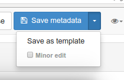
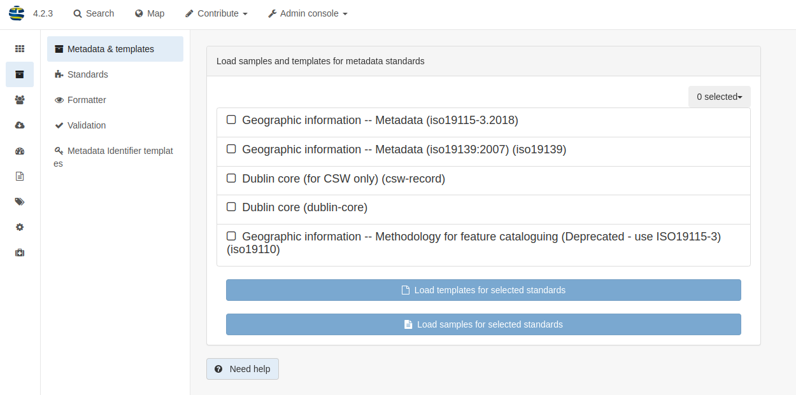
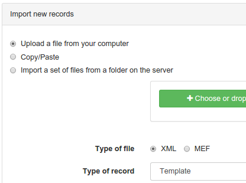

# Managing templates {#creating-templates}

Templates are metadata records that you can use as the starting point to describe new resources. This topic describes how to load and manage templates.

## Creating and managing templates

You can:

-   Manage templates in the catalog the same way as metadata records, with a special 'template'-tag.
-   Create, update and remove templates using the `contribute` section.
-   Convert metadata records to templates and vice versa at any time from the metadata editor using the `save as template` button.

You can assign templates to limited groups, so only these groups can use the template in their work process (See [Managing privileges](../publishing/managing-privileges.md)).

## Loading default templates

The `Metadata and Templates` page in the Administration page displays all available standards.

If you have provided these in the schema plugin, using this page, users can:

-   load default samples
-   load default templates

**Note**: You have to be logged in as an administrator to access this page and function.

## Importing templates

An alternate way of loading templates is to use the metadata import page where you can import XML files and selecting the type of record: `template`.

## Creating your own templates

Each standard provides default samples, but you can build your own template to make editing task as easy as possible depending on:

-   the type of resources to describe (eg. template for paper maps)
-   the structure of your organization (eg. defining templates per services)
-   the type of usage of the metadata (eg. public use, internal use, data quality)
-   the type of users

In a template, you should:

-   set as many default values as you can (eg. define default contact)
-   create elements that your encoding guideline recommend (to not spend time on searching elements in the advanced view)
-   provide instructions

The main goal is to guide editor work without requiring too much knowledge of the standard use.

For further customization, you could improve the schema plugin by defining custom documentation, recommended values, \... (see [Implementing schema plugins](../../customizing-application/implementing-a-schema-plugin.md)) or creating custom view (see [Customizing editor](../../customizing-application/editor-ui/creating-custom-editor.md)).
