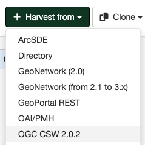

# Harvesting CSW services

This harvester will connect to a remote CSW server and retrieve metadata records that match the query parameters specified.

## Adding a CSW harvester

To create a CSW harvester go to `Admin console` > `Harvesting` and select `Harvest from` > `CSW`:

Providing the following information:

-   **Identification**
    -   *Node name and logo*: A unique name for the harvester and, optionally, a logo to assign to the harvester.
    -   *Group*: Group which owns the harvested records. Only the catalog administrator or users with the profile `UserAdmin` of this group can manage the harvester.
    -   *User*: User who owns the harvested records.

-   **Schedule**: Scheduling options to execute the harvester. If disabled, the harvester must be run manually from the harvester page. If enabled, a scheduling expression using cron syntax should be configured ([See examples](https://www.quartz-scheduler.org/documentation/quartz-2.1.7/tutorials/crontrigger)).

-   **Configure connection to OGC CSW 2.0.2**
    -   *Service URL*: The URL of the capabilities document of the CSW server to be harvested. eg. <http://geonetwork-site.com/srv/eng/csw?service=CSW&request=GetCabilities&version=2.0.2>. This document is used to discover the location of the services to call to query and retrieve metadata.
    -   *Remote authentication*: If checked, should be provided the credentials for basic HTTP authentication on the CSW server.
    -   *Search filter*: (Optional) Define the search criteria below to restrict the records to harvest.
    -   *Search options*:
        -     *Sort by*: Define sort option to retrieve the results. Sorting by 'identifier:A' means by UUID with alphabetical order. Any CSW queryables can be used in combination with A or D for setting the ordering.
        -     *Output Schema*: The metadata standard to request the metadata records from the CSW server.
        -     *Distributed search*: Enables the distributed search in remote server (if the remote server supports it). When this option is enabled, the remote catalog cascades the search to the Federated CSW servers that has configured.
    
-   **Configure response processing for CSW**
    -   *Action on UUID collision*: When a harvester finds the same uuid on a record collected by another method (another harvester, importer, dashboard editor,...), should this record be skipped (default), overriden or generate a new UUID?
    -   *Validate records before import*: Defines the criteria to reject metadata that is invalid according to XML structure (XSD) and validation rules (schematron).
        -   Accept all metadata without validation.
        -   Accept metadata that are XSD valid.
        -   Accept metadata that are XSD and schematron valid.
    -   *Check for duplicate resources based on the resource identifier*: If checked, ignores metadata with a resource identifier (`gmd:identificationInfo/*/gmd:citation/gmd:CI_Citation/gmd:identifier/*/gmd:code/gco:CharacterString`) that is assigned to other metadata record in the catalog. It only applies to records in ISO19139 or ISO profiles.
    -   *XPath filter*: (Optional) When record is retrived from remote server, check an XPath expression to accept or discard the record.
    -   *XSL transformation to apply*: (Optional)  The referenced XSL transform will be applied to each metadata record before it is added to GeoNetwork.
    -   *Batch edits*: (Optional) Allows to update harvested records, using XPATH syntax. It can be used to add, replace or delete element.
    -   *Category*: (Optional) A GeoNetwork category to assign to each metadata record.

-   **Privileges** - Assign privileges to harvested metadata.
