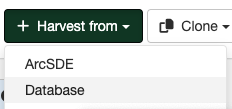

# Database Harvesting {#database_harvester}

This harvesting type uses a database connection to harvest metadata stored in a database table.

## Adding a Database harvester

To create a Database harvester go to `Admin console` > `Harvesting` and select `Harvest from` > `Database`:

Providing the following information:

-   **Identification**
    -   *Node name and logo*: A unique name for the harvester and optionally a logo to assign to the harvester.
    -   *Group*: Group which owns the harvested records. Only the catalog administrator or users with the profile `UserAdmin` of this group can manage the harvester.
    -   *User*: User who owns the harvested records.

-   **Schedule**: Scheduling options to execute the harvester. If disabled, the harvester should be executed manually from the harvesters page. If enabled a schedule expression using cron syntax should be configured ([See examples](https://www.quartz-scheduler.org/documentation/quartz-2.1.7/tutorials/crontrigger)).

-   **Configure connection to Database**
    -   *Server*: The database server IP/Hostname.
    -   *Port*: The database port. For example, for Postgres usually 5432.
    -   *Database name*: The database name to connect.
    -   *Table name*: Table name with the metadata. The name must begin with a letter (a-z) or underscore (_). Subsequent characters in a name can be letters, digits (0-9), or underscores.
    -   *Metadata field name*: Table field name that contains the metadata XML text. The field name must begin with a letter (a-z) or underscore (_). Subsequent characters in a name can be letters, digits (0-9), or underscores.
        The supported SQL generic types for this field are the following: `BLOB`, `LONGVARBINARY`, `LONGNVARCHAR`, `LONGVARCHAR`, `VARCHAR`, `SQLXML`. Check your database documentation for specific implementations of these generic types.
    -   *Database type*: Database type. Currently supported Postgres and Oracle.
    -   *Remote authentication*: Credentials to connect to the database.

-   **Search filter**: allows to define a simple field condition to filter the results.
    -   *Filter field*: Table field name used to filter the results. The name must begin with a letter (a-z) or underscore (_). Subsequent characters in a name can be letters, digits (0-9), or underscores.
    -   *Filter value*: Value to filter the results. It can contain wildcards (%).
    
-   **Configure response processing for database**
    -   *Action on UUID collision*: When a harvester finds the same uuid on a record collected by another method (another harvester, importer, dashboard editor,...), should this record be skipped (default), overriden or generate a new UUID?
    -   *Validate records before import*: If checked, the metadata will be validated after retrieval. If the validation does not pass, the metadata will be skipped. 
    -   *XSL filter name to apply*: (Optional) The XSL filter is applied to each metadata record. The filter is a process which depends on the metadata schema (see the `process` folder of the metadata schemas).

        It could be composed of parameter which will be sent to XSL transformation using the following syntax: `anonymizer?protocol=MYLOCALNETWORK:FILEPATH&email=gis@organisation.org&thesaurus=MYORGONLYTHEASURUS`

    -   *Batch edits*: (Optional) Allows to update harvested records, using XPATH syntax. It can be used to add, replace or delete element.
    -   *Translate metadata content*: (Optional) Allows to translate metadata elements. It requires a translation service provider configured in the System settings.

-   **Privileges** - Assign privileges to harvested metadata.
