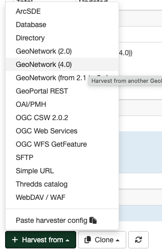

# GeoNetwork 4.x Harvester {#gn4_harvester}

GeoNetwork 4.x uses **Elasticsearch** as its search engine, breaking compatibility with previous protocols 
from older GeoNetwork releases. To harvest metadata from a GeoNetwork 4.x catalogue, you must use the 
dedicated GeoNetwork 4.x harvester type.

---

## How to Add a GeoNetwork 4.x Harvester

1. **Go to**: `Admin console` > `Harvesting`
2. **Select**: `Harvest from` > `GeoNetwork (from 4.x)`
3. **Complete the configuration panels as described below**

### Identification

- **Name**: Provide a short, descriptive name for your remote GeoNetwork instance. This name will appear in the main page as the name for this instance of the harvester.
- **Group**: Assign the group that will own the harvested metadata records.
- **User**: Select the user (owner) for the harvested records.

### Schedule

- **Schedule**: Set how often the harvester should run (e.g., daily, weekly), using cron syntax or the built-in scheduler.
  You may also run the harvester manually from the interface.

### Connection to GeoNetwork

- **Catalog URL**: Enter the full URL of the remote GeoNetwork 4.x server.
- **Node name**: Specify the catalogue node to harvest (typically `srv`).
- **Search filter**: Define filters to limit harvested metadata using criteria like:
  - **Full text**: Matches all text fields.
  - **Title**: Filter by title.
  - **Abstract**: Filter by abstract.
  - **Keyword**: Filter by keyword.
  - **Categories**: Combine multiple categories with `AND` or `OR` (e.g., `cat1 AND cat2`, `cat1 OR cat2`).
  - **Scheme**: Specify the metadata standards (e.g., `iso19139 OR iso19115-3.2018`).
  - **Group Owner**: List one or more group (owners of the metadata) numeric IDs, comma-separated.
  - **Catalog**: Identify a source sub-catalogue, if needed.

### Response Processing

- **Action on UUID collision**: Choose how to configure the action when a harvester finds the same UUID on a record collected by another method (another harvester, importer, dashboard editor, etc.):
  - **Skipped** (default): Leave duplicates unchanged.
  - **Overridden**: Replace with new record.
  - **Generate a new UUID**: Assign a new unique identifier and keep both and old records.
- **Remote Authentication**: Configure if credentials are required for the source catalogue.
- **Use Full MEF Format**: Enable to transfer all metadata fields and resources.
- **Use Change Date for Comparison**: Updates only if the change date differs.
- **Set Category If Exists Locally**: Assign categories if matched in local catalogue.
- **Category for Harvested Records**: Set the default category for imported entries.
- **XSL Filter Name to Apply**: Specify custom XSL transformations if needed.
- **Validate Records Before Import**: Toggle to validate metadata against the expected schema before import.

### Privileges

- Assign viewing, editing, or publishing privileges for harvested records.
