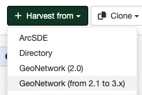

# GeoNetwork 4.X Harvester {#gn4_harvester}

GeoNetwork 4.x changed the search engine to Elasticsearch, which is not compatible with previous versions. To harvest a catalogue based on GeoNetwork 4.x, this harvesting type is required.

## Adding a GeoNetwork 4.x Harvester

To create a GeoNetwork 4.X harvester, go to `Admin console` > `Harvesting` and select `Harvest from` > `GeoNetwork (from 4.x)`:

Provide the following information:
- **Identification** - Options describing the remote site.
  - *Name* - A short description of the remote site. It will be shown on the harvesting main page as the name for this instance of the harvester.
  - *Group* - Group that owns the harvested metadata.
  - *User* - User that owns the harvested metadata.
- **Schedule** - Schedule configuration to execute the harvester.
- **Configure connection to GeoNetwork**:
  - *Catalog URL* - The URL of the GeoNetwork server from which metadata will be harvested.
  - *Node name* - GeoNetwork node name to harvest, by default `srv`.
  - *Search filter* - This allows you to select metadata records for harvest based on certain criteria:
    - *Full text*
    - *Title*
    - *Abstract*
    - *Keyword*
    - *Catalog* - Allows you to select a source to filter the metadata to harvest.

- **Configure response processing**
  - *Action on UUID collision* - Allows you to configure the action when a harvester finds the same UUID on a record collected by another method (another harvester, importer, dashboard editor, etc.).
    - skipped (default)
    - overridden
    - generate a new UUID
  - *Remote authentication*
  - *Use full MEF format*
  - *Use change date for comparison*
  - *Set category if it exists locally*
  - *Category for harvested records*
  - *XSL filter name to apply*
  - *Validate records before import*

- **Privileges** - Assign privileges to harvested metadata.
