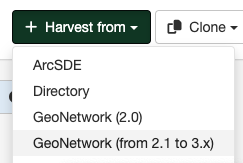

# GeoNetwork 2.1-3.X Harvester

This harvester will connect to a remote GeoNetwork server that uses versions from 2.1-3.X and retrieve metadata records that match the query parameters.

## Adding a GeoNetwork 2.1-3.X harvester

To create a GeoNetwork 2.1-3.X harvester go to `Admin console` > `Harvesting` and select `Harvest from` > `GeoNetwork (from 2.1 to 3.x)`:

Providing the following information:

-   **Identification**
    -   *Node name and logo*: A unique name for the harvester and optionally a logo to assign to the harvester.
    -   *Group*: Group which owns the harvested records. Only the catalog administrator or users with the profile `UserAdmin` of this group can manage the harvester.
    -   *User*: User who owns the harvested records.

-   **Schedule**: Scheduling options to execute the harvester. If disabled, the harvester should be executed manually from the harvesters page. If enabled a schedule expression using cron syntax should be configured ([See examples](https://www.quartz-scheduler.org/documentation/quartz-2.1.7/tutorials/crontrigger)).

-   **Configure connection to GeoNetwork (from 2.1 to 3.x)**
    -   *Catalog URL*: 
        - The remote URL of the GeoNetwork server from which metadata will be harvested. The URL should contain the catalog name, for example: http://www.fao.org/geonetwork.
        - Additionally, it should be configured the node name, usually the value `srv`.
    -   *Search filter*: (Optional)  Define the filter to retrieve the remote metadata.
    -   *Catalog*: (Optional) Select the portal in the remote server to harvest.
    -   *Remote authentication*: If checked, should be provided the credentials for basic HTTP authentication on the WebDAV/WAF server.
    -   *Use full MEF format*: If checked, uses MEF format instead of XML to retrieve the remote metadata. Recommended to metadata with files.

-   **Configure response processing for GeoNetwork**
    -   *Action on UUID collision*: When a harvester finds the same uuid on a record collected by another method (another harvester, importer, dashboard editor,...), should this record be skipped (default), overriden or generate a new UUID?
    -   *Use change date for comparison*: If checked, uses change date to detect changes on remote server.
    -   *Set category if it exists locally*: If checked, uses the category set on the metadata in the remote server also locally (assuming it exists locally). Applies only when using MEF format for the harvesting.
    -   *Category*: (Optional) A GeoNetwork category to assign to each metadata record.
    -   *XSL filter name to apply*: (Optional) The XSL filter is applied to each metadata record.  The filter is a process which depends on the schema (see the `process` folder of the schemas).

        It could be composed of parameter which will be sent to XSL transformation using the following syntax: `anonymizer?protocol=MYLOCALNETWORK:FILEPATH&email=gis@organisation.org&thesaurus=MYORGONLYTHEASURUS`

    -   *Validate records before import*: If checked, the metadata will be validated after retrieval. If the validation does not pass, the metadata will be skipped.

-   **Privileges** - Assign privileges to harvested metadata.
