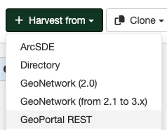

# GeoPortal REST Harvesting {#geoportal_rest_harvester}

This harvester will connect to a remote GeoPortal version 9.3.x or 10.x server and retrieve metadata records that match the query parameters specified using the GeoPortal REST API.

## Adding a GeoPortal REST harvester

To create a GeoPortal REST harvester go to `Admin console` > `Harvesting` and select `Harvest from` > `GeoPortal REST`:

Providing the following information:

-   **Identification**
    -   *Node name and logo*: A unique name for the harvester and, optionally, a logo to assign to the harvester.
    -   *Group*: Group which owns the harvested records. Only the catalog administrator or users with the profile `UserAdmin` of this group can manage the harvester.
    -   *User*: User who owns the harvested records.

-   **Schedule**: Scheduling options to execute the harvester. If disabled, the harvester must be run manually from the harvester page. If enabled, a scheduling expression using cron syntax should be configured ([See examples](https://www.quartz-scheduler.org/documentation/quartz-2.1.7/tutorials/crontrigger)).

-   **Configure connection to GeoPortal REST**
    -   *URL*: The base URL of the GeoPortal server to be harvested. eg. <http://yourhost.com/geoportal>. The harvester will add the additional path required to access the REST services on the GeoPortal server.
    -   *Remote authentication*: If checked, should be provided the credentials for basic HTTP authentication on the server.
    -   *Search filter*: (Optional) You can query any field on the GeoPortal server using the Lucene query syntax described at <http://webhelp.esri.com/geoportal_extension/9.3.1/index.htm#srch_lucene.htm>.
  
-   **Configure response processing for geoPREST**
    -   *Validate records before import*: Defines the criteria to reject metadata that is invalid according to XML structure (XSD) and validation rules (schematron).
        -   Accept all metadata without validation.
        -   Accept metadata that are XSD valid.
        -   Accept metadata that are XSD and schematron valid.
    -   *XSL transformation to apply*: (Optional)  The referenced XSL transform will be applied to each metadata record before it is added to GeoNetwork.

-   **Privileges** - Assign privileges to harvested metadata.

!!! Notes

    -   This harvester uses two REST services from the GeoPortal API:
        -   `rest/find/document` with searchText parameter to return an RSS listing of metadata records that meet the search criteria (maximum 100000)
        -   `rest/document` with id parameter from each result returned in the RSS listing
    -   This harvester has been tested with GeoPortal 9.3.x and 10.x. It can be used in preference to the CSW harvester if there are issues with the handling of the OGC standards etc.
    -   Typically ISO19115 metadata produced by the Geoportal software will not have a 'gmd' prefix for the namespace `http://www.isotc211.org/2005/gmd`. GeoNetwork XSLTs will not have any trouble understanding this metadata but will not be able to map titles and codelists in the viewer/editor. To fix this problem, please select the ``Add-gmd-prefix`` XSLT for the *Apply this XSLT to harvested records* in the **Harvested Content** set of options described earlier
