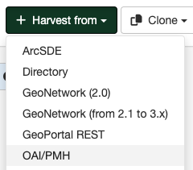

# OAIPMH Harvesting {#oaipmh_harvester}

This is a harvesting protocol that is widely used among libraries. GeoNetwork implements version 2.0 of the protocol. An OAI-PMH server implements a harvesting protocol that GeoNetwork, acting as a client, can use to harvest metadata.

## Adding an OAI-PMH harvester

To create a OAI-PMH harvester go to `Admin console` > `Harvesting` and select `Harvest from` > `OAI/PMH`:

Providing the following information:

-   **Identification**
    -   *Node name and logo*: A unique name for the harvester and, optionally, a logo to assign to the harvester.
    -   *Group*: Group which owns the harvested records. Only the catalog administrator or users with the profile `UserAdmin` of this group can manage the harvester.
    -   *User*: User who owns the harvested records.

-   **Schedule**: Scheduling options to execute the harvester. If disabled, the harvester must be run manually from the harvester page. If enabled, a scheduling expression using cron syntax should be configured ([See examples](https://www.quartz-scheduler.org/documentation/quartz-2.1.7/tutorials/crontrigger)).

-   **Configure connection to OGC CSW 2.0.2**
    -   *URL*: The URL of the OAI-PMH server from which metadata will be harvested.
    -   *Remote authentication*: If checked, should be provided the credentials for basic HTTP authentication on the OAIPMH server.
    -   *Search filter*: (Optional) Define the search criteria below to restrict the records to harvest.
        -   *From*: You can provide a start date here. Any metadata whose last change date is equal to or greater than this date will be harvested. To add or edit a value for this field you need to use the icon alongside the text box. This field is optional so if you don't provide a start date the constraint is dropped. Use the icon to clear the field.
        -   *Until*: Functions in the same way as the *From* parameter but adds an end constraint to the last change date search. Any metadata whose last change data is less than or equal to this data will be harvested.
        -   *Set*: An OAI-PMH server classifies metadata into sets (like categories in GeoNetwork). You can request all metadata records that belong to a set (and any of its subsets) by specifying the name of that set here.
        -   *Prefix*: 'Prefix' means metadata format. The oai_dc prefix must be supported by all OAI-PMH compliant servers.

            !!! note
    
                The 'OAI provider sets' drop down next to the *Set* text box and the 'OAI provider prefixes' drop down next to the *Prefix* textbox are initially blank. After specifying the connection URL, you can press the **Retrieve Info** button, which will connect to the remote OAI-PMH server, retrieve all supported sets and prefixes and fill the drop downs with these values. Selecting a value from either of these drop downs will fill the appropriate text box with the selected value.
-   **Configure response processing for oaipmh**
    -   *Action on UUID collision*: When a harvester finds the same uuid on a record collected by another method (another harvester, importer, dashboard editor,...), should this record be skipped (default), overriden or generate a new UUID?
    -   *Validate records before import*: Defines the criteria to reject metadata that is invalid according to XML structure (XSD) and validation rules (schematron).
        -   Accept all metadata without validation.
        -   Accept metadata that are XSD valid.
        -   Accept metadata that are XSD and schematron valid.  
    - *XSL transformation to apply*: (Optional)  The referenced XSL transform will be applied to each metadata record before it is added to GeoNetwork.

    -   *Category*: (Optional) A GeoNetwork category to assign to each metadata record.

-   **Privileges** - Assign privileges to harvested metadata.

!!! Notes

    -   If you request the oai_dc output format, GeoNetwork will convert it to Dublin Core format.
    -   When you edit a previously created OAIPMH harvester instance, both the *set* and *prefix* drop down lists will be empty. You have to press the retrieve info button again to connect to the remote server and retrieve set and prefix information.
    -   The id of the remote server must be a UUID. If not, metadata can be harvested but during hierarchical propagation id clashes could corrupt harvested metadata.
