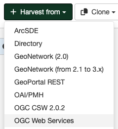

# Harvesting OGC Services {#ogcwxs_harvester}

An OGC service implements a GetCapabilities operation that GeoNetwork, acting as a client, can use to produce metadata for the service (ISO19119) and resources delivered by the service (ISO19115/19139). This harvester supports the following OGC services and versions:

-   Web Map Service (WMS) - versions 1.0.0, 1.1.1, 1.3.0
-   Web Feature Service (WFS) - versions 1.0.0 and 1.1.0
-   Web Coverage Service (WCS) - version 1.0.0
-   Web Processing Service (WPS) - version 0.4.0 and 1.0.0
-   Catalogue Services for the Web (CSW) - version 2.0.2
-   Sensor Observation Service (SOS) - version 1.0.0

## Adding an OGC Service Harvester

To create a OGC Service harvester go to `Admin console` > `Harvesting` and select `Harvest from` > `OGC Web Services`:

Providing the following information:

-   **Identification**
    -   *Node name and logo*: A unique name for the harvester and, optionally, a logo to assign to the harvester.
    -   *Group*: Group which owns the harvested records. Only the catalog administrator or users with the profile `UserAdmin` of this group can manage the harvester.
    -   *User*: User who owns the harvested records.

-   **Schedule**: Scheduling options to execute the harvester. If disabled, the harvester must be run manually from the harvester page. If enabled, a scheduling expression using cron syntax should be configured ([See examples](https://www.quartz-scheduler.org/documentation/quartz-2.1.7/tutorials/crontrigger)).

-   **Configure connection to OGC Web Services**
    -   *Service URL*: The service URL is the URL of the service to contact (without parameters like "REQUEST=GetCapabilities", "VERSION=", \...). It has to be a valid URL like <http://your.preferred.ogcservice/type_wms>.
    -   *Service type* - The type of OGC service indicates if the harvester has to query for a specific kind of service. Supported type are WMS (1.0.0, 1.1.1, 1.3.0), WFS (1.0.0 and 1.1.0), WCS (1.0.0), WPS (0.4.0 and 1.0.0), CSW (2.0.2) and SOS (1.0.0).
    -   *Remote authentication*: If checked, should be provided the credentials for basic HTTP authentication on the server.

-   **Configure response processing for ogcwxs**
    -   *Build service metadata record from a template*: 
    -   *Category for service metadata*: (Optional) Metadata for the harvested service is assigned to the category selected in this option (eg. "interactive resources").
    -   *Create record for each layer only using GetCapabilities information*: Checking this option means that the harvester will loop over datasets served by the service as described in the GetCapabilities document.
        - *Import record for each layer using MetadataURL attributes*: Checkthis option means that the harvester will generate metadata from an XML document referenced in the MetadataUrl attribute of the dataset in the GetCapabilities document. If the document referred to by this attribute is not valid (eg. unknown schema, bad XML format), the GetCapabilities document is used as per the previous option.
        - *Build dataset metadata records from a template*
        - *Create thumbnail*: If checked, when harvesting from an OGC Web Map Service (WMS) that supports WGS84 projection, thumbnails for the layers metadata will be created during harvesting.
        - *Category for datasets*: Metadata for the harvested datasets is assigned to the category selected in this option (eg. "datasets").

    -   *ISO category*: (Optional) Used to populate the topic category element in the metadata. It is recommended to choose one as the topic category is mandatory for the ISO19115/19139 standard if the hierarchical level is "datasets".
    -   *Metadata language*: Required field that will define the language of the metadata. It should be the language used by the OGC web service administrator.
    -   *Output schema*: The metadata schema of the dataset metadata records that will be created by this harvester. The value should be an XSLT process which is used by the harvester to convert the GetCapabilities document to metadata records from that schema. If in doubt, use the default value `iso19139`.
    -   *Validate records before import*: Defines the criteria to reject metadata that is invalid according to XML structure (XSD) and validation rules (schematron).
        -   Accept all metadata without validation.
        -   Accept metadata that are XSD valid.
        -   Accept metadata that are XSD and schematron valid.
    -   *XSL transformation to apply*: (Optional)  The referenced XSL transform will be applied to each metadata record before it is added to GeoNetwork.
 

-   **Privileges** - Assign privileges to harvested metadata.

!!! Notes

    -   Every time the harvester runs, it will remove previously harvested records and create new records. GeoNetwork will generate the uuid for all metadata (both service and datasets). The exception to this rule is dataset metadata created using the MetadataUrl tag is in the GetCapabilities document, in that case, the uuid of the remote XML document is used instead
