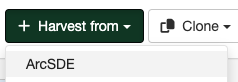

# Harvesting an ARCSDE Node {#sde_harvester}

This is a harvesting protocol for metadata stored in an ArcSDE installation. The harvester identifies the ESRI metadata format: ESRI ISO, ESRI FGDC to apply the required xslts to transform metadata to ISO19139.

## Adding an ArcSDE harvester

To create an ArcSDE harvester go to `Admin console` > `Harvesting` and select `Harvest from` > `ArcSDE`:

Providing the following information:

-   **Identification**
    -   *Node name and logo*: A unique name for the harvester and, optionally, a logo to assign to the harvester.
    -   *Group*: Group which owns the harvested records. Only the catalog administrator or users with the profile `UserAdmin` of this group can manage the harvester.
    -   *User*: User who owns the harvested records.

-   **Schedule**: Scheduling options to execute the harvester. If disabled, the harvester must be run manually from the harvester page. If enabled, a scheduling expression using cron syntax should be configured ([See examples](https://www.quartz-scheduler.org/documentation/quartz-2.1.7/tutorials/crontrigger)).

-   **Configure connection to Database**
    -   *Server*: ArcSDE server IP address or name.
    -   *Port*: ArcSDE service port (typically 5151) or ArcSDE database port, depending on the connection type selected, see below the *Connection type* section.
    -   *Database name*: ArcSDE instance name (typically esri_sde).
    -   *ArcSDE version:  ArcSDE version to harvest. The data model used by ArcSDE is different depending on the ArcSDE version.
    -   *Connection type*
        -   *ArcSDE service*: Uses the ArcSDE service to retrieve the metadata.

            !!! note

               Additional installation steps are required to use the ArcSDE harvester because it needs proprietary ESRI Java api jars to be installed.

               ArcSDE Java API libraries need to be installed by the user in GeoNetwork (folder `INSTALL_DIR_GEONETWORK/WEB-INF/lib`), as these are proprietary libraries not distributed with GeoNetwork.

               The following jars are required:

               -   jpe_sdk.jar
               -   jsde_sdk.jar

               `dummy-api-XXX.jar` must be removed from `INSTALL_DIR/web/geonetwork/WEB-INF/lib`.

        -   *Database direct connection*: Uses a database connection (JDBC) to retrieve the metadata.

            !!! note

                Database direct connection requires to copy JDBC drivers in `INSTALL_DIR_GEONETWORK/WEB-INF/lib`.

            !!! note

                Postgres JDBC drivers are distributed with GeoNetwork, but not for Oracle or SqlServer.

    -   *Database type* - ArcSDE database type: Oracle, Postgres, SqlServer. Only available if connection type is configured to *Database direct connection*.
    -   *Remote authentication*: Credentials to connect to the ArcSDE server.

-   **Configure response processing for arcsde**
    -   *Validate records before import*: Defines the criteria to reject metadata that is invalid according to XML structure (XSD) and validation rules (schematron).
        -   Accept all metadata without validation.
        -   Accept metadata that are XSD valid.
        -   Accept metadata that are XSD and schematron valid.
 
-   **Privileges** - Assign privileges to harvested metadata.
