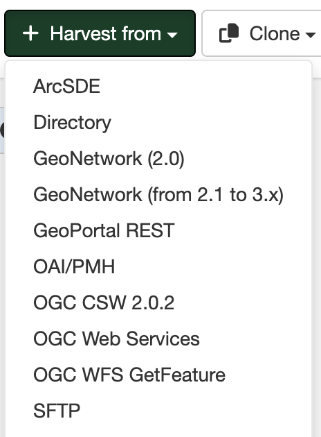

# SFTP server Harvesting {#sftpserver_harvester}

This harvester will harvest metadata as XML files from a SFTP server.

## Adding a SFTP server harvester

To create a SFTP server harvester go to `Admin console` > `Harvesting` and select `Harvest from` > `SFTP server`:

Providing the following information:

-   **Identification**
    -   *Node name and logo*: A unique name for the harvester and, optionally, a logo to assign to the harvester.
    -   *Group*: Group which owns the harvested records. Only the catalog administrator or users with the profile `UserAdmin` of this group can manage the harvester.
    -   *User*: User who owns the harvested records.

-   **Schedule**: Scheduling options to execute the harvester. If disabled, the harvester must be run manually from the harvester page. If enabled, a scheduling expression using cron syntax should be configured ([See examples](https://www.quartz-scheduler.org/documentation/quartz-2.1.7/tutorials/crontrigger)).

-   **Configure connection to SFTP**
    -   *SFTP host address*: The SFTP host name or IP address to connect to. Note that the 'sftp://' prefix should be omitted.
    -   *SFTP port*: The port to connect to (usually 22).
    -   *SFTP home directory*: Directory path on the SFTP server containing the metadata (XML files) that need to be harvested. Set to '/' to start searching from the "root" directory of the connection. Note that the user that you are connecting with may already be mapped to a specific directory on the SFTP server.
    -   *Recurse subfolders*: If checked, the harvester will recursively process metadata in all folders (within the given home directory) as well as their subfolders. Otherwise, only the items in the home directory itself will be processed.
    -   *Username*: The username to connect to the SFTP server.
    -   *Use SSH key*: If checked, a private/public key will be generated to connect to the SFTP server. An SSH key is a more secure authentication method than a password, and is therefore recommended. However, the user (or an administrator) must configure the generated public key on the SFTP server in order for it to work.
        - *SSH key type*: Select the algorithm to create the SSH keys. You can choose between RSA (4096 bits) or ECDSA.
    -   *Password*: The password to connect to the SFTP server. Only applies when *Use SSH key* is unchecked.
    
-   **Configure response processing for filesystem**
    -   *Action on UUID collision*: When a harvester finds the same uuid on a record collected by another method (another harvester, importer, dashboard editor,...), should this record be skipped (default), overriden or generate a new UUID?
    -   *Update catalog record only if file was updated*
    -   *Keep local even if deleted at source*: If checked then metadata records that have already been harvested will be kept even if they have been deleted from the *Directory* specified.
    -   *Validate records before import*: Defines the criteria to reject metadata that is invalid according to XML structure (XSD) and validation rules (schematron).
        -   Accept all metadata without validation.
        -   Accept metadata that are XSD valid.
        -   Accept metadata that are XSD and schematron valid.
    -   *XSL transformation to apply*: (Optional)  The referenced XSL transform will be applied to each metadata record before it is added to GeoNetwork.
    -   *Batch edits*: (Optional) Allows to update harvested records, using XPATH syntax. It can be used to add, replace or delete element.
    -   *Category*: (Optional) A GeoNetwork category to assign to each metadata record.

-   **Privileges** - Assign privileges to harvested metadata.
