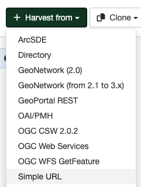

# Simple URL harvesting (opendata) {#harvesting-simpleurl-services}

This harvester connects to a remote server via a simple URL to retrieve metadata records. This allows harvesting opendata catalogs such as opendatasoft, ESRI, DKAN and more.

## Adding a simple URL harvester

To create a Simple URL harvester go to `Admin console` > `Harvesting` and select `Harvest from` > `Simple URL`:

Provide the following information:

- **Identification**
    - *Node name and logo*: A unique name for the harvester and, optionally, a logo to assign to the harvester.
    - *Group*: Group which owns the harvested records. Only the catalog administrator or users with the profile `UserAdmin` of this group can manage the harvester.
    - *User*: User who owns the harvested records.

- **Schedule**: Scheduling options to execute the harvester. If disabled, the harvester must be run manually from the harvester page. If enabled, a scheduling expression using cron syntax should be configured ([See examples](https://www.quartz-scheduler.org/documentation/quartz-2.1.7/tutorials/crontrigger)).

- **Configure connection to Simple URL**
    - *URL* - The URL of the server to be harvested. This can include pagination params like `?start=0&rows=20`
    - *Remote authentication*: If checked, provide credentials for basic HTTP authentication on the server.
    - *API Key authentication*:  
      You can optionally provide an API Key to be sent with each request to the remote server for authentication or authorization:
        - *API Key value*: The API key or token string as provided by the external service.
        - *API Key header name*: The HTTP header name to use (default is `Authorization`).  
      If both Basic Auth and API Key are configured, both will be sent in the request as headers. This supports servers that require or accept multiple authentication schemes.
    - *Element to loop on*: Property/element containing a list of the record entries. (Indicated as an absolute path from the document root.) eg. `/datasets`
    - *Element for the UUID of each record* : Property containing the record id. eg. `/datasetid`
    - *Pagination parameters*: (optional)
        - *Element for the number of records to collect*: Property indicating the total count of record entries. (Indicated as an absolute path from the document root.) eg. `/nhits`
        - *From URL parameter*: Property indicating the first record item on the current "page" eg. `start`
        - *Size URL parameter*: Property indicating the number of records contained in the current "page" eg. `rows`

- **Configure response processing for Simple URL**
    - *XSL transformation to apply*: Name of the conversion schema to use, which must be available as XSL on the GeoNetwork instance. eg. `OPENDATASOFT-to-ISO19115-3-2018`
        !!! note

            GN looks for schemas by name in <https://github.com/geonetwork/core-geonetwork/tree/4.0.x/web/src/main/webapp/xsl/conversion/import>. These schemas might internally include schemas from other locations like <https://github.com/geonetwork/core-geonetwork/tree/4.0.x/schemas/iso19115-3.2018/src/main/plugin/iso19115-3.2018/convert>. To indicate the `fromJsonOpenDataSoft` schema for example, from the latter location directly in the admin UI the following syntax can be used: `schema:iso19115-3.2018:convert/fromJsonOpenDataSoft`.
    - *Batch edits*: (Optional) Allows updating harvested records using XPath syntax. It can be used to add, replace, or delete elements.
    - *Category*: (Optional) A GeoNetwork category to assign to each metadata record.
    - *Validate records before import*: Defines the criteria to reject metadata that is invalid according to XML structure (XSD) and validation rules (schematron).
        - Accept all metadata without validation.
        - Accept metadata that are XSD valid.
        - Accept metadata that are XSD and schematron valid.

- **Privileges** - Assign privileges to harvested metadata.

## API Key Authentication: Example

Some open data services require an API Key for access or rate limiting.  
To use the API Key feature:
- Enter the key or token in the **API Key value** field.
- Specify the corresponding **API Key header name** (e.g., `X-API-KEY`, `Authorization`). If left blank, `Authorization` is used.
- The key will be sent in each HTTP request as a header: `Header-Name: <api-key-value>`.  
If Basic Auth is also set, both forms of authentication will be sent.

## Sample configurations

### Sample configuration for opendatasoft v1

- *Element to loop on* - `/datasets`
- *Element for the number of records to collect* : `/nhits`
- *Element for the UUID of each record* : `/datasetid`
- *From URL parameter* : `start`
- *Size URL parameter* : `rows`
- *XSL transformation to apply* : `OPENDATASOFT-to-ISO19115-3-2018`

### Sample configuration for opendatasoft v2

- *Element to loop on* - `/datasets`
- *Element for the number of records to collect* : `/nhits`
- *Element for the UUID of each record* : `/dataset/datasetid`
- *From URL parameter* : `start`
- *Size URL parameter* : `rows`
- *XSL transformation to apply* : `OPENDATASOFT-to-ISO19115-3-2018`

### Sample configuration for ESRI

- *Element to loop on* - `/dataset`
- *Element for the number of records to collect* : `/result/count`
- *Element for the UUID of each record* : `/landingPage`
- *From URL parameter* : `start`
- *Size URL parameter* : `rows`
- *XSL transformation to apply* : `ESRIDCAT-to-ISO19115-3-2018`

### Sample configuration for DKAN

- *Element to loop on* - `/result/0`
- *Element for the number of records to collect* : `/result/count`
- *Element for the UUID of each record* : `/id`
- *From URL parameter* : `start`
- *Size URL parameter* : `rows`
- *XSL transformation to apply* : `DKAN-to-ISO19115-3-2018`
