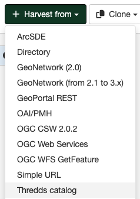

# THREDDS Harvesting {#thredds_harvester}

THREDDS catalogs describe inventories of datasets. They are organised in a hierarchical manner, listing descriptive information and access methods for each dataset. They typically catalog netCDF datasets but are not restricted to these types of files. This harvesting type crawls through a THREDDS catalog harvesting metadata for datasets and services described in it or in referenced netCDF datasets. This harvesting type can extract fragments of metadata from the THREDDS catalog, allowing the user to link or copy these fragments into a template to create metadata records.

## Adding a THREDDS Catalog Harvester

To create a THREDDS Catalog harvester go to `Admin console` > `Harvesting` and select `Harvest from` > `Thredds Catalog`:

Providing the following information:

-   **Identification**
    -   *Node name and logo*: A unique name for the harvester and, optionally, a logo to assign to the harvester.
    -   *Group*: Group which owns the harvested records. Only the catalog administrator or users with the profile `UserAdmin` of this group can manage the harvester.
    -   *User*: User who owns the harvested records.

-   **Schedule**: Scheduling options to execute the harvester. If disabled, the harvester must be run manually from the harvester page. If enabled, a scheduling expression using cron syntax should be configured ([See examples](https://www.quartz-scheduler.org/documentation/quartz-2.1.7/tutorials/crontrigger)).

-   **Configure connection to Thredds catalog**
    -   *Service URL*: The remote URL of the THREDDS Catalog from which metadata will be harvested. This must be the xml version of the catalog (i.e. ending with .xml). The harvester will crawl through all datasets and services defined in this catalog creating metadata for them as specified by the options described further below.
 
-   **Configure response processing for thredds**
    -   *Language*: Use this option to specify the language of the metadata to be harvested.
    -   *ISO19115 Topic category for output metadata records*: Use this option to specify the ISO topic category of service metadata.
    -   *Create ISO19119 metadata for all services in the thredds catalog*: Select this option to generate iso19119 metadata for services defined in the THREDDS catalog (eg. OpenDAP, OGC WCS, ftp) and for the THREDDS catalog itself.
    -   *Select schema for output metadata records*: The metadata standard to create the metadata. It should be a valid metadata schema installed in GeoNetwork, by default `iso19139`.
    -   *Dataset title*: (Optional) Title for the dataset. Default is catalog url.
    -   *Dataset abstract*: (Optional) Abstract for the dataset. Default is 'Thredds Dataset'.
    -   *Geonetwork category to assign to dataset metadata records* - Select the category to assign to the ISO19119 service records for the THREDDS services.
    -   *Geonetwork category to assign to dataset metadata records* - Select the category to assign the generated metadata records (and any subtemplates) to.

-   **Privileges** - Assign privileges to harvested metadata.

## More about harvesting THREDDS DIF metadata elements with the THREDDS Harvester

THREDDS catalogs can include elements from the DIF metadata standard. The Unidata netcdf-java library provides a DIFWriter process that can create a DIF metadata record from these elements. GeoNetwork has a DIFToISO stylesheet to transform these DIF records to ISO.

## More about harvesting Unidata dataset discovery metadata with the THREDDS Harvester

The options described above for the *Extract Unidata dataset discovery metadata using fragments* (see <http://www.unidata.ucar.edu/software/netcdf-java/formats/DataDiscoveryAttConvention.html> for more details of these conventions) invoke the following process for each collection dataset or atomic dataset in the THREDDS catalog:

1.  The harvester bundles up the catalog URI, a generated uuid, the THREDDS metadata for the dataset (generated using the catalog subset web service) and the ncml for netCDF datasets into a single xml document. An example is shown below.
2.  This document is then transformed using the specified stylesheet (see *Stylesheet* option above) to obtain a metadata fragments document.
3.  The metadata fragment harvester is then called to create subtemplates and/or metadata for the each dataset as requested

## Example

DIF Metadata elements on datasets in THREDDS catalogs are not as widely used as metadata elements that follow the Unidata dataset discovery metadata conventions. This example will show how to harvest metadata elements that follow the Unidata data discovery conventions (see <http://www.unidata.ucar.edu/software/netcdf-java/formats/DataDiscoveryAttConvention.html>).

Two reference stylesheets are provided as examples of how to harvest metadata fragments from a THREDDS catalog. One of these stylesheets, thredds-metadata.xsl, is for generating iso19139 metadata fragments from THREDDS metadata following Unidata dataset discovery conventions. The other stylesheet, netcdf-attributes.xsl, is for generating iso19139 fragments from netCDF datasets following Unidata dataset discovery conventions. These stylesheets are designed for use with the 'HARVESTING TEMPLATE -- THREDDS -- DATA DISCOVERY' template and can be found in the schema 'convert' directory eg. for ISO19139 this is `GEONETWORK_DATA_DIR/config/schema_plugins/iso19139/convert/ThreddsToFragments`.

A sample template 'HARVESTING TEMPLATE -- THREDDS -- DATA DISCOVERY' has been provided for use with the stylesheets described above for the iso19139 metadata schema. This template is in the schema 'templates' directory eg. for ISO19139, this is `GEONETWORK_DATA_DIR/config/schema_plugins/iso19139/templates/thredds-harvester-unidata-data-discovery.xml`. *Before* attempting to run this example, you should make sure that this template and others from the iso19139 schema have been loaded into GeoNetwork using the 'Add templates' function in the Administration menu.

We'll now give an example of how to set up a harvester and harvest THREDDS metadata from one of the public unidata motherlode catalogs at <http://motherlode.ucar.edu:8080/thredds/catalog/satellite/3.9/WEST-CONUS_4km/catalog.xml>. If you were to paste this URL into your browser, you would see the XML representation of this THREDDS catalog. This is the document that is read and converted into metadata by the THREDDS harvester.

In GeoNetwork, go into the Administration menu, choose Harvesting Management as described earlier. Add a THREDDS Catalog harvester. Fill out the harvesting management form.

The first thing to notice is that the *Service URL* should be <http://motherlode.ucar.edu:8080/thredds/catalog/satellite/3.9/WEST-CONUS_4km/catalog.xml>. Make sure that you use the xml version of the catalog. If you use an html version, you will not be able to harvest any metadata.

Now because this unidata motherload THREDDS catalog has lots of file level datasets (many thousands in fact), we will only harvest collection metadata. To do this you should check *Create metadata for Collection Datasets* and ignore the atomic datasets.

Next, because the metadata in this catalog follows Unidata data discovery conventions, so we will choose *Extract Unidata dataset discovery metadata using fragments*.

Next, we will check *Ignore harvesting attribute*. We do this because datasets in the THREDDS catalog can have an attribute indicating whether the dataset should be harvested or not. Since none of the datasets in this catalog have the harvesting attribute, we will ignore it. If we didn't check this box, all the datasets would be skipped.

Next we will select the metadata schema that the harvested metadata will be written out in. We will choose *iso19139* here because this is the schema for which we have stylesheets that will convert THREDDS metadata to fragments of iso19139 metadata and a template into which these fragments of metadata can be copied or linked. After choosing *iso19139*, choices will appear that show these stylesheets and templates.

The first choice is the stylesheet that will create iso19139 metadata fragments. Because we are interested in the thredds metadata elements in the THREDDS catalog, we will choose the *(iso19139) thredds-metadata* (located in `GEONETWORK_DATA_DIR/config/schema_plugins/iso19139/convert/ThreddsToFragments`) to convert these elements to iso19139 metadata fragments.

For the purposes of this demonstration, we will *not* check *Create subtemplates for fragments (xlinks\...)*. This means that the fragments of metadata created by the stylesheet will be copied directly into the metadata template. They will not be able to be reused (eg. shared between different metadata records). See the earlier section on metadata fragments if you are not sure what this means.

Finally, we will choose *HARVESTING TEMPLATE - THREDDS - UNIDATA DISCOVERY* as the template metadata record that will be combined with the metadata fragments to create the output records. This template will have been loaded into GeoNetwork from `GEONETWORK_DATA_DIR/config/schema_plugins/iso19139/templates/thredds-harvester-unidata-data-discovery.xml` through the Add Templates function in the Administration interface. This template could be filled out with metadata common to all records before the harvester is run. The process by which the template is used to create metadata records is as follows:

1.  For each dataset in the THREDDS catalog, the template will be copied to create a new iso19139 metadata record
2.  Each fragment of metadata harvested from a THREDDS dataset will be copied into the new iso19139 metadata record by matching an identifier in the template with an identifier in the fragment (this match is created by the developer of the template and the stylesheet).
3.  The new record is then inserted into the GeoNetwork metadata catalog and the record content is indexed in Lucene for searching.

You can then fill out the remainder of the form according to how often you want the harvested metadata to be updated, what categories will be assigned to the created metadata record, which icon will be displayed with the metadata records in the search results and what the privileges on the created metadata records will be.

Save the harvester screen. Then from the harvesting management screen, check the box beside the newly created harvester, *Activate* it and then *Run* it. After a few moments (depending on your internet connection and machine) you should click on *Refresh*. If your harvest has been successful you should see a results panel appear something like the one shown in the following screenshot.

Notice that there were 48 metadata records created for the 48 collection level datasets in this THREDDS catalog. Each metadata record was formed by duplicating the metadata template and then copying 13 fragments of metadata into it - hence the total of 624 fragments harvested.

An example of one of the collection level metadata records created by the harvester in this example and rendered by GeoNetwork is shown below.
