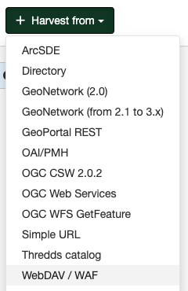

# WEBDAV Harvesting {#webdav_harvester}

This harvesting type uses the WebDAV (Distributed Authoring and Versioning) protocol or the WAF (web accessible folder) protocol to harvest metadata from a web server. It can be useful to users that want to publish their metadata through a web server that offers a DAV interface. The protocol permits retrieval of the contents of a web page (a list of files) along with the change date.

## Adding a WebDAV harvester

To create a WebDAV harvester go to `Admin console` > `Harvesting` and select `Harvest from` > `WebDAV / WAF`:

Providing the following information:

-   **Identification**
    -   *Node name and logo*: A unique name for the harvester and optionally a logo to assign to the harvester. 
    -   *Group*: Group which owns the harvested records. Only the catalog administrator or users with the profile `UserAdmin` of this group can manage the harvester.
    -   *User*: User who owns the harvested records.

-   **Schedule**: Scheduling options to execute the harvester. If disabled, the harvester should be executed manually from the harvesters page. If enabled a schedule expression using cron syntax should be configured ([See examples](https://www.quartz-scheduler.org/documentation/quartz-2.1.7/tutorials/crontrigger)). 

-   **Configure connection to WebDAV / WAF**
    -   *URL*: The remote URL from which metadata will be harvested. Each file found that has the extension `.xml` is assumed to be a metadata record.
    -   *Type of protocol*: Select WebDAV or WAF according to the type of server being harvested.
    -   *Remote authentication*: If checked, should be provided the credentials for basic HTTP authentication on the WebDAV/WAF server.
    -   *Also search in subfolders*: When the harvesting engine will find folders, it will recursively descend into them.

-   **Configure response processing for webdav**
    -   *Action on UUID collision*: When a harvester finds the same uuid on a record collected by another method (another harvester, importer, dashboard editor,...), should this record be skipped (default), overriden or generate a new UUID?
    -   *XSL filter name to apply*: (Optional) The XSL filter is applied to each metadata record.  The filter is a process which depends on the schema (see the `process` folder of the schemas). 
    
        It could be composed of parameter which will be sent to XSL transformation using the following syntax: `anonymizer?protocol=MYLOCALNETWORK:FILEPATH&email=gis@organisation.org&thesaurus=MYORGONLYTHEASURUS`
    
    -   *Validate records before import*: If checked, the metadata will be validated after retrieval. If the validation does not pass, the metadata will be skipped.
    -   *Category*: (Optional) A GeoNetwork category to assign to each metadata record.
    
-   **Privileges** - Assign privileges to harvested metadata.
