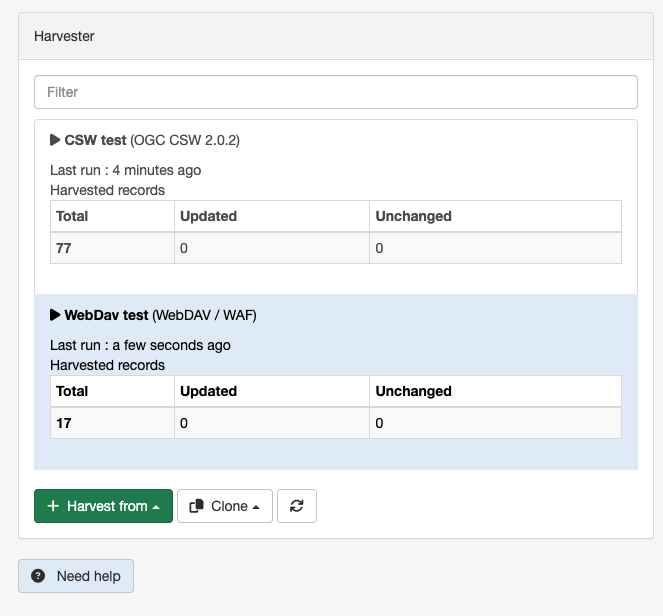
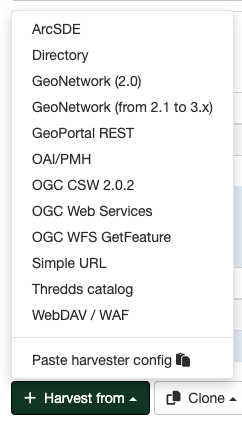
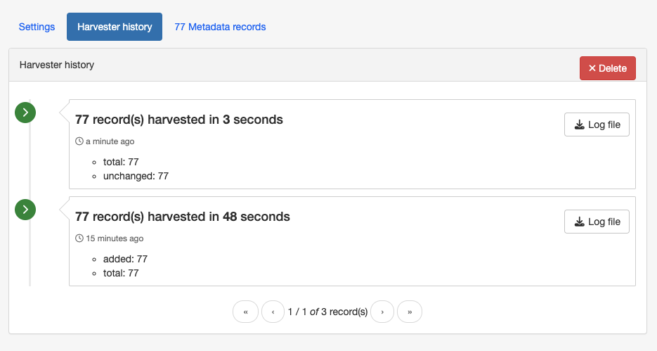
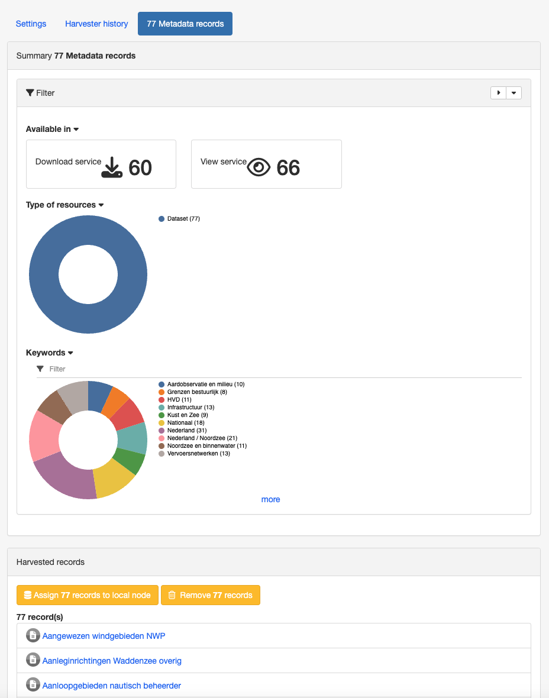

# Harvesting

Data discovery gets more interesting once multiple catalogs and services share their resources.

Harvesting is the process of ingesting metadata from remote sources and storing it locally in the catalog for fast searching. It is a scheduled process, so local copy and remote metadata are kept aligned.

The following sources can be harvested:

-   [GeoNetwork 2.1-3.X Harvester](harvesting-geonetwork.md)
-   [GeoNetwork 2.0 Harvester](harvesting-geonetwork-2.md)
-   [Harvesting CSW services](harvesting-csw.md)
-   [Harvesting OGC Services](harvesting-ogcwxs.md)
-   [Simple URL harvesting (opendata)](harvesting-simpleurl.md)
-   [Local File System Harvesting](harvesting-filesystem.md)
-   [WEBDAV Harvesting](harvesting-webdav.md)
-   [OAIPMH Harvesting](harvesting-oaipmh.md)
-   [Harvesting an ARCSDE Node](harvesting-sde.md)
-   [GeoPortal REST Harvesting](harvesting-geoportal.md)
-   [THREDDS Harvesting](harvesting-thredds.md)
-   [WFS GetFeature Harvesting](harvesting-wfs-features.md)
-   [SFTP Server Harvesting](harvesting-sftp.md)
-   [Database Harvesting](harvesting-database.md)

## Mechanism overview

The harvesting mechanism relies on the concept of a `universally unique identifier (UUID)`. This is a special id because it is not only unique locally to the node that generated it but it is globally unique. It is a combination of :

-   the network interface MAC address,
-   the current date/time
-   and a random number.

For every new record, a UUID is generated and assigned to it.

Another important concept behind the harvesting is the `last change date`. Every time you change a metadata record, the last change date is updated. Just storing this parameter and comparing it with a new one allows any system to find out if the metadata record has been modified since last update.

These two concepts allow catalogs to fetch remote metadata, check if it has been updated and remove it locally if it has been removed remotely. UUIDs also allowed cross catalog harvesting in case B harvests from C and A harvests from B.

## Harvesting life cycle

When a harvester is created, there is no harvested metadata. During the first run, all remote matching metadata are retrieved and stored locally. For some harvesters, after the first run, only metadata that has changed will be retrieved.

Harvested metadata are (by default) not editable for the following reasons:

1.  The harvesting is periodic so any local change to harvested metadata will be lost during the next run.
2.  The change date may be used to keep track of changes so if the metadata gets changed, the harvesting mechanism may be compromised.

Metadata properties (like categories, privileges etc\...) on harvested metadata records can be updated but will be updated on next run.

!!! note

    if you really want to edit harvested metadata records and aren't worried by the possible issues described above, there is now a configuration setting which will permit this. See [Metadata import](../../administrator-guide/configuring-the-catalog/system-configuration.md#editing_harvested_records) for more details.
    
    Another option would be to assign the harvested records to the local catalog and then modify them. For the time being, no interface allows to change record's source catalog.


The harvesting process goes on until one of the following situations arises:

1.  An administrator stops (deactivates) the harvester.
2.  An exception arises. In this case the harvester is automatically stopped.

When a harvester is removed, all metadata records associated with that harvester are removed.

## Multiple harvesting and hierarchies

Catalogues that use UUIDs to identify metadata records (eg. GeoNetwork) can be harvested several times without having to take care about metadata overlap.

As an example, consider the GeoNetwork harvesting type which allows one GeoNetwork node to harvest metadata records from another GeoNetwork node and the following scenario:

1.  Node (A) has created metadata (a)
2.  Node (B) harvests (a) from (A)
3.  Node (C) harvests (a) from (B)
4.  Node (D) harvests from both (A), (B) and (C)

In this scenario, Node (D) will get the same metadata (a) from all 3 nodes (A), (B), (C). The metadata will flow to (D) following 3 different paths but thanks to its UUID only one copy will be stored. When (a) is changed in (A), a new version will flow to (D) but, thanks to the change date, the copy in (D) will be updated with the most recent version.

## Harvesting Fragments of Metadata to support re-use {#harvesting_fragments}

All the harvesters except for the THREDDS and OGC WFS GetFeature harvester create a complete metadata record that is inserted into or replaces an existing record in the catalog. However, it's often the case that:

-   the metadata harvested from an external source is really only one or more fragments of the metadata required to describe a resource such as a dataset
-   you might want to combine harvested fragments of metadata with manually entered or static metadata in a single record
-   a fragment of metadata harvested from an external source may be required in more than one metadata record

For example, you may only be interested in harvesting the geographic extent and/or contact information from an external source and manually entering or maintaining the remainder of the content in the metadata record. You may also be interested in re-using the contact information for a person or organisation in more than one metadata record.

To support this capability, both the WFS GetFeature Harvester and the THREDDS harvester, allow fragments of metadata to be harvested and linked or copied into a template record to create metadata records. Fragments that are saved into the GeoNetwork database are called subtemplates and can be used in more than one metadata record.

As shown above, an example of a metadata fragment is the gmd:contactInfo element of an iso19139 document. This element contains contact details for an individual or an organisation. If a fragment is stored in the GeoNetwork database as a subtemplate for a given person or organisation, then this fragment can be referenced in metadata records where this organisation or individual is specified using an XML linking mechanism called XLink.

## HTTPS support

Harvesting between GeoNetwork nodes may require the HTTPS protocol. If harvesting from an https GeoNetwork URL, the server will need to have a trusted certificate available in a JVM keystore accessible to the GeoNetwork node running the harvest.

If you don't have a trusted certificate in the JVM keystore being used by GeoNetwork, the harvester may issue an exception like this when you try to harvest from the https GeoNetwork:

``` text
javax.net.ssl.SSLHandshakeException:
   sun.security.validator.ValidatorException: PKIX path building failed:
   sun.security.provider.certpath.SunCertPathBuilderException:
   unable to find valid certification path to requested target

Caused by: sun.security.validator.ValidatorException:
   PKIX path building failed: sun.security.provider.certpath.SunCertPathBuilderException:
   unable to find valid certification path to requested target

Caused by: sun.security.provider.certpath.SunCertPathBuilderException:
   unable to find valid certification path to requested target
```

The server certificate for the GeoNetwork server being harvested needs to be added to the JVM keystore with [keytool](https://docs.oracle.com/en/java/javase/11/tools/keytool.html) in order to be trusted.

An alternative way to add the certificate is to use a script like:

``` bash
## JAVA SSL Certificate import script
## Based on original MacOs script by LouiSe@louise.hu : http://louise.hu
##
## Usage: ./ssl_key_import.sh <sitename> <port>
##
## Example: ./ssl_key_import.sh mail.google.com 443 (to read certificate from https://mail.google.com)

## Compile and start
javac InstallCert.java
java InstallCert $1:$2

## Copy new cert into local JAVA keystore
echo "Please, enter administrator password:"
sudo cp jssecacerts $JAVA_HOME/jre/lib/security/jssecacerts
# Comment previous line and uncomment next one for MacOs
#sudo cp jssecacerts /Library/Java/Home/lib/security/
```

To use the script, the Java compiler must be installed and the file [InstallCert.java](https://github.com/escline/InstallCert), must be downloaded and placed in the same directory as the script.

The script will add the certificate to the JVM keystore, if you run it as follows::

    $ ./ssl_key_import.sh https_server_name 443

## Harvesting page

To access the harvesting main page you have to be logged in with a profile `Administrator` or `UserAdmin`. From the `Admin console` menu, select the option `Harvesting`.

The page shows a list of the currently defined harvesters with information about the status of the harvesters:



The following information is shown for each harvester:

-   **Last run**: Date on which the harvester was last run.
-   **Total**: It is the total number of metadata found remotely. Metadata with the same id are considered as one.
-   **Updated**: Number of metadata that are present locally but needed to be updated because their last modification date was different from the remote one.
-   **Unchanged**: Number of local metadata that have not been modified. Its remote last modification date has not changed.

At the bottom of the harvester list there are the following buttons:

1. *Harvest from*: Allows you to select the type of harvester to create.
2. *Clone*: Creates a new harvester, using the information of an existing harvester.
3. *Refresh*: Refreshes the list of harvesters.

### Adding new harvesters

To add a new harvester, click on the `Harvest from` button. A drop-down list with all available harvesting protocols will appear.



You can choose the type of harvesting you want to do. Supported harvesters and details on what to do next can be found in the following sections.

### Harvester History {#harvest_history}

Each time a harvester is run, a log file is generated of what was harvested and/or what went wrong (e.g., an exception report). To view the harvester history, select a harvester in the harvester list and select the `Harvester history` tab on the harvester page:



Once the harvester history is displayed, it is possible to download the log file of the harvester run and delete the harvester history.

### Harvester records

When a harvester is executed, you can see the list of harvested metadata and some statistics about the metadata. Select a harvester in the list of harvesters and select the `Metadata records` tab on the harvester page:


