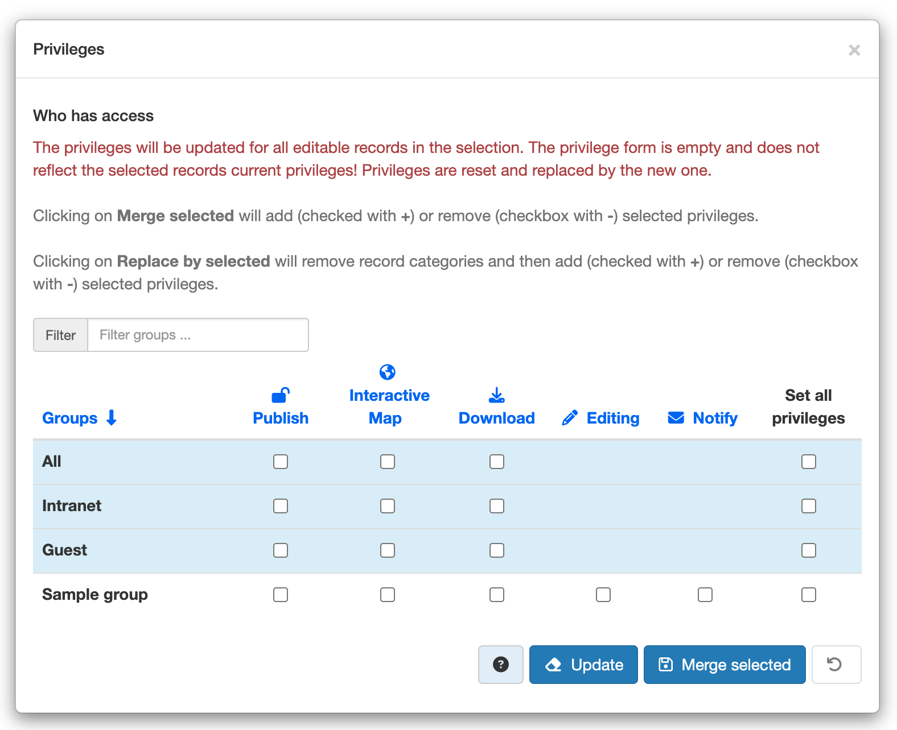

# Managing privileges

To manage privileges to your metadata record and any attached data, you will need to identify User Groups and the privileges you want to assign to users in these groups. eg. Viewing the metadata, downloading the data attached to the record, etc.

For example, you can specify that the metadata and related services are visible to all (Internet users) or just to internal users only (Intranet). Privileges are assigned on a per group basis. Depending on the user profile (Guest, Registered User, Editor, Admin etc.) access to these functions may differ on a per user basis.

!!! Note
  
    [System Privilege Groups](../../administrator-guide/managing-users-and-groups/creating-group.md#3-system-privilege-group) are special groups which cannot have privileges set for specific metadata records.

## Assigning privileges

To assign privileges, follow these steps:

1.  Find your metadata record using the search option. Whether you have multiple or single results from the search, on top of the individual record or next to the record you will always see a row of buttons including a Privileges button.
2.  Click the Privileges button. A drop down menu appears. You can assign certain privileges to specific groups using checkboxes.
3.  Click the small box next to the privilege to place or remove a checkmark. The Set All and Clear All buttons allow you to place and remove the checkmarks all at once.

Below is a brief description for each privilege to help you identify which ones you should assign to which group(s).

**Publish**: Users in the specified group/s are able to view the metadata eg. if it matches search criteria entered by such a user.

**Interactive Map**: Users in the specified group/s are able to get an interactive map. The interactive map has to be created separately using a Web Map Server such as GeoServer, which is distributed with GeoNetwork.

**Download**: Users in the specified group/s are able to download the data.

**Editing**: Users in the specified group/s are able to edit the metadata, if they have the *editor* profile.

**Notify**: Users in the specified group receive notification if data attached to the metadata record is downloaded.

Review and make sure that you understand [Users, Groups and Roles](../../administrator-guide/managing-users-and-groups/index.md#user_profiles) in the User and Group Administration section of this manual.

!!! note

    A public metadata record is a metadata record that has the view privilege for the group named "All".

The following rules apply to Viewing and Editing permissions on a metadata record:

## Viewing

An *administrator* can view any metadata.

A *content reviewer* can view a metadata if:

-   The metadata is public or
-   The metadata is part of a group that the user is a member of.

A *user administrator* or an *editor* can view:

-   All metadata that has the view privilege selected for one of the groups they are a member of.
-   All metadata created by them.

A *registered user* can view:

-   All metadata that has the view privilege selected for one of the groups they are a member of.

Any user (logged in or not) can view the public metadata.

## Editing

An *administrator* can edit any metadata.

A *reviewer* / *editor* can edit a metadata if:

* They are the metadata owner.

* The metadata has editing privilege in the group(s) where the user is a *reviewer* / *editor*.

# Setting Privileges

## Setting Privileges on a metadata record

A button to access the Privileges page for a metadata record displays in the search results or when you are viewing the record for:

-   All Administrators
-   All Reviewers that are member of one of the groups assigned to the metadata owner.
-   The Owner of the metadata

Only Administrators and Reviewers can edit privileges for the All and Intranet groups.

## Setting Privileges on a selected set of metadata records

You can set privileges on a selected set of records in the search results using the "actions on selected set" menu.

The following rules apply:

-   If the "[Only set privileges to user's groups](../../administrator-guide/configuring-the-catalog/system-configuration.md#metadata-privileges)" setting is set, only the groups the user is a member of will be shown in the list.
-   [System Privilege Groups](../../administrator-guide/managing-users-and-groups/creating-group.md#3-system-privilege-group) are not shown
-   the privileges specified will only be applied to records that the user has ownership or administration rights on - any other records will be skipped
-   the current records privileges will be reset and replaced by the selected privilege
