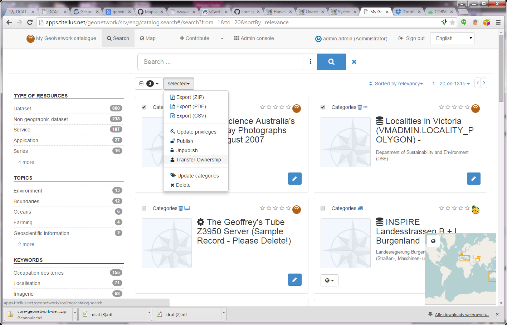
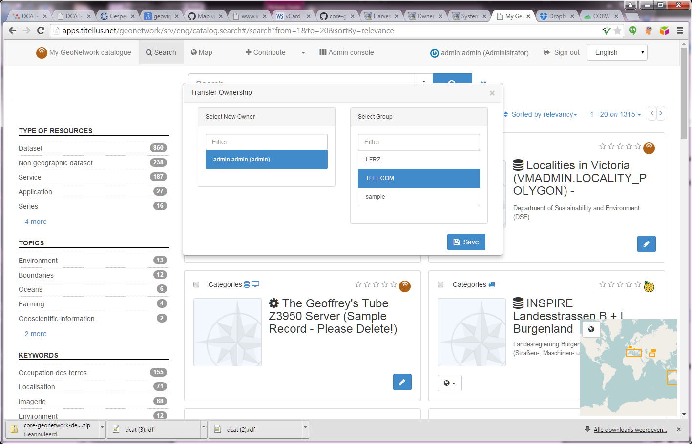

# Transferring privileges

## Transfer Ownership

When you need to transfer metadata ownership from one user to another for all or specific metadata records, use the *Transfer Ownership* option.

How to open the Transfer Ownership page

1.  From the "actions on selected set" in the search, the Portal displays the following panel.

    

    The Transfer Ownership panel

    -  **Select New Owner**: Select a user in this auto-complete.

    !!! note

        The drop down is filled with all Editors visible to you. If you are not an Administrator, you will view only a subset of all Editors.

    -   **Select group**: Select one of the groups this user is a member of. Privileges to groups All and Intranet are not transferable.
