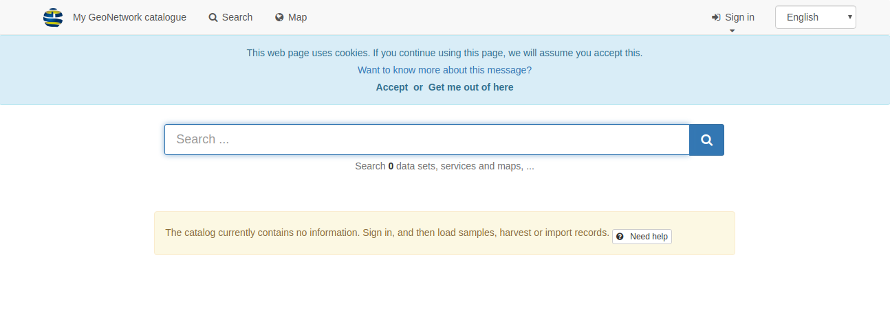
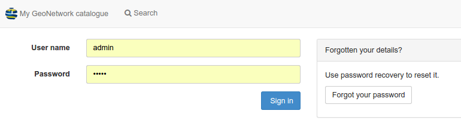
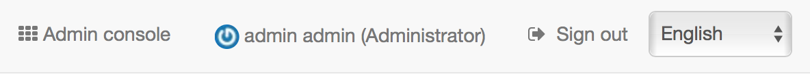
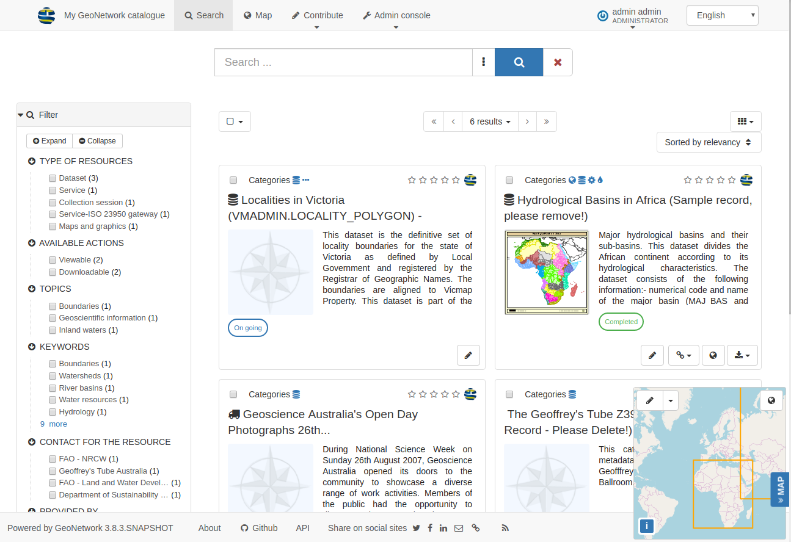
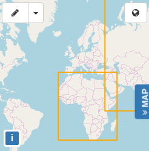
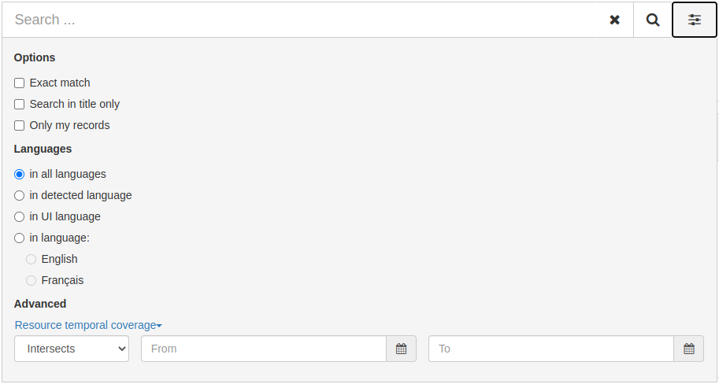
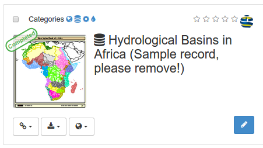
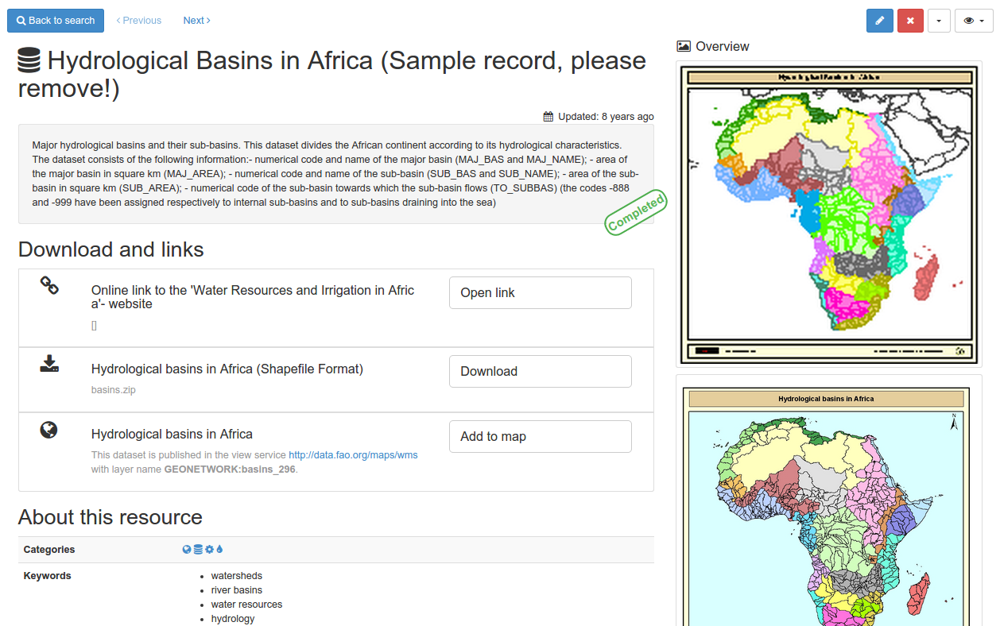
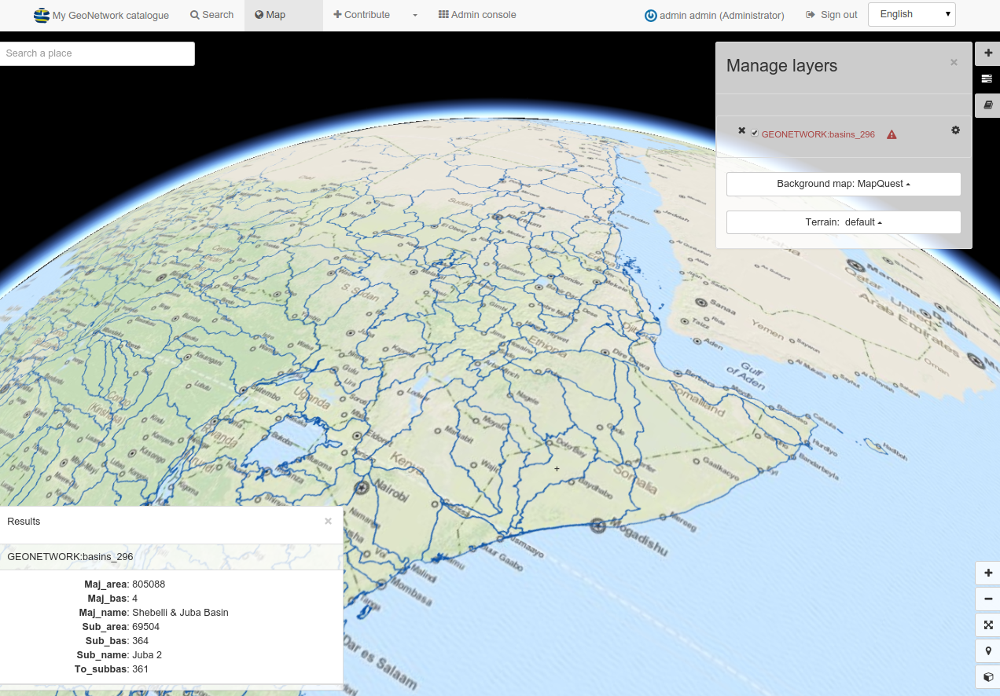

# Quick start {#quick_start}

GeoNetwork is a catalog application to manage spatially referenced resources. It provides powerful metadata editing and search functions as well as an interactive web map viewer. It is currently used in numerous Spatial Data Infrastructure initiatives across the world.

This Quick Start also describes:

-   some of the different ways you can search for spatial data
-   how to download and display data from the search results

## Starting the catalog

This topic describes how to start GeoNetwork after installation on your machine.

**Before you start:**

Ensure you have successfully installed GeoNetwork using the steps described in `Installing the application`.

To start the catalog:

1.  From your GeoNetwork folder location, open the bin folder and double-click start.bat (on windows) or startup.sh (on linux). This initiates a web service for GeoNetwork, which you can use to view the catalog.

    Tip: If you are using the command line, you can view the log messages directly in the console.

2.  Open a web browser and go to the GeoNetwork homepage. If you installed it on your computer, use this link ``http://localhost:8080/geonetwork``.

3.  The GeoNetwork catalog page is displayed.

    

4.  Once you have started the catalog, you can sign in to view additional options, search for specific resources or drill down to view detailed information about the resource.

## Signing in and load templates

This topic describes how to sign in using your admin login details and load templates to view examples of resources in the GeoNetwork catalog.

1.  On the GeoNetwork home page, from the top menu, click `Sign in` to connect as administrator. The Sign in page displays.

    

2.  Enter the username and password and click Sign in. The default admin account details are: username `admin` with password `admin`. After you sign in, the top toolbar displays an `admin console` and your login details.

    

3.  Navigate to `admin console` and click on `metadata and templates`:

    

4.  On the Metadata & templates page, select all standards from the Standards available list, and:

    a.  Click `load samples`, and
    b.  Click `load templates` to load examples.

    

5.  From the top menu, click Search to view the examples:

    

## Searching information

You can use the Search form to search information using the GeoNetwork catalog. The Search form allows you to search using:

-   A full text search box providing suggestions. Enter the desired keywords and search terms into the **Search** box and click the **Search** icon or press ++Enter++. The search results are displayed in a list. Note that the entire content of the record is searched, not just the titles and description.

    

    The wildcard `*` is used to match the start or end of word; for example, if you search for `Area*`,  you will search for results that contain words beginning with the text `Area`. Wildcards can also be used multiple times to search for part of a word.

-   Facets which defines groups that you can click to browse the content of the catalog

    

-   Spatial filtering to choose information in specific areas

    

-   Advanced search options are located in the last menu item of the **Search** field.
    - Allows you to configure the search behaviour, such as:
        - Exact match: search for exact matches of the search terms. For example, if you search for multiple words, the search will return only records that contain all of the words in the same order as you entered them.
        - Search in title only: searches for the search terms only in the title of the records.
        - Only my records: searches for records that you have created.
    
    - Define the languages to search in.
    - Filter by date range: allows you to search for records that were created or modified within a specific date range.

    

## Discovering information

Search results display main information about each resources: title, abstract, categories, status, overview and links.

To view detailed information about the resources, click the record. These details include:

-   Download and links

-   About the resource

-   Technical information

-   Metadata details

    

-   To get more information, switch the advanced view mode.

-   To update the record, click Edit.

From the results or the record view, you can add WMS layers referenced in a metadata record on the map. Using the map, you can:

-   Visualize your data,

-   Choose your background maps,

-   Query objects,

-   Display on a 3D globe

    

Read more about use of the [Maps and dataset visualisation](../map/index.md)

## Upgrading from GeoNetwork 3 Guidance
   
!!! warning

    Permalink to search page from GeoNetwork 3.x will need to be updated to work with 4.x. 

If you have linked to search results please be advised that some of the URL parameters have changed and you should test and recreate these URLs.

* The catalog services does not provide **permalink** to search results.
* URLs created with ***GeoNetwork 3.x*** search results are not intended to work with ***GeoNetwork 4.x***.

* The use of a new search engine has resulted in changes to the URL parameter names and facets:
  
  Very simple text query:
  
   * GeoNetwork 3: ``http://localhost:8080/geonetwork/srv/eng/catalog.search#/search?any=road``
   * GeoNetwork 4: ``http://localhost:8080/geonetwork/srv/eng/catalog.search#/search?any=road``

  The use of a new search engine has resulted in changes to the URL parameter names and facets:
   
   * GeoNetwork 3: ``http://localhost:8080/geonetwork/srv/eng/catalog.search#/searchsrv/eng/catalog.search#/search?resultType=details&sortBy=changeDate&any=road&fast=index&_content_type=json&from=1&to=20``
   * GeoNetwork 4: ``http://localhost:8080/geonetwork/srv/eng/catalog.search#/search?isTemplate=n&resourceTemporalDateRange=%7B%22range%22:%7B%22resourceTemporalDateRange%22:%7B%22gte%22:null,%22lte%22:null,%22relation%22:%22intersects%22%7D%7D%7D&sortBy=dateStamp&sortOrder=desc&any=road&from=1&to=20``
