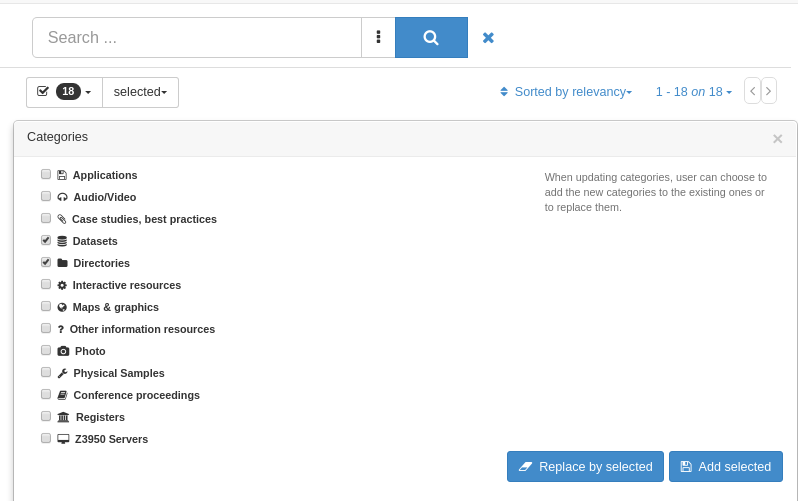
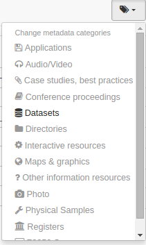

# Tagging with categories

A catalog can define a set of categories that can be used to classify metadata records for easy searching or management purposes (see [Managing categories](../../administrator-guide/managing-classification-systems/managing-categories.md)). Categories are added to the metadata records itself and cannot be exported when the record is harvested (eg. when using CSW protocol). If the category needs to be propagated with the metadata, use other harvesting protocols (eg. GeoNetwork) or use keywords (see [Tagging with keywords](tagging-with-keywords.md)).

There are two ways to assign categories to a metadata record:

-   Search records, select one or more record and choose the `Update categories` on the selection.
-   Using the tag selection category, you can either replace categories or add new ones.

-   Search the metadata record, open the editor and click on the `Categories` button. A drop down menu will appear.
-   Using the Change metadata categories dropdown, to assign one or more categories, select relevant checkboxes.

