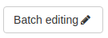
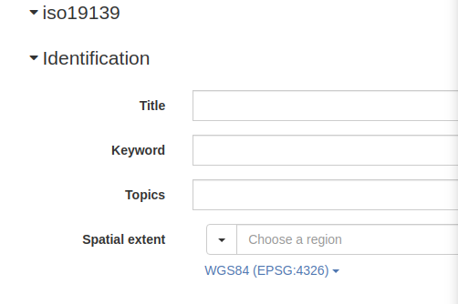
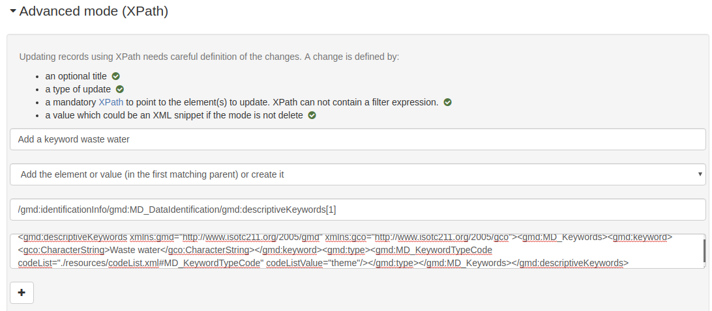
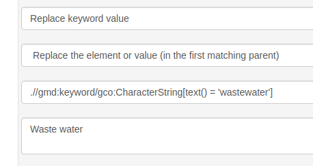
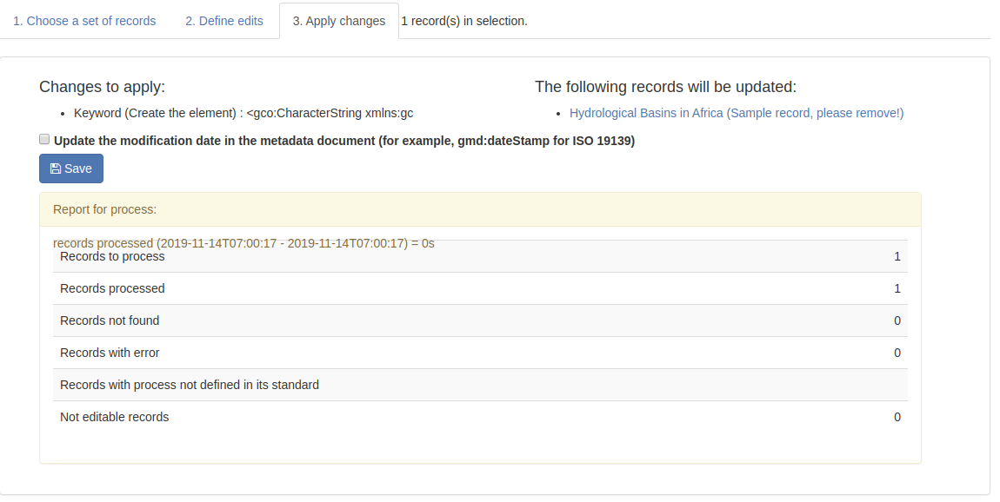

# Updating a set of records {#batchediting}

From the editor board, editors can do batch editing on multiple records.



Batch editing consists of 3 steps:

-   Choose a set of records
-   Define edits
-   Apply changes

## Defining edits

**Warning: You can break things here. When defining xpath and using delete or replace mode, be sure to test on a single record before applying changes to a lot of records. If needed, back up your record first.**

Changes are defined on a per standard basis. A set of default fields to edit is available (and can be extended in the `config-editor.xml` file of the standard).



An advanced mode is also available to define custom edits. The advanced mode consists of:

-   an optional title
-   a type of update (`gn_add`, `gn_create`, `gn_replace`, `gn_delete`)
-   a mandatory XPath to point to the element(s) to update. The XPath may contain a filter expression.
-   a value, which could be an XML snippet or a text string if the mode is not `delete`.



To add an element, eg. add a new keyword section in first position:

``` json
[{
  "xpath": "/gmd:identificationInfo/gmd:MD_DataIdentification/gmd:descriptiveKeywords[1]",
  "value": "<gn_add><gmd:descriptiveKeywords xmlns:gmd=\"http://www.isotc211.org/2005/gmd\" xmlns:gco=\"http://www.isotc211.org/2005/gco\"><gmd:MD_Keywords><gmd:keyword><gco:CharacterString>Waste water</gco:CharacterString></gmd:keyword><gmd:type><gmd:MD_KeywordTypeCode codeList=\"./resources/codeList.xml#MD_KeywordTypeCode\" codeListValue=\"theme\"/></gmd:type></gmd:MD_Keywords></gmd:descriptiveKeywords></gn_add>"
}]
```

To remove an element, eg. remove all online resource having a protocol `OGC:WMS`:

``` json
[{
  "xpath": ".//gmd:onLine[*/gmd:protocol/*/text() = 'OGC:WMS']",
  "value":"<gn_delete></gn_delete>"
}]
```

To replace an element, eg. replacing a keyword value:

``` json
[{
  "xpath":".//gmd:keyword/gco:CharacterString[text() = 'wastewater']",
  "value":"<gn_replace>Waste water</gn_replace>"
}]
```



## Applying changes

When applying changes, user privileges apply, so if the user cannot edit a selected record, batch edits will not be applied to that record.

The batch edit report explains how many records were processed:



Batch editing can also be applied using the API: ``doc/api/index.html#/records/batchEdit>``

## Examples

### Add a new keyword sections in identification

-   Mode: Add

-   XPath (the parent element of the XML snippet to add). The XML is inserted in the position defined in the XSD.

    ``` xslt
    .//srv:SV_ServiceIdentification
    ```

-   XML

    ``` xml
    <mri:descriptiveKeywords xmlns:mri="http://standards.iso.org/iso/19115/-3/mri/1.0"
                             xmlns:gcx="http://standards.iso.org/iso/19115/-3/gcx/1.0"
                             xmlns:xlink="http://www.w3.org/1999/xlink">
      <mri:MD_Keywords>
        <mri:keyword>
          <gcx:Anchor xlink:href="http://inspire.ec.europa.eu/metadata-codelist/SpatialDataServiceCategory/infoMapAccessService">Service d’accès aux cartes</gcx:Anchor>
        </mri:keyword>
      </mri:MD_Keywords>
    </mri:descriptiveKeywords>
    ```

### Replace a keyword section encoded using a CharacterString to an Anchor

-   Mode: Replace

-   XPath (the parent element of the XML snippet to insert)

    ``` xslt
    .//mri:descriptiveKeywords[*/mri:keyword/gco:CharacterString/text() = 'infoMapAccessService']
    ```

-   XML

    ``` xml
    <mri:MD_Keywords  xmlns:cit="http://standards.iso.org/iso/19115/-3/cit/2.0"
                      xmlns:mri="http://standards.iso.org/iso/19115/-3/mri/1.0"
                      xmlns:mcc="http://standards.iso.org/iso/19115/-3/mcc/1.0"
                      xmlns:gco="http://standards.iso.org/iso/19115/-3/gco/1.0"
                      xmlns:gcx="http://standards.iso.org/iso/19115/-3/gcx/1.0"
                      xmlns:xlink="http://www.w3.org/1999/xlink">
      <mri:keyword>
        <gcx:Anchor xlink:href="http://inspire.ec.europa.eu/metadata-codelist/SpatialDataServiceCategory/infoMapAccessService">Service d’accès aux cartes</gcx:Anchor>
      </mri:keyword>
      <mri:type>
        <mri:MD_KeywordTypeCode codeList="http://standards.iso.org/iso/19115/resources/Codelists/cat/codelists.xml#MD_KeywordTypeCode"
                                 codeListValue="theme"/>
      </mri:type>
      <mri:thesaurusName>
         <cit:CI_Citation>
            <cit:title>
               <gcx:Anchor xlink:href="http://inspire.ec.europa.eu/metadata-codelist/SpatialDataServiceCategory#">Classification of spatial data services</gcx:Anchor>
            </cit:title>
            <cit:date>
               <cit:CI_Date>
                  <cit:date>
                     <gco:Date>2008-12-03</gco:Date>
                  </cit:date>
                  <cit:dateType>
                     <cit:CI_DateTypeCode codeList="http://standards.iso.org/iso/19115/resources/Codelists/cat/codelists.xml#CI_DateTypeCode"
                                          codeListValue="publication"/>
                  </cit:dateType>
               </cit:CI_Date>
            </cit:date>
            <cit:identifier>
               <mcc:MD_Identifier>
                  <mcc:code>
                     <gcx:Anchor xlink:href="http://metawal.wallonie.be/geonetwork/srv/fre/thesaurus.download?ref=external.theme.httpinspireeceuropaeumetadatacodelistSpatialDataServiceCategory-SpatialDataServiceCategory">geonetwork.thesaurus.external.theme.httpinspireeceuropaeumetadatacodelistSpatialDataServiceCategory-SpatialDataServiceCategory</gcx:Anchor>
                  </mcc:code>
               </mcc:MD_Identifier>
            </cit:identifier>
         </cit:CI_Citation>
      </mri:thesaurusName>
    </mri:MD_Keywords>
    ```

### Remove a keyword block

-   Mode: Remove

-   XPath (the second descriptiveKeywords block corresponding to a thesaurus 'Champ géographique')

    ``` xslt
    (.//mri:descriptiveKeywords
        [*/mri:thesaurusName/*/cit:title/gcx:Anchor = 'Champ géographique'])[2]
    ```

-   XML (N/A)

### Remove a keyword

-   Mode: Remove

-   XPath (All keyword with value 'IDP_reference')

    ``` xslt
    .//gmd:keyword[*/text() = 'IDP_reference']
    ```

-   XML (N/A)

### Remove associatedResource with a type partOfSeamlessDatabase only if it is a serie

-   Mode: Remove

-   XPath

    ``` xslt
    .[mdb:metadataScope/*/mdb:resourceScope/*/@codeListValue = 'series']//mri:associatedResource[*/mri:associationType/*/@codeListValue = "partOfSeamlessDatabase"]
    ```

-   XML (N/A)
