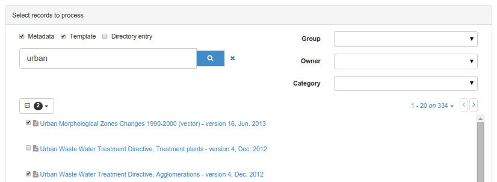
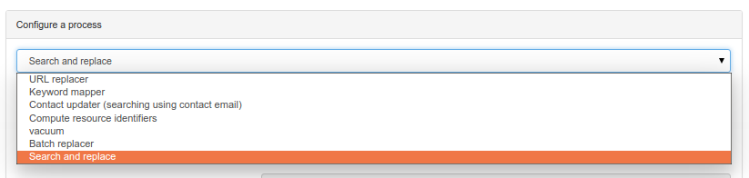
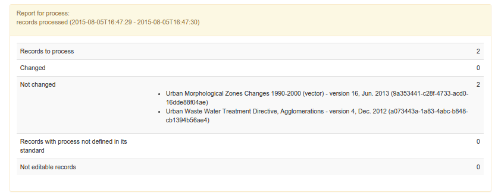
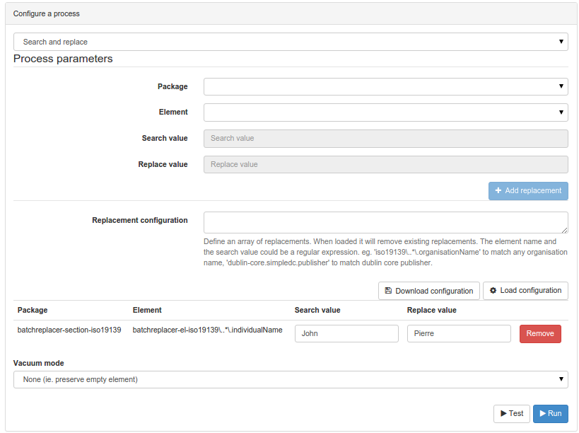
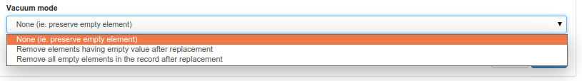

# Updating a set of records from the admin console {#batchupdate_from_admin}

In some circumstances, users may want to update a set of records. Administrator users can, from the `admin console`, open the `tools`, `Batch process` page.

From this page, user can:

-   Select a set of records by running a search and selecting records to modify

    

-   Choose a process from the list

    

!!! info "See Also"

    New process can be added. See [Adding batch process](batchupdate-xsl.md#batch-process-add).


-   Define process parameters (if any)
-   Run the process and follow the progress.

Process can only be applied to records that current user can edit. If not, then the non editable record is ignored and the process continue. The report contains the following information:

-   Number of records to process
-   Number of records affected by the process
-   Number of records unchanged (for search and replace process)
-   Number of records for which the process was not found (process depends on the standard, and may not exists depending on the standard).
-   Number of records that current user can't edit



Before running a process, it is recommended to make a backup of all metadata records to be updated in case something goes wrong with the process.

!!! info "Todo"

    Document other processes


## Search and replace

This process search values in elements and replace by other values. It supports ISO19139 and Dublin Core records. The configuration is the following:



-   Select a package (ISO19139 or Dublin Core)
-   Choose an element from that package to replace (the one preconfigured is about contact but can be extended - see below)
-   Define the search value
-   Define the replacement
-   Click `Add replacement`

Multiple replacements can be configured and added. Once the configuration done, user can save the configuration by clicking `Download configuration`. The configuration is downloaded as JSON format and can be updated and reloaded later by copy/paste in the replacement configuration textarea and by clicking `Load configuration`.

Sample configuration:

``` json
[{
  "package":"iso19139",
  "element":"iso19139\\..*\\.individualName",
  "searchval":"John",
  "replaceval":"Pierre"
  }]
```

In the configuration, the `element` define the target element in the metadata record. It starts with the schema identifier and then define a path to the element. This is a regular expression and could use `.*` for matching all elements wherever in the document. To match a more specific element, user can defined complete path like `iso19139\\.contact\\.individualName` to match only the metadata contact individual name.

The `searchval` is also a [regular expression](https://www.regular-expressions.info/tutorial.html). It could be simple text or more advanced expression. For example with catching groups, searching for `(.*)` and replacing by `Mr $1` will replace `John` by `Mr John`.

The last parameter is the vacuum mode defining what to do with empty elements:



After the configuration done, user can preview the changes by clicking the `Test` button and then apply the changes with `Run`
