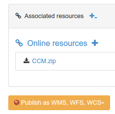
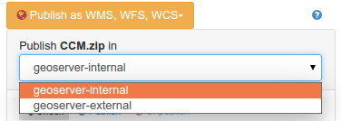
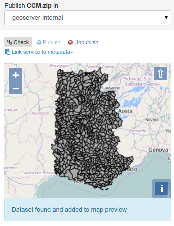
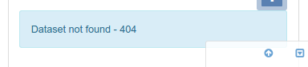
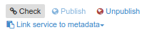

# Publishing GIS data in a map server {#geopublication-usage}

This topic describes how to publish GIS data in a map server.

## Before you begin

-   The catalog administrator needs to configure connection to map servers in the administration interface (see [Map servers configuration for geopublication](../../administrator-guide/configuring-the-catalog/map-server-configuration.md)).
-   The editors reference GIS files or spatial database tables in the metadata record (see [Linking a database table or a GIS file on the network](../associating-resources/linking-online-resources.md#linking-online-resources-georesource)).

To publish data from the metadata editor in a remote map server:

1.  When a spatial resource is detected and one or more map servers are configured, the geopublication wizard is available in the metadata editor.

    

2.  Choose a resource from the list to display the wizard. The wizard display the list of map servers available:

    

3.  Choose the server you want to publish the data in. When selected, the catalog will check if the dataset is already published.

    If found, it is added to the map.

    

    If not, a status message indicates that the dataset is not available.

    

4.  From the menu, control the publication process:

    

    -   Click the `check` button to verify that the dataset is already published in the selected map server.
    -   Click the `publish` button to register the data on the selected map server.
    -   Click the `unpublish` button to unregister the data on the selected map server.
    -   Click the `link service to metadata` button to add links to the OGC service in the current metadata record for the published layer.

## Next steps

Once you have registered a WMS layer in a metadata record, you can generate an overview using the service (see [Generating a thumbnail using WMS layers](../associating-resources/linking-thumbnail.md#linking-thumbnail-from-wms)).
