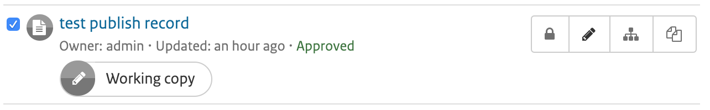

# Life cycle

## Record life cycle

Metadata records have a lifecycle that typically goes through one or more states. For example, when a record is:

-   created and edited by an `Editor` it is in the `Draft` state.
-   being reviewed by a `content reviewer`, or a review is requested brings the record to `Submitted` state.
-   completed and corrected by the `Content Reviewer` it is in the `Approved` state.
-   superseded or replaced the state is `Retired`.

The catalog has (an extensible) set of states that a metadata record can have:

-   `Unknown` - this is the default state - nothing is known about the status of the metadata record.
-   `Draft` - the record is under construction or being edited.
-   `Submitted` - the record has been submitted for approval to a content review.
-   `Approved` - the content reviewer has reviewed and approved the metadata record.
-   `Rejected` - the content reviewer has reviewed and rejected the metadata record.
-   `Retired` - the record has been retired.

Workflow can be enabled for the full catalogue, certain groups or on an individual record level.

In the last case, to enable workflow and change the status from `Unknown` to `Draft`, click the `enable workflow` button in the metadata view:


!!! note

    To use the workflow for metadata records created before enabling it, you must use the above option.


To enable workflow for the full catalogue or certain groups, check Administration --> Settings --> Metadata Workflow. In workflow mode, in case approved records are modified, you're working on a copy of the approved record. Changes on the record will not be visible to users outside your group until the modified record is approved again.

When done editing you can submit a record for review by a content reviewer. The submit button is available on the `manage record` menu in the metadata view. A popup will open in which you can leave a message for the content reviewer.


A user with role content reviewer is able to submit a record, instantly approve a record (without submission) or approve a record which has been submitted for review. During the review process a content reviewer may benefit from the version history option, which shows the differences between the different versions of the record. As part of the approval process, the content reviewer can also set the level of access to the record, an option is to set the access level to public (visible to all).


Notifications will be sent to editors and content reviewers indicating the status changes on the record involved, so users can easily act when action is required.

In the metadata dashboard you can see which records are currently being updated or reviewed. A label is displayed indicating a 'working copy' is available for that record. You can click the label to visit the work in progress.



## Status actions

There are two status change action hooks (in Java) that can be used by sites to provide specific behaviour:

-   `statusChange` - This action is called when status is changed by a user eg. when `Draft` records are set to `Submitted` and could be used for example to send notifications to other users affected by this change.
-   `onEdit` - This action is called when a record is edited and saved and could be used for example to reset records with an `Approved` status to `Draft` status.

A default set of actions is provided. These can be customized or replaced by sites that wish to provide different or more extensive behaviour.

A default pair of metadata status change actions defined in Java is provided with GeoNetwork using the class org.fao.geonet.services.metadata.DefaultStatusActions.java (see `core/src/main/java/org/fao/geonet/kernel/metadata/DefaultStatusActions.java`).

### When a status changes

This action is called when status is changed by a user. What happens depends on the status change taking place:

-   when an `Editor` changes the state on a metadata record(s) from `Draft` or `Unknown` to `Submitted`, the Content Reviewers from the groupOwner of the record are informed of the status change via email which looks like the following. They can log in and click on the link supplied in the email to access the submitted records. Here is an example email sent by this action:

    ``` text
    Date: Tue, 13 Dec 2011 12:58:58 +1100 (EST)
    From: Metadata Workflow <feedback@localgeonetwork.org.au>
    Subject: Metadata records SUBMITTED by userone@localgeonetwork.org.au (User One) on 2011-12-13T12:58:58
    To: "reviewer@localgeonetwork.org.au" <Reviewer@localgeonetwork.org.au>
    Reply-to: User One <userone@localgeonetwork.org.au.au>
    Message-id: <1968852534.01323741538713.JavaMail.geonetwork@localgeonetwork.org.au>

    These records are complete. Please review.

    Records are available from the following URL:
    http://localgeonetwork.org.au/geonetwork/srv/en/main.search?_status=4&_statusChangeDate=2011-12-13T12:58:58
    ```

-   when a `Content Reviewer` changes the state on a metadata record(s) from `Submitted` to `Accepted` or `Rejected`, the owner of the metadata record is informed of the status change via email. The email received by the metadata record owner looks like the following. Again, the user can log in and use the link supplied in the email to access the approved/rejected records. Here is an example email sent by this action:

    ``` text
    Date: Wed, 14 Dec 2011 12:28:01 +1100 (EST)
    From: Metadata Workflow <feedback@localgeonetwork.org.au>
    Subject: Metadata records APPROVED by reviewer@localgeonetwork.org.au (Reviewer) on 2011-12-14T12:28:00
    To: "User One" <userone@localgeonetwork.org.au>
    Message-ID: <1064170697.31323826081004.JavaMail.geonetwork@localgeonetwork.org.au>
    Reply-To: Reviewer <reviewer@localgeonetwork.org.au>

    Records approved - please resubmit for approval when online resources attached

    Records are available from the following URL:
    http://localgeonetwork.org.au/geonetwork/srv/en/main.search?_status=2&_statusChangeDate=2011-12-14T12:28:00
    ```

### When editing

This action is called when a record is edited and saved by a user. If the user did not indicate that the edit changes were a `Minor edit` and the current status of the record is `Approved`, then the default action is to set the status to `Draft`.

## Changing the status actions

These actions can be replaced with different behaviours by:

-   writing Java code in the form of a new class that implements the interface defined in `org.fao.geonet.services.metadata.StatusActions.java` and placing a compiled version of the class in the GeoNetwork class path
-   defining the name of the new class in the statusActionsClass configuration parameter in `web/geonetwork/WEB-INF/config.xml`
