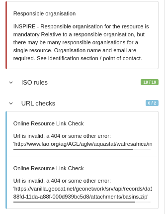
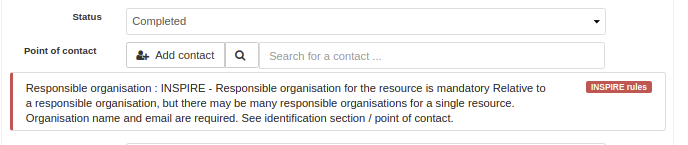
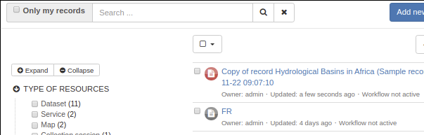

# Validating records {#validation}

#\. In the metadata editor, click Validate to trigger the validation. The right panel displays all validation results by levels:

#\. Click the thumbs up or down icons to display errors. Errors reported in blue are for information only and do not affect the global validation of the record:

The editor also reports error messages where applicable (as all error messages cannot be shown in the editor):

1.  Once a record is validated, the validation status is saved and is displayed in the editor board page:

You can filter the Validation status using a facet in the editor board.

## Configuring validation

Catalog administrators can force validation every time an editor exits or closes the metadata editing interface (see [system-configuration](system-configuration.md)). To configure validation levels (see [configure-validation](configure-validation.md)). In case of INSPIRE records, you can use remote validator (see [inspire-validation](inspire-validation.md))
