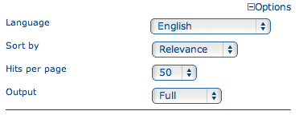

.. _multilingual:

Multilingual search
===================

Introduction
------------

GeoNetwork supports *multilingual* search. Depending on the configuration, this influences which search results are returned and how they are presented:

*Enable auto-detecting search request language:* If this option is selected, Geonetwork will analyse the search query and attempt to detect the language that is used before defaulting to the GUI language.

*Search only in requested language* The options in this section determines how documents are sorted/prioritised relative to the language in the document compared to the search language.

- *All documents in all languages (No preferences)* - The search language is ignored and will have no effect on the ordering of the results

- *Prefer documents with translations requested language* - Documents with a translation in the search language (anywhere in the document) will be prioritized over documents without any elements in the search language

- *Prefer documents whose language is the requested language* - Documents that are the same language as the search language (IE the documents that are specified as being in the same language as the search language) or prioritized over documents that are not.

- *Translations in requested language* - The search results will only contain documents that have some translations in the search language.  

- *Document language is the requested language* - The search results will contain documents whose metadata language is specified as being the in search language

Administrator users can change these settings in the System Configuration page:

.. figure:: requested-language-behaviour.png

Requested language
-----------------------

The requested language is determined as follows (in this order):

- request parameter: in the GUI, the user may select a language:

 For XML searches, the client may add::

    <requestedLanguage>language-code</requestedLanguage>

where language-code is one of the ISO 639-2 (three-character) language codes, see http://www.loc.gov/standards/iso639-2/php/code_list.php.

- if the request parameter is not sent (the user selected "any" language, or it's not in the XML request), the requested language may be automatically detected, if an Administrator user has enabled this in the System Configuration:

The auto-detection feature uses Language Detection Library for Java, see https://code.google.com/p/language-detection/. This library tries to detect the language of search terms in parameter 'any'. This may not work very well, depending on the language, if there is only one or very few search terms. This is why this feature is disabled by default. At the time of writing the auto-detection supports these languages:

    - Afrikaans
    - Arabic
    - Bulgarian
    - Bengali
    - Czech
    - Danish
    - German
    - Greek (modern)
    - English
    - Spanish
    - Estonian
    - Persian
    - Finnish
    - French
    - Gujarati
    - Hebrew
    - Hindi
    - Croatian
    - Hungarian
    - Indonesian
    - Italian
    - Japanese
    - Kannada
    - Korean
    - Lithuanian
    - Latvian
    - Macedonian
    - Malayalam
    - Marathi
    - Nepali
    - Dutch
    - Norwegian
    - Punjabi
    - Polish
    - Portuguese
    - Romanian
    - Russian
    - Slovak
    - Slovenian
    - Somali
    - Albanian
    - Swedish
    - Swahili
    - Tamil
    - Telugu
    - Thai
    - Tagalog
    - Turkish
    - Ukrainian
    - Urdu
    - Vietnamese
    - Chinese (traditional)
    - Chinese (simplified)

- if autodetecting the language is disabled (the default), the current language of the user's GUI is used as the requested language

- if there is no GUI, the requested language is hardcoded to be English

Stopwords
------------------------
Stopwords are words that are considered to carry little or no meaning relevant to search. To improve relevance ranking of search results, stopwords are often removed from search terms. In GeoNetwork stopwords are automatically used if a stopwords list for the requested language is available; if not, no stopwords are used. At the time of writing there are stopword lists for:

    - Arabic
    - Bulgarian
    - Bengali
    - Catalan
    - Czech
    - Danish
    - German
    - Greek (modern)
    - English
    - Spanish
    - Persian
    - Finnish
    - French
    - Hindi
    - Hungarian
    - Italian
    - Japanese
    - Korean
    - Marathi
    - Malay
    - Dutch
    - Norwegian
    - Polish
    - Portuguese
    - Romanian
    - Russian
    - Swedish
    - Turkish
    - Chinese

System administrators may add additional languages' stopword lists by placing them in the directory <geonetwork>/web/resources/stopwords. The filenames should be <ISO 639-2 code>.txt. If you do add a stopwords list for another language, please consider contributing it for inclusion in GeoNetwork.

Likewise, to disable stopwords usage for one or more languages, the stopword list files should be removed or renamed.
