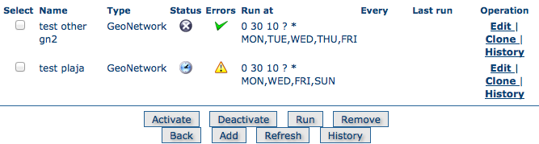
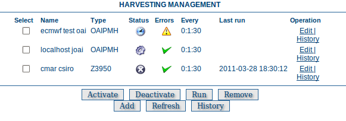
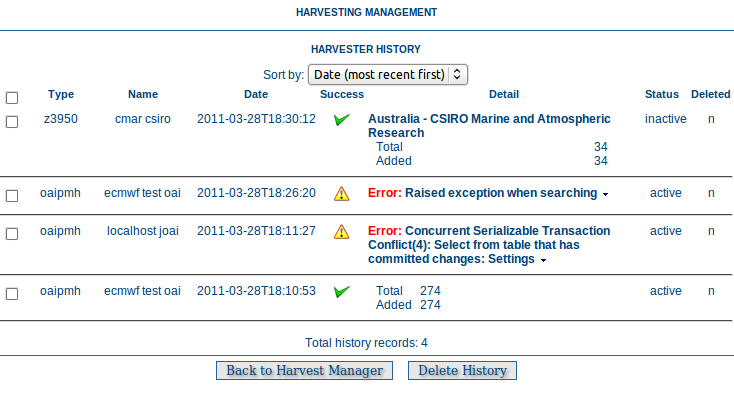

# Harvesting

There has always been a need to share metadata between GeoNetwork nodes and bring metadata into GeoNetwork from other sources eg. self-describing web services that deliver data and metadata or databases with organisational metadata etc.

Harvesting is the process of collecting metadata from a remote source and storing it locally in GeoNetwork for fast searching via Lucene. This is a periodic process to do, for example, once a week. Harvesting is not a simple import: local and remote metadata are kept aligned.

GeoNetwork is able to harvest from the following sources (for more details see below):

> 1.  Another GeoNetwork node (version 2.1 or above). See [GeoNetwork Harvesting](gn/index.md)
> 2.  An old GeoNetwork 2.0 node (deprecated). See [GeoNetwork 2.0 Harvester](gn2.0/index.md)
> 3.  A WebDAV server. See [WEBDAV Harvesting](webdav/index.md)
> 4.  A CSW 2.0.1 or 2.0.2 catalogue server. See [CSW Harvesting](csw/index.md)
> 5.  A GeoPortal 9.3.x or 10.x server. See [GeoPortal REST Harvesting](geoPREST/index.md)
> 6.  A File system acessible by GeoNetwork. See [Local File System Harvesting](localfilesystem/index.md)
> 7.  An OAI-PMH server. See [OAIPMH Harvesting](oaipmh/index.md)
> 8.  An OGC service using its GetCapabilities document. These include WMS, WFS, WPS and WCS services. See [Harvesting OGC Services](ogcwxs/index.md)
> 9.  An ArcSDE server. See [Harvesting an ARCSDE Node](sde/index.md)
> 10. A THREDDS catalog. See [THREDDS Harvesting](thredds/index.md)
> 11. An OGC WFS using a GetFeature query. See [WFS GetFeature Harvesting](wfs-getfeatures/index.md)
> 12. One or more Z3950 servers. See [Z3950 Harvesting](z3950/index.md)

## Mechanism overview

The harvesting mechanism relies on the concept of a *universally unique identifier (UUID)*. This is a special id because it is not only unique locally to the node that generated it but it is globally unique. It is a combination of the network interface MAC address, the current date/time and a random number. Every time you create a new metadata record in GeoNetwork, a new UUID is generated and assigned to it.

Another important concept behind the harvesting is the *last change date*. Every time you change a metadata record, the last change date is updated. Just storing this parameter and comparing it with a new one allows any system to find out if the metadata record has been modified since last update.

These two concepts allow GeoNetwork to fetch remote metadata, check if it has been updated and remove it locally if it has been removed remotely. Furthermore, thanks to UUIDs, a hierarchy of harvesting nodes can be built where B harvests from C and A harvests from B.

## Harvesting life cycle

When a harvester is first set up, there is no harvested metadata. During the first run, all remote matching metadata are retrieved and stored locally. For some harvesters, after the first run, only metadata that has changed will be retrieved.

Harvested metadata are (by default) not editable for the following reasons:

1.  The harvesting is periodic so any local change to harvested metadata will be lost during the next run.
2.  The change date may be used to keep track of changes so if the metadata gets changed, the harvesting mechanism may be compromised.

Metadata properties (like categories, privileges etc\...) on harvested metadata records cannot be changed.

!!! note

    if you really want to edit harvested metadata records and aren't worried by the possible issues described above, there is now a configuration setting which will permit this. See [Harvesting](../../admin/configuration/index.md#editing_harvested_records) for more details.

The harvesting process goes on until one of the following situations arises:

1.  An administrator stops (deactivates) the harvester.
2.  An exception arises. In this case the harvester is automatically stopped.

When a harvester is removed, all metadata records associated with that harvester are removed.

## Multiple harvesting and hierarchies

Catalogues that use UUIDs to identify metadata records (eg. GeoNetwork) can be harvested several times without having to take care about metadata overlap.

As an example, consider the GeoNetwork harvesting type which allows one GeoNetwork node to harvest metadata records from another GeoNetwork node and the following scenario:

1.  Node (A) has created metadata (a)
2.  Node (B) harvests (a) from (A)
3.  Node (C) harvests (a) from (B)
4.  Node (D) harvests from both (A), (B) and (C)

In this scenario, Node (D) will get the same metadata (a) from all 3 nodes (A), (B), (C). The metadata will flow to (D) following 3 different paths but thanks to its UUID only one copy will be stored. When (a) is changed in (A), a new version will flow to (D) but, thanks to the change date, the copy in (D) will be updated with the most recent version.

## Harvesting Fragments of Metadata to support re-use {#harvesting_fragments}

All the harvesters except for the THREDDS and OGC WFS GetFeature harvester create a complete metadata record that is inserted into or replaces an existing record in the catalog. However, it's often the case that:

-   the metadata harvested from an external source is really only one or more fragments of the metadata required to describe a resource such as a dataset
-   you might want to combine harvested fragments of metadata with manually entered or static metadata in a single record
-   a fragment of metadata harvested from an external source may be required in more than one metadata record

For example, you may only be interested in harvesting the geographic extent and/or contact information from an external source and manually entering or maintaining the remainder of the content in the metadata record. You may also be interested in re-using the contact information for a person or organisation in more than one metadata record.

To support this capability, both the WFS GetFeature Harvester and the THREDDS harvester, allow fragments of metadata to be harvested and linked or copied into a template record to create metadata records. Fragments that are saved into the GeoNetwork database are called subtemplates and can be used in more than one metadata record. These concepts are shown in the diagram below.

<figure>

<figcaption><em>Harvesting Metadata Fragments</em></figcaption>
</figure>

As shown above, an example of a metadata fragment is the gmd:contactInfo element of an iso19139 document. This element contains contact details for an individual or an organisation. If a fragment is stored in the geonetwork database as a subtemplate for a given person or organisation, then this fragment can be referenced in metadata records where this organisation or individual is specified using an XML linking mechanism called XLink. An example of an XLink is shown in the following diagram.

## HTTPS support

Harvesting between GeoNetwork nodes may require the HTTPS protocol. If harvesting from an https GeoNetwork URL, the server will need to have a trusted certificate available in a JVM keystore accessible to the GeoNetwork node running the harvest.

If you don't have a trusted certificate in the JVM keystore being used by GeoNetwork, the harvester may issue an exception like this when you try to harvest from the https GeoNetwork:

    javax.net.ssl.SSLHandshakeException: 
       sun.security.validator.ValidatorException: PKIX path building failed: 
       sun.security.provider.certpath.SunCertPathBuilderException: 
       unable to find valid certification path to requested target

    Caused by: sun.security.validator.ValidatorException: 
       PKIX path building failed: sun.security.provider.certpath.SunCertPathBuilderException: 
       unable to find valid certification path to requested target

    Caused by: sun.security.provider.certpath.SunCertPathBuilderException: 
       unable to find valid certification path to requested target

The server certificate for the GeoNetwork server being harvested needs to be added to the JVM keystore with [keytool](http://docs.oracle.com/javase/6/docs/technotes/tools/solaris/keytool.html) in order to be trusted.

An alternative way to add the certificate is to use a script like:

    ## JAVA SSL Certificate import script
    ## Based on original MacOs script by LouiSe@louise.hu : http://louise.hu
    ##
    ## Usage: ./ssl_key_import.sh <sitename> <port>
    ##
    ## Example: ./ssl_key_import.sh mail.google.com 443 (to read certificate from https://mail.google.com)

    ## Compile and start 
    javac InstallCert.java
    java InstallCert $1:$2

    ## Copy new cert into local JAVA keystore
    echo "Please, enter admnistrator password:"
    sudo cp jssecacerts $JAVA_HOME/jre/lib/security/jssecacerts
    # Comment previous line and uncomment next one for MacOs
    #sudo cp jssecacerts /Library/Java/Home/lib/security/

To use the script, the Java compiler must be installed and the file [InstallCert.java](http://code.google.com/p/java-use-examples/source/browse/trunk/src/com/aw/ad/util/InstallCert.java), must be downloaded and placed in the same directory as the script.

The script will add the certificate to the JVM keystore, if you run it as follows::

    $ ./ssl_key_import.sh https_server_name 443

## The main page

To access the harvesting main page you have to be logged in as an administrator. From the administration page, click the link shown below with a red rectangle.

<figure>

<figcaption><em>How to access the harvesting main page</em></figcaption>
</figure>

The harvesting main page will then be displayed.

<figure>

<figcaption><em>The harvesting main page</em></figcaption>
</figure>

The page shows a list of the currently defined harvesters and a set of buttons for management functions. The meaning of each column in the list of harvesters is as follows:

1.  *Select* Check box to select one or more harvesters. The selected harvesters will be affected by the first row of buttons (activate, deactivate, run, remove). For example, if you select three harvesters and press the Remove button, they will all be removed.
2.  *Name* This is the harvester name provided by the administrator.
3.  *Type* The harvester type (eg. GeoNetwork, WebDAV etc\...).
4.  *Status* An icon showing current status. See [Harvesting Status and Error Icons](index.md#admin_harvesting_status) for the different icons and status descriptions.
5.  *Errors* An icon showing the result of the last harvesting run, which could have succeeded or not. See [Harvesting Status and Error Icons](index.md#admin_harvesting_status) for the different icons and error descriptions. Hovering the cursor over the icon will show detailed information about the last harvesting run.
6.  *Run at* and *Every*: Scheduling of harvester runs. Essentially the time of the day + how many hours between repeats and on which days the harvester will run.
7.  *Last run* The date, in ISO 8601 format, of the most recent harvesting run.
8.  *Operation* A list of buttons/links to operations on a harvester.

> -   Selecting *Edit* will allow you to change the parameters for a harvester.
> -   Selecting *Clone* will allow you to create a clone of this harvester and start editing the details of the clone.
> -   Selecting *History* will allow you to view/change the harvesting history for a harvester - see [Harvest History](index.md#harvest_history).

At the bottom of the list of harvesters are two rows of buttons. The first row contains buttons that can operate on a selected set of harvesters. You can select the harvesters you want to operate on using the check box in the Select column and then press one of these buttons. When the button finishes its action, the check boxes are cleared. Here is the meaning of each button:

1.  *Activate* When a new harvester is created, the status is *inactive*. Use this button to make it *active* and start the harvester(s) according to the schedule it has/they have been configured to use.
2.  *Deactivate* Stops the harvester(s). Note: this does not mean that currently running harvest(s) will be stopped. Instead, it means that the harvester(s) will not be scheduled to run again.
3.  *Run* Start the selected harvesters immediately. This is useful for testing harvester setups.
4.  *Remove* Remove all currently selected harvesters. A dialogue will ask the user to confirm the action.

The second row contains general purpose buttons. Here is the meaning of each button:

1.  *Back* Simply returns to the main administration page.
2.  *Add* This button creates a new harvester.
3.  *Refresh* Refreshes the current list of harvesters from the server. This can be useful to see if the harvesting list has been altered by someone else or to get the status of any running harvesters.
4.  *History* Show the harvesting history of all harvesters. See [Harvest History](index.md#harvest_history) for more details.

## Harvesting Status and Error Icons {#admin_harvesting_status}

| Icon                        | Status   | Description                                                                                                                                                                |
|-----------------------------|----------|----------------------------------------------------------------------------------------------------------------------------------------------------------------------------|
|  | Inactive | The harvester is stopped.                                                                                                                                                  |
|      | Active   | The harvesting engine is waiting for the next scheduled run time of the harvester.                                                                                         |
|       | Running  | The harvesting engine is currently running, fetching metadata. When the process is finished, the result of the harvest will be available as an icon in the *Errors* column |

*Possible status icons*

| Icon                        | Description                                                                                                                                              |
|-----------------------------|----------------------------------------------------------------------------------------------------------------------------------------------------------|
|   | The harvesting was OK, no errors were found. In this case, a tool tip will show some harvesting results (like the number of harvested metadata etc\...). |
|  | The harvesting was aborted due to an unexpected condition. In this case, a tool tip will show some information about the error.                          |

*Possible error icons*

## Harvesting result tips

When a harvester runs and completes, a tool tip showing detailed information about the harvesting process is shown in the **Errors** column for the harvester. If the harvester succeeded then hovering the cursor over the tool tip will show a table, with some rows labelled as follows:

-   **Total** - This is the total number of metadata found remotely. Metadata with the same id are considered as one.
-   **Added** - Number of metadata added to the system because they were not present locally.
-   **Removed** - Number of metadata that have been removed locally because they are not present in the remote server anymore.
-   **Updated** - Number of metadata that are present locally but that needed to be updated because their last change date was different from the remote one.
-   **Unchanged** - Local metadata left unchanged. Their remote last change date did not change.
-   **Unknown schema** - Number of skipped metadata because their format was not recognised by GeoNetwork.
-   **Unretrievable** - Number of metadata that were ready to be retrieved from the remote server but for some reason there was an exception during the data transfer process.
-   **Bad Format** - Number of skipped metadata because they did not have a valid XML representation.
-   **Does not validate** - Number of metadata which did not validate against their schema. These metadata were harvested with success but skipped due to the validation process. Usually, there is an option to force validation: if you want to harvest these metadata anyway, simply turn/leave it off.
-   **Thumbnails/Thumbnails failed** - Number of metadata thumbnail images added/that could not be added due to some failure.
-   **Metadata URL attribute used** - Number of layers/featuretypes/coverages that had a metadata URL that could be used to link to a metadata record (OGC Service Harvester only).
-   **Services added** - Number of ISO19119 service records created and added to the catalogue (for THREDDS catalog harvesting only).
-   **Collections added** - Number of collection dataset records added to the catalogue (for THREDDS catalog harvesting only).
-   **Atomics added** - Number of atomic dataset records added to the catalogue (for THREDDS catalog harvesting only).
-   **Subtemplates added** - Number of subtemplates (= fragment visible in the catalog) added to the metadata catalog.
-   **Subtemplates removed** - Number of subtemplates (= fragment visible in the catalog) removed from the metadata catalog.
-   **Fragments w/Unknown schema** - Number of fragments which have an unknown metadata schema.
-   **Fragments returned** - Number of fragments returned by the harvester.
-   **Fragments matched** - Number of fragments that had identifiers that in the template used by the harvester.
-   **Existing datasets** - Number of metadata records for datasets that existed when the THREDDS harvester was run.
-   **Records built** - Number of records built by the harvester from the template and fragments.
-   **Could not insert** - Number of records that the harvester could not insert into the catalog (usually because the record was already present eg. in the Z3950 harvester this can occur if the same record is harvested from different servers).

<table>
<thead>
<tr class="header">
<th>Result vs harvesting type</th>
<th>GeoNetwork</th>
<th>WebDAV</th>
<th>CSW</th>
<th>OAI-PMH</th>
<th>OGC Service</th>
<th>OGC WFS Features</th>
<th>THREDDS</th>
<th>Z3950 Server(s)</th>
<th>GeoPortal REST</th>
</tr>
</thead>
<tbody>
<tr class="odd">
<td>
Total Added Removed Updated Unchanged Unknown schema Unretrievable Bad Format Does Not Validate Thumbnails / Thumbnails failed Metadata URL attribute used Services Added Collections Added Atomics Added Subtemplates Added Subtemplates removed Fragments w/Unknown Schema Fragments Returned Fragments Matched Existing datasets Records Built Could not insert
</td>
<td>
      
</td>
<td>
        
</td>
<td>
      
</td>
<td>
        
</td>
<td>
  

 

 

</td>
<td>

    

</td>
<td>

         
</td>
<td>
        

</td>
<td>
        
</td>
</tr>
</tbody>
</table>

*Result information supported by harvesting types*

## Adding new harvesters

The Add button in the main page allows you to add new harvesters. A drop down list is then shown with all the available harvester protocols.

<figure>

<figcaption><em>Adding a new harvester</em></figcaption>
</figure>

You can choose the type of harvest you intend to perform and press *Add* to begin the process of adding the harvester. The supported harvesters and details of what to do next are in the following sections:

> gn/index.rst webdav/index.rst csw/index.rst geoPREST/index.rst localfilesystem/index.rst gn2.0/index.rst oaipmh/index.rst ogcwxs/index.rst sde/index.rst thredds/index.rst wfs-getfeatures/index.rst z3950/index.rst

## Harvest History {#harvest_history}

Each time a harvester is run, it generates a status report of what was harvested and/or what went wrong (eg. exception report). These reports are stored in a table in the database used by GeoNetwork. The entire harvesting history for all harvesters can be recalled using the History button on the Harvesting Management page. The harvest history for an individual harvester can also be recalled using the History link in the Operations for that harvester.

<figure>

<figcaption><em>An example of the Harvesting Management Page with History functions</em></figcaption>
</figure>

<figure>

<figcaption><em>An example of the Harvesting History for all harvesters</em></figcaption>
</figure>

<figure>

<figcaption><em>An example of the Harvesting History for a harvester</em></figcaption>
</figure>

Once the harvest history has been displayed it is possible to:

-   expand the detail of any exceptions
-   sort the history by harvest date (or in the case of the history of all harvesters, by harvester name)
-   delete any history entry or the entire history
