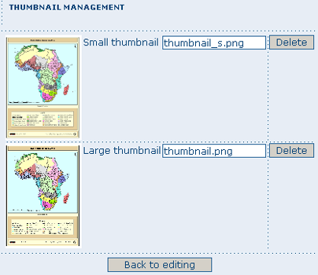
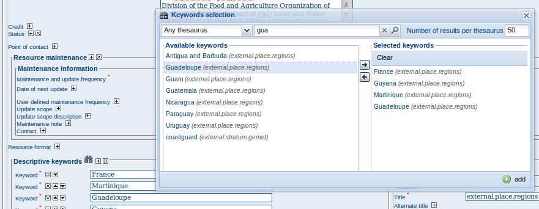
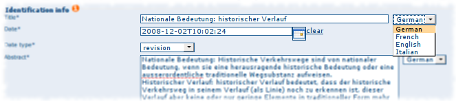

.. _new_metadata:

Adding a metadata record
========================

This section guides you through the process of adding new metadata records with associated data and/or services into the GeoNetwork catalog. You will use metadata template records, add thumbnails, upload data, link to services and set access privileges to the metadata and the data it describes.

To add or edit metadata, you must be **registered** as a user with an **Editor** profile or higher. That user should be a member of the User Group you want to add information for. Contact your administrator if you are not a registered Editor for your User Group.

For metadata creation using the online editor, GeoNetwork provides a set of simplified metadata templates based on the cited standards available in your GeoNetwork instance: typically ISO19139 (an implementation of ISO19115), FGDC and Dublin Core. The templates for describing vector or raster geographic data based on ISO19139 are preferred because they are devised in a way that hides much of the complexity of the ISO19115 standard in the default view. At the same time those templates are extensible with new elements to fit specialized needs through the advanced view.

To produce a good metadata record, always try to:
 - gather as many details as possible on the resource that you want to describe taking into account the metadata elements that have been presented in the previous chapter
 - develop and reuse the same terms or phrases to describe the concepts you want to capture. A record of these terms and phrases will be helpful for others in understanding your metadata.
 
The next step is to fill out properly the fields provided by the metadata templates, while at the same time avoiding duplication of information throughout the form.

The most important fields that may not be waived while compiling a standard based metadata record are the following: **Title, Date of Creation or Publication, Abstract, Language used for documenting data, Topic Category, Scale, Maintenance and Update Frequency, Metadata Author, Language Used for Documenting Metadata.**

In addition to the main mandatory fields, we recommend you to fill out these optional but critical fields (if information is available): **Purpose - Keywords - Presentation Form - Status - Spatial Representation Type - Geographic Location - Reference System Info - Temporal Extent - Data Quality Info - Access and Use Constraints - Point of Contact - Distribution Info: Online Resources.**

*You should also prepare an image of your data that is required to be displayed in search results as thumbnail.*

*Next section will guide you through the process of metadata creation using the online editor.*

Creating a New Record using the Metadata Editor
-----------------------------------------------

#. In the home page, click on the **Administration Tab**.

#. Select **New Metadata** from the List of the admin page.

#. Select the metadata standard **Template**, if possible, using the preferred ones. GeoNetwork opensource comes by default with support for three metadata standards, ISO19139, FGDC and Dublin core. For the ISO standard, two templates have been developed; one for vector and one for raster data. Both contain a relevant set of elements to describe the respective types of data. More templates can be developed online.

#. Select the **Group** the metadata will belong to. These are the groups authorized to add metadata to by your administrator.

#. Click on **Create**.

The steps in more details
-------------------------

#. Enter your username and password and click on the login button. The system will identify you and assign the correct privileges to work with.

    .. figure:: login.png

        *Login*

#. Open the Administration page by clicking the Administration button in the banner and then click on the New metadata link.

    .. figure:: Admin.png
    
        *Administration panel*

#. From the metadata creation page, select the metadata standard to use from the dropdown list (Figure 4.3, “Template selection”)

    .. figure:: metadataCreation.png
        
        *Template selection*
    
#. After selecting the correct template, you should identify which group of users the metadata will belong to and finally click on **Create**.

    .. figure:: selectGroup.png
        
        *Group selection*

#. A new metadata form based on the selected template will be displayed for you to fill out.

Switching Editing Views from Default to Advanced to XML View
------------------------------------------------------------

Once you create a new record, you can choose between **Default, Advanced** or **XML View**. To switch view, simply click on the view you want to switch to on the left column of the page. The view in **bold** is the view you are currently using.

.. figure:: switchViews.png

    *Metadata view options*

In the previous chapter you have analyzed the metadata structure as it is presented in the **Default View**. A selection of the main fields from different categories of information is shown in one single view. The minimum set of metadata required to serve the full range of metadata applications (data discovery, determination of data fitness for use, data access, data transfer and use of digital data) is defined here, along with optional metadata elements to allow for a more extensive standard description of geographic data, if required. However, if should be there a need to add more metadata elements, you can switch to the advanced view at any time while editing.

In the **Advanced View**, the ISO profile offers the possibility to visualize and edit the entire metadata structure organized in sections accessible through tabs from the left column. You can use this view to write more advanced metadata descriptions or templates to fit specialized needs.

.. figure:: advancedView.png

    *Advanced view*

The **XML View** shows the entire content of the metadata in the original hierarchical structure; different colors allow to distinguish between an element's name and its value. The XML structure is composed of tags and to every tag must correspond a closing tag. The content is entirely contained withing the two, i.e.::

  <gmd:language>
    <gco:CharacterString>eng</gco:CharacterString>
  </gmd:language>

.. figure:: xmlView1.png

    *XML view*

Nevertheless, the use of the XML view requires some knowledge of the XML language.

Both the **Default** and the **Advanced Views** are composed of ``mandatory``, ``conditional`` and ``optional`` metadata fields. The meaning of mandatory and optional is fairly intuitive; the mandatory fields are required, like ``Title`` and ``Abstract`` for instance, whereas the optional fields can be provided but are not fundamental, depending on the metadata author. The conditional fields may be considered mandatory under certain circumstances: essentially a conditional requirement indicates that the presence of a specified data element is dependent on the value or presence of other data elements in the same section. For instance, the ``Individual name`` metadata element of the ``Point of Contact``, which is a conditional element of the Identification section, becomes mandatory if another element of the same section, ``Organization name`` or ``Position name`` is not already defined.

.. figure:: PoC_Maint.png

    *Point of Contact*

The **mandatory fields** as well as those **highly recommended** are flagged with **red asterisk [*]**. The standard definition for each field can be read by passing the mouse on the element name.

The **Default View** is the preferred view as it provides a selection of the available metadata elements, facilitating both the user and the editor in reading and editing a metadata record, and at the same time it ensures that a geospatial data can be properly described, through :

* the minimum set of metadata required to serve the full range of metadata applications (data discovery, determination of data fitness for use, data access, data transfer, and use of digital data);

* optional metadata elements - to allow for a more extensive standard description of geographic data, if required;

* a method for extending metadata to fit specialized needs.

Using basic commands of the editor
----------------------------------

Fields are either **free text fields** or **drop down lists**. Free text means you can type any text into that field. Drop down lists allow you to select only one option from the list. You can add multiple fields of the same kind by clicking on the **[+]** symbol next to the element. Every new field that you will add in the advanced view will then be visible in the default view. You can also delete existing fields by clicking on the **[x]** symbol next to the element. Clearly, mandatory fields cannot be deleted. One example of the need to add multiple fields can arise if the content of your dataset has some text written in two different languages.

.. figure:: multipleElement.png
    
    *Describing multilingual data*

Example: Entering metadata for a Thematic Map
---------------------------------------------

As we mentioned in the introduction to this guide, GeoNetwork provides tools to describe any type of geographic data (vector layers, raster, tables, map services, etc.) as well as general documents like reports, projects, papers, etc. For the purpose of this Quick Start Guide, an example of required and useful metadata elements to properly describe a thematic map will be provided hereafter. You should gather as much information as possible to identify and understand the map’s resource and characteristics you want to describe. Use the default view to start. If necessary, you can always switch to advanced view or come back later and edit the record with the additional information collected.

Please follow these steps to enter your map's metadata. Note that we will only go through the fields that have been identified as compulsory (i.e. those fields marked with the asterix [*], mandatory or highly recommended).

**Title** \*: Under the Identification Info field, give your map a name. There will be a default name of your data. Use free text to describe your map here.

**Date** \*: Indicate the exact date of creation, publication or revision on your map.

**Presentation Form**: Specify the type of presentation, i.e. digital, hard copy, table, etc.

**Abstract** \*: Enter some description of the map.

**Purpose**: Enter a short summary of the purposes for your map to be developed.

**Status**: Specify the status of your map within the following options: completed, historical archive, obsolete, ongoing, planned, required, under development.

**Point of Contact**: Enter all mandatory information and others you have at hand for the contact of the person(s) associated with this resources of the map. Note that some fields are only conditionally mandatory, such as Organization Name if Individual Name and Position are not entered.

**Maintenance and update frequency** \* : Specify the frequency with which you expect to make changes and additions to your map after the initial version is completed. If any changes are scheduled you can leave As Needed selected from the drop-down list.

**Descriptive Keywords**: Enter keywords that describe your map. Also specify the type of keyword you are entering, i.e. place, theme, etc. Remember that you can add another keyword field if you need to add different types of keywords.

**Access Constraints**: Enter an access constraint here, such as a copyright, trademark, etc. to assure the protection of privacy and intellectual property.

**User Constraints**: Enter a user constraint here to assure the protection of privacy and intellectual property.

**Other Constraints** \* : Enter other constraint here to assure the protection of privacy and intellectual property. Note that this field is conditionally mandatory if Access and Use constraints are not entered.

**Spatial representation type**: Select, from the drop-down list the method used to spatially represent your data. The options are: vector, grid, text table, stereo model, video.

**Scale Denominator** \* : Enter the denominator for an equivalent scale of a hard copy of the map.

**Language*** : Select the language used within your map

**Topic category** \* : Specify the main ISO category/ies through which your map could be classified (see Annex for the complete list of ISO topic categories).

**Temporal Extent** \* : Enter the starting and ending date of the validity period.

**Geographic Bounding Box** \* : Enter the longitude and latitude for the map or select a region from the predefined drop-down list. Make sure you use degrees for the unit of the geographic coordinates as they are the basis for the geographic searches.

**Supplemental Information**: Enter any other descriptive information about your map that can help the user to better understand its content.

**Distribution Info**: Enter information about the distributor and about options for obtaining your map.

**Online Resource**: Enter information about online resources for the map, such as where a user may download it, etc. This information should include a link, the link type (protocol) and a description of the resource.

**Reference System Info**: Enter information about the spatial reference system of your map. The default view contains one element to provide the alphanumeric value identifying the reference system used. GNos uses the EPSG codes which are numeric codes associated with coordinate system definitions. For instance, EPSG:4326 is Geographic lat-long WGS84, and EPSG:32611 is "UTM zone 11 North, WGS84". Using elements from the advanced view, you may add more details on data projection, ellipsoid and datum. Note that if this information is provided, a reference system identifier is not mandatory.

**Data Quality**: Specify the hierarchal level of the data (dataset series, dataset, features, attributes, etc.) and provide a general explanation on the production processes (lineage) used for creating the data. The statement element is mandatory if the hierarchical level element is equal to dataset or series. Detailed information on completeness, logical consistency and positional, thematic and temporal accuracy can be directly added into the advanced form.

**Metadata Author** \* : Provide information about the author of the map, including the person’s name, organization, position, role and any other contact information available.

After completion of this section, you may select the Type of document that you are going to save in the catalogue. You have three options: Metadata, Template, Sub-template. By default Metadata is set up.

When done, you may click ``Save`` or ``Save and Close`` to close the editing session.

Metadata validation
-------------------
In editing mode, editors can validate the current metadata record against standard rules and recommendations.

For all standards, a first level of validation is made for XML metadata validation based on XML Schema (XSD).
For ISO19139 records, other rules are checked:

- ISO recommendations

- GeoNetwork recommendations

- (Optional and not available by default) INSPIRE recommendations

The validation report display the list of rules checked and their status (pass or failed). The top checkbox allows to display only errors or all.

.. figure:: validationreport.png

.. TODO : Maybe add more details on how to solve XSD error messages ?

Creating a Thumbnail
--------------------

To help the user identify a metadata record of interest, you can create a graphic overview (or thumbnail) 
in the form of an image and attach it to the metadata record. For example, if your metadata record describes 
some geographic dataset then the the graphic overview could be an image of the map with legend produced 
by an OGC Web Map Service.

You can associate two thumbnails with a record: a small thumbnail, which will be displayed in search results 
and a large thumbnail with more details in case the user is interested in more information. 
The large thumbnail will be displayed when the user clicks on the small thumbnail.

To create a thumbnail, go to the editing menu. If you are no longer in editing mode, retrieve the metadata record
using one of the search options then click on Edit. Then follow these simple steps:

From the editing menu, click on the Thumbnails button on the top or bottom of the page.

.. figure:: thumButton.png

	*The thumbnail wizard button*

- You will be taken to the Thumbnail Management wizard.

- To create a small or large thumbnail, click on the Browse button next to either one. It is recommended that you use 180 pixels for small thumbnails and 800x600 for large thumbnails. Using the ‘Large thumbnail’ option allows you to create both a small and large thumbnail in one go.

- You can use GIF, PNG and JPEG images as input for the thumbnails.

- A pop up window will appear allowing you to browse your files on your computer. Select the file you wish to create a thumbnail with by double-clicking on it.

- Click on ``Add``.

- Your thumbnail will be added and displayed on the following page.

- You can then click on Back to Editing and save your record.

.. figure:: thumbManag.png

	*Thumbnail wizard*

	*Completed thumbnail wizard*

Compute bounding box from keywords
----------------------------------

Editor can add extent information based on keyword analysis.

- For each keywords

- Search for the keyword in thesaurus

- If keyword in the thesaurus has an extent

- Add an extent with a description and a bounding box to the metadata record.

The process could be run in 2 modes :

- Add : Keep existing extent elements and add the new one at the end. Editor could clean the section after processing.
- Replace : Remove all extent having only a bounding box (temporal, vertical and bounding polygon are not removed), and add the new one at the end.

Editor need to select keyword from a thesaurus with spatial information. The name is added to the extent description field.

Then in the other actions menu, the compute boundinx box menus are available:

.. figure:: computebbox-button.png

The metadata is saved during the process and one extent is added for each keywords.

.. figure:: computebbox-results.png

If user manually add keywords just before computing bounding box, then it's recommended to save your metadata record before launching the action in order to have latest keywords taken into account.

Assigning Privileges 
--------------------

To assign privileges to your metadata record and any attached data you will need to identify User Groups and the privileges you want to assign to users in these groups. eg. View the metadata, download the data attached to the record, etc.

For instance, you can specify that the metadata and related services are visible to all (Internet users) or just to internal users only (Intranet). Privileges are assigned on a per group basis. Depending on the user profile (Guest, Registered User, Editor, Admin etc.) access to these functions may differ on a per user basis.

To assign privileges, follow these steps:

- Find your metadata record by using the search option. Whether you have multiple or single results from the search, on top of the individual record or next to the record you will always see a row of buttons including a Privileges button.

.. figure:: privilegesButton.png

	*The editing toolbar with Privileges button*

- Click on the Privileges button. A drop down menu will appear from which you can assign certain privileges to specific groups using checkboxes. Simply click on the small box next to the privilege to place or remove a checkmark. Set All and Clear All buttons allow you to place and remove the checkmarks all at once.

.. figure:: privilegesSetting1.png

	*Privileges settings*

Below is a brief description for each privilege to help you identify which ones you should assign to which group(s).

**Publish**: Users in the specified group/s are able to view the metadata eg. if it matches search criteria entered by such a user.

**Download**: Users in the specified group/s are able to download the data.

**Interactive Map**: Users in the specified group/s are able to get an interactive map. The interactive map has to be created separately using a Web Map Server such as GeoServer, which is distributed with GeoNetwork.

**Featured**: When randomly selected by GeoNetwork, the metadata record can appear in the `Featured` section of the GeoNetwork home page.

**Notify**: Users in the specified group receive notification if data attached to the metadata record is downloaded.

Assigning Categories
--------------------

Each GeoNetwork site has a set of local categories that can be used to classify metadata records for easy searching. To assign categories to a metadata record, follow these steps:

- Find your metadata record using the search option. Whether you have just one or many results from your search, you will always see a row of buttons including a **Categories** button.

- Click on the **Categories** button. A drop down menu will appear from which you can assign one or more categories using checkboxes. Simply click on the small box next to the category to place or remove a checkmark.

.. figure:: categoriesManag.png

	*Category management*

Multilingual metadata in ISO19139
---------------------------------
Editors can create multilingual metadata for ISO19139. A default template is provided but user could add translation to an existing record.

To declare a new language in a metadata record:

- First check, the main language is defined in the metadata section

- then add one or more languages in the other language in the metadata section.

In editing mode, each multilingual elements are composed of:

- text input

- language selection list (language declared on the other language section are listed here)

By default, the selected language is the GUI language if language is defined in the metadata.

Alternatively, Google translation service could be used. Translation could be suggested to the editor using the small icon right to the language selector. The translation convert the default metadata character string in the current selected language. 

In view mode, according to GUI language : if GUI language is available in the metadata, the element is displayed in this language else the element is displayed in metadata default language.
This behaviour is also applied to dublin core output for CSW services.

Uploading a New Record using the XML Metadata Insert Tool
=========================================================

A more advanced procedure to upload a new metadata record in the GeoNetwork system is using an XML document. This procedure is particularly useful for users who already have metadata in XML format, for instance created by some GIS application. To this regard, it has to be noted that the metadata must be in one of the standards used by GeoNetwork: ISO19115, FGDC and Dublin Core.

To start the metadata uploading process through the **XML Metadata Insert** tool, you should log in and select the appropriate option from the Administration page.

.. figure:: administration_panel.png

	*Administration panel*

The main part of the page **Import XML Formatted Metadata** that is displayed is the **Metadata** text area, where the user can paste the XML metadata to import. Below this, there is the **Type** choice, which allows you select the type of record that you are going to create (Metadata, Template and Subtemplate). Then you can apply a stylesheet to convert your metadata input from ArcCatalog8 to ISO1915 or from ISO19115 to ISO19139, if required. Otherwise you can just leave none selected. The **Destination schema** list provides you with four options to choose the final standard layout for your metadata (ISO19115, ISO19139, FGDC and Dublin Core). Finally you should select the **Group** as main group in charge of the metadata and the **Category** that you want to assign to your metadata. By clicking the **Insert** button the metadata is imported into the system; please note that all links to external files, for instance to thumbnails or data for download, have to be removed from the metadata input, to avoid any conflict within the data repository.

.. figure:: xmlImporTool.png

	*XML metadata import tool*
	
If your metadata is already in ISO19115 format, the main actions to be performed are the following:

#. Paste the XML file that contains the metadata information in the **Metadata** text area;
#. Select Metadata as **type** of record that you are going to create
#. Select the metadata schema ISO19139 that will be the final **destination schema**;
#. Select the **validate** check box if you want your metadata to be validated according to the related schema.
#. Select the **group** in charge of the metadata from the drop down list; 
#. Select **Maps and Graphics** from the list of categories; 
#. Click the **Insert** button and the metadata will be imported into the system.

.. figure:: xmlImporTool2.png

	*XML metadata import 2*
