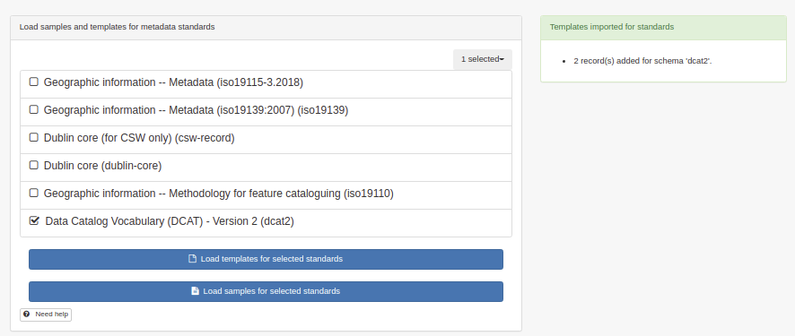
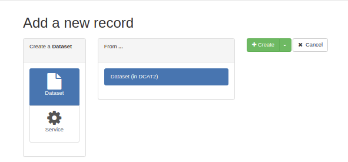
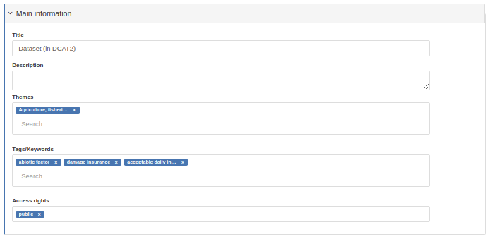
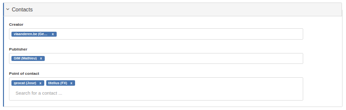
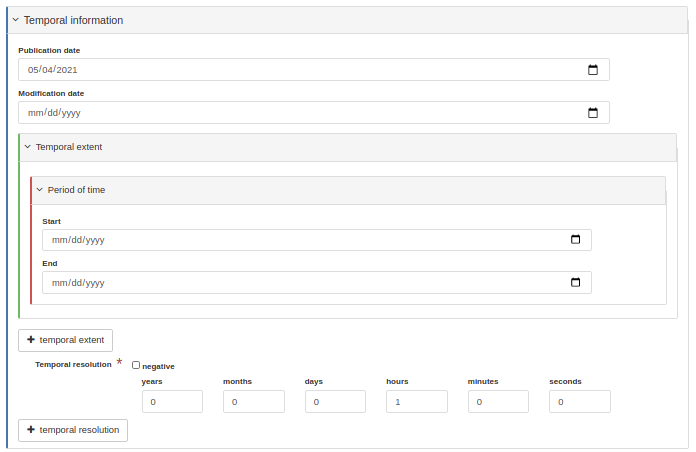
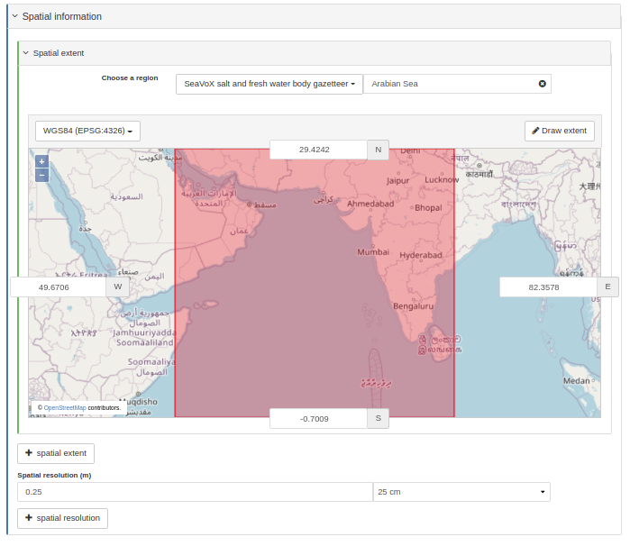
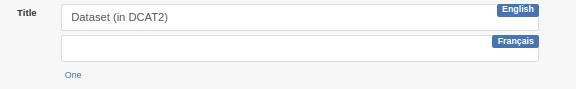
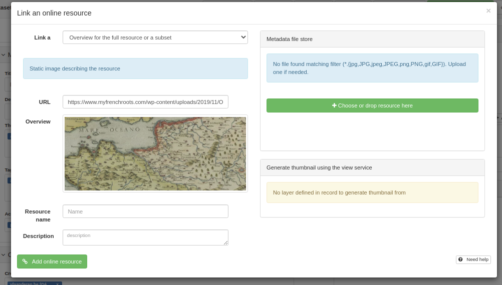
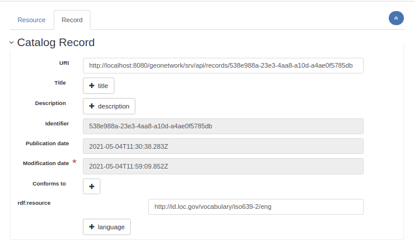
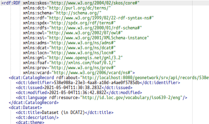

# DCAT2 Schema Plugin for GeoNetwork

DCAT2 plugin for GeoNetwork. This plugin is currently under development. See progress in https://github.com/metadata101/dcat2/projects/1.

## Description

Load templates from the admin > metadata and templates:

Add new records:

### Editing records

#### Basic form

The DCAT editor default view is composed of 4 sections:

* Main information

Themes are based on [EU vocabularies Data theme](https://op.europa.eu/en/web/eu-vocabularies/dataset/-/resource?uri=http://publications.europa.eu/resource/dataset/data-theme). 

Keywords can be populated to any thesaurus loaded in the catalogue.

Access rights is based on http://publications.europa.eu/resource/authority/access-right.

* Contacts

Creator, Publisher and point of contact can only be selected in a contact directory of ISO19139 responsible party. A mapping to `foaf:Agent` is made. Contact are inserted as XLink in the record and can only by updated in the contact directory.

* Temporal information

* Spatial information

#### Multilingual record

By adding a language in the record tab of the advanced view, user can create multilingual description of a record:

The first language is the "main" one.

#### Distribution

[Distribution](https://www.w3.org/TR/vocab-dcat-2/#Class:Distribution) can be added using associated resource panel:

Online link in distribution is limited to:
* URL
* title
* description

TODO: Add licence support

#### Associated resources

Not yet supported.

#### Advanced editor

The advanced view is composed of 2 tabs:
* the dataset or data service
* the record information

### Encoding

DCAT metadata record are encoded as RDF/XML. A metadata record is composed of:
* a [catalogue record](https://www.w3.org/TR/vocab-dcat-2/#Property:catalog_catalog_record)
* a [dataset](https://www.w3.org/TR/vocab-dcat-2/#Class:Dataset) or a [data service](https://www.w3.org/TR/vocab-dcat-2/#Class:Data_Service)

Some elements can be encoded using an element or using a `rdf:resource` attribute. This needs improvements.

### Viewing details

TODO: Improve indexing.

### Importing record

TODO: which formats?

### Output formats

TODO:
* RDF dump support?
* Test OGC API Records DCAT output formats.

## Installation
### GeoNetwork version to use with this plugin

Use GeoNetwork 4 based on https://github.com/geonetwork/core-geonetwork/pull/5616.

### Adding the plugin to the source code

TODO

## Reference documents

See:
* [W3C Data Catalog Vocabulary (DCAT)](https://www.w3.org/TR/vocab-dcat-2/)
* [DCAT Application Profile for data portals in Europe](https://joinup.ec.europa.eu/collection/semantic-interoperability-community-semic/solution/dcat-application-profile-data-portals-europe)
* [Geo-DCAT-AP](https://inspire.ec.europa.eu/good-practice/geodcat-ap)
* Previous versions:
  * [DCAT-AP v1.2 plugin](https://github.com/metadata101/dcat-ap1.1).
