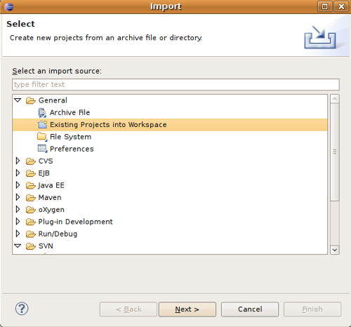

# Eclipse IDE

The [Eclipse Foundation](https://www.eclipse.org/) produces several distributions of the Eclipse IDE. The "Eclipse IDE for Java Developers" and "Eclipse IDE for Enterprise Java Developers" can be used for GeoNetwork development.

Eclipse provides maven integration using the built-in [M2Eclipse](http://eclipse.org/m2e/) plugin.

The Eclipse IDE is recommended for excellent refactoring support.

## Import source code

In order to import the source code, follow instructions below:

1. Press **File** > **Import** Menu item
2. In new dialog Select **Maven** > **Existing Maven Projects**
3. Press *Next*

   

4. In **Select root directory** field enter the location of your source code:

   * `C:\dev\geonetwork\trunk`

5. Select All projects and Press **Finish** button.

6. During the import process Eclipse will attempt to map each maven plugin to matching
   functionality provided by the Eclipse IDE.
   
   If another window appears showing these associations, just continue without changing any option.

7. It will take some minutes while the m2e plugin downloads all the Maven dependencies.

## Building

The Eclispe IDE is configured to respect the `src` and `target` locations defined by the maven `pom.xml` file.

* Eclipse makes use of an incremental compiler, allowing classes to be changed during debugging sessions.

* If you build on the command line, be sure to run a clean build in Eclipse when switching back to the IDE.

## Running with Jetty

Use **Run As** > **Maven Build** to use `jetty:run` from inside Eclipse.

You can add some maven variables to be able to run in parallel a debug watch to debug your code.

## Debugging with JRebel Plugin

Using the [JRebel plugin](http://zeroturnaround.com/software/jrebel/) is very useful for debugging in Eclipse.

An example of the configuration file for JRebel may be the following:

```xml

<?xml version="1.0" encoding="UTF-8"?>
<application xmlns:xsi="http://www.w3.org/2001/XMLSchema-instance"
             xmlns="http://www.zeroturnaround.com"
             xsi:schemaLocation="http://www.zeroturnaround.com http://www.zeroturnaround.com/alderaan/rebel-2_0.xsd">
     <classpath>
   <dir name="------/web/target/classes"/>
 </classpath>

 <web>
   <link target="/">
     <dir name="--------/web/src/main/webapp">
     </dir>
   </link>
        <link target="/">
            <dir name="-------/web/target/webapp">
            </dir>
        </link>
        <link target="/">
            <dir name="--------/web/target/geonetwork">
            </dir>
        </link>
 </web>

</application>
```

## Debugging with Tomcat Server

The Eclipse for [Web Tools Project](https://www.eclipse.org/webtools/) includes a
Tomcat Plugin for controlling a Tomcat Service.

#. Create a new Tomcat Server on Eclipse and add the geonetwork-main project as a web project.

## Remote Debugging

* [How do I configure Tomcat to support remote debugging?](https://cwiki.apache.org/confluence/display/TOMCAT/Developing#Developing-Q1)
* [How do I remotely debug Tomcat using Eclipse?](https://cwiki.apache.org/confluence/display/TOMCAT/Developing#Developing-Q2)

## Code Quality Tools in Eclipse

In order to see the same code quality warnings in Eclipse as Maven will detect, Find Bugs and Checkstyle
need to be installed in your Eclipse install and configured as follows::

* Start Eclipse
* Go to **Help > Eclipse Marketplace**
 * Install **findbugs**
  * Don't Restart
 * Install **checkstyle**
  * Now Restart
* Open preferences **Window > Preferences**
 *  Select *Java > Code Style > Code Templates*
  *  Select both Comments and Code elements
  *  Click **Import** and import **code_quality/codetemplates.xml**
 *  Select **Java > Code Style > Formatter**
  *  Click **Import** and import **code_quality/formatter.xml**
 *  Select **Java > Code Style > Clean Up**
  *  Click **Import** and import **code_quality/cleanup.xml**
 *  Select **Checkstyle**
  * Click **New**
  * Select **External Configuration**
  * Enter any name (IE GeoNetwork)
  * For **location** choose **code_quality/checkstyle_checks.xml**
  * Press *OK*
  * Select New configuration
  * Press *Set as Default*
 * Select **Java > FindBugs**
  * Set **analysis effort** to **Maximum**
  * Set **Minimum rank to report** to **2**
  * Set **Minimum confidence to report** to **Medium**
  * Check(enable) all bug categories
  * Set all **Mark bugs with ... rank as** to **Warning**
  * Change to _Filter files_ tab
   * Add **code_quality/findbugs-excludes.xml** file to the **Exclude filter files**
 * Close Preferences
 * Right click on project in **Projects View** select **Checkstyle > Activate Checkstyle**
 * Rebuild full project ( **Project > Clean...** )
  * Checkstyle violations will show up as warnings
 * Right click on project in **Projects View** select **Find Bugs > Find Bugs**
   * FindBugs violations will show up as warnings

## Code Quality Tools and Maven

During the build process FindBugs and Checkstyle are executed. If a violation is found then the build will fail. Usually the easiest way of resolving violations are to use Eclipse and run Checkstyle or FindBugs on the class or project with the failure. 
Usually a detailed report will be provided in Eclipse along with suggested fixes. If the violation is determined to be an intentional violation the **code_quality/findbugs-excludes.xml** or **code_quality/checkstyle_suppressions.xml** should be updated to suppress the reporting of the violation. (See FindBugs and Checkstyle sections for more details.)

Since the FindBugs and Checkstyle processes can be quite time consuming, adding -DskipTests to the maven commandline will skip those processes as well as tests.
For example:

```bash
mvn install -DskipTests
```

Or if you want to run the tests but skip static analysis:

```bash
mvn install -P-run-static-analysis
```

That disables the profile that executes the static analysis tasks.

### FindBugs

FindBugs is a tool that statically analyzes Java class files and searches for potential bugs. It excels at finding issues like unclosed reasources, inconsistent locking of resources, refering null known null-values. It also checks for bad practices like using default platform charset instead of an explicit charset.

Because bad practices are checked for, sometimes FindBugs detects issues that are intentional. In order to account for these intentional violations FindBugs has exclude filter files which contain rules for violations that should be ignored.
In GeoNetwork the excludes filter file can be found at **<root>/code_quality/findbugs-excludes.xml**.

For complete details of how to specify matches in the excludes file see http://findbugs.sourceforge.net/manual/filter.html and look at the existing examples in the file.

The Maven build will fail if any violations are detected so it is important to run FindBugs on each project and fix or exclude each violation that is reported.

## FindBugs Annotations (JSR 305)

In order to get the maximum benefit from the FindBugs (and Eclipse) analysis the javax.annotation annotations can be used to add metadata to methods, fields and parameters. The most commonly used annotations are @CheckForNull and @Nonnull. These
can be used on a parameter or return value to indicate that the parameter or return value must not be null or may be null. The FindBugs process will enforce these conditions and statically check that null is only ever correctly returned (in the case of return values) or passed to a method (in the case of parameters).

Some resources for these annotations are:

* http://vard-lokkur.blogspot.ch/2012/03/findbugs-and-jsr-305.html
* http://www.infoq.com/news/2008/06/jsr-305-update
* http://www.klocwork.com/blog/static-analysis/jsr-305-a-silver-bullet-or-not-a-bullet-at-all/
* http://minds.coremedia.com/2012/10/31/jsr-305-nonnull-and-guava-preconditions/
* http://findbugs.sourceforge.net/manual/annotations.html (the package names are out of date and should be java.annotation instead of edu.umd.cs.findbugs.annotation but the descriptions are accurate)
