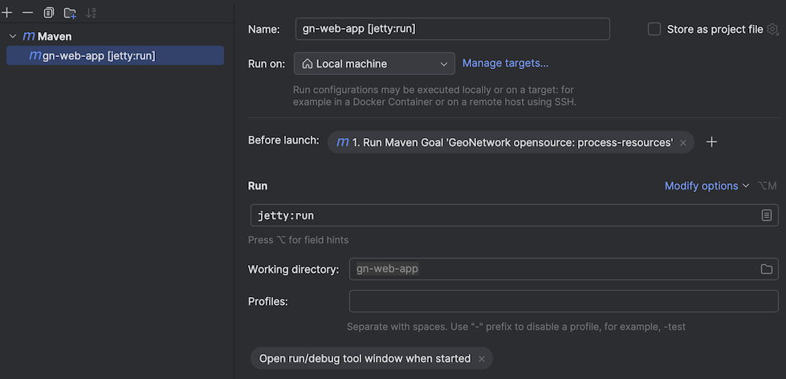

# IntelliJ IDE

JetBrains provide the IntelliJ IDE, a community edition is available [here](https://www.jetbrains.com/idea/download/).

This IDE is recommended for excellent Maven integration, and very fast build times. 
It is especially good at working with large multi-module projects such as GeoNetwork.

If you are running on Windows, it might make sense to set up the project in the WSL to run unit tests.
See the [Testing Documentation](TESTING.md) for more details.

## Setting up

1. Open project in IntelliJ, it will create an `.idea` folder (which is covered by `.gitignore`)

2. Use *File* > *Project Structure* to confirm Java 11 is used. If you have cloned the Repo in the WSL filesystem, make sure the WSL version is selected

3. Configuration to make *Maven* tools window easier to follow:

   * *Group Modules*
   * *Always Show ArtifactId*

   

4. Use the *Maven* tools window to:
   
   * Enable the `env-dev` profile
   * *Toggle "Skip Tests" Mode*
   * *Execute Maven Goal*: `clean install`
   
   

## Building

1. After doing the maven build once, select menu *Build* > *Build Project*.

2. The build progress is shown in the *Build* tools window.

3. This is an incremental build, so only modified files are compiled in the future.

## Running

1. Menu *Run* > *Edit Configurations...*

2. Add new *Maven* configuration:
   
   * Working Directory: `core-geonetwork/web`

   * Command Line: `jetty:run`

   * Profiles: `env-dev`
   
   
   
3. Add maven goal `proccess-resources` before launch.
   
   

4. Run

5. Testing
   
   * http://localhost:8080/geonetwork
   * user: admin
   * password: admin

6. Live debugging
   
   * Debug using the run configuration created above
   * The `env-dev` allows updates while running
   * Use *Build Project* to compile, allowing methods to be rewritten interactively.
   * Use *Maven* tool window to run `mvn process-resources` to
     copy changes into the running web application.
