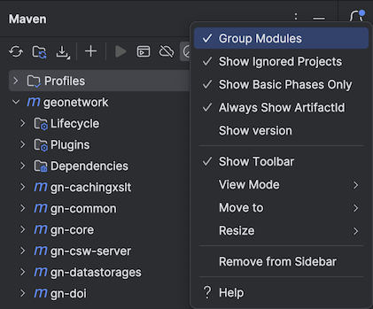

# IntelliJ IDE

JetBrains provide a the IntelliJ IDE, a community edition is available and
is documented here.

This IDE is recommended for excellent Maven integration, and very fast build times. 
It is especially good at working with large multi-module projects such as GeoNetwork.

## Setting up

1. Open project in IntelliJ, it will create an `.idea` folder (which is covered by `.gitignore`)

2. Use *File* > *Project Structure* to confirm Java 8 is used

4. Configuration to make *Maven* tools window easier to follow:

   * *Group Modules*
   * *Always Show ArtifactId*

   

5. Use the *Maven* tools window to:
   
   * Enable the `env-dev` profile
   * *Toggle "Skip Tests" Mode*
   * *Execute Maven Goal*: `clean install`
   
   

## Building

1. After doing the maven build once, select menu *Build* > *Build Project*.

2. The build progress is shown in the *Build* tools window.

3. This is an incremental build, so only modified files are compiled in the future.

## Running

1. Menu *Run* > *Edit Configurations...*

2. Add new *Maven* configuration:
   
   * Working Directory: `core-geonetwork/web`

   * Command Line: `jetty:run`

   * Profiles: `env-dev`
   
   
   
3. Add maven goal `proccess-resources` before launch.
   
   

4. Run

5. Testing
   
   * http://localhost:8080/geonetwork
   * user: admin
   * password: admin

6. Live debugging
   
   * Debug using the run configuration created above
   * The `env-dev` allows updates while running
   * Use *Build Project* to compile, allowing methods to be rewritten interactively.
   * Use *Maven* tool window to run `mvn process-resources` to
     copy changes into the running web application.

## IntelliJ Settings / Preferences

1. Open settings:
   
   * **Window > Preferences** (Windows and Linux)
   * **IntelliJ IDEA > Preferences** (macOS)

2. Navigate to **Editor > Code Style > Java**.
   
   * Locate **Scheme** at the top of the page, and the actions menu.
     
   * Select **Import Scheme | Eclipse XML Profile **
   
   * Import the `code_quality/formatter.xml`

3. Navigate to **Editor > File and Code Templates**.
   
   * Change to **Includes** tab
     
   * Define **File Header**:
   
     ```
     //=============================================================================
     //===	Copyright (C) 2001-2007 Food and Agriculture Organization of the
     //===	United Nations (FAO-UN), United Nations World Food Programme (WFP)
     //===	and United Nations Environment Programme (UNEP)
     //===
     //===	This program is free software; you can redistribute it and/or modify
     //===	it under the terms of the GNU General Public License as published by
     //===	the Free Software Foundation; either version 2 of the License, or (at
     //===	your option) any later version.
     //===
     //===	This program is distributed in the hope that it will be useful, but
     //===	WITHOUT ANY WARRANTY; without even the implied warranty of
     //===	MERCHANTABILITY or FITNESS FOR A PARTICULAR PURPOSE. See the GNU
     //===	General Public License for more details.
     //===
     //===	You should have received a copy of the GNU General Public License
     //===	along with this program; if not, write to the Free Software
     //===	Foundation, Inc., 51 Franklin St, Fifth Floor, Boston, MA 02110-1301, USA
     //===
     //===	Contact: Jeroen Ticheler - FAO - Viale delle Terme di Caracalla 2,
     //===	Rome - Italy. email: geonetwork@osgeo.org
     //==============================================================================
     ```
