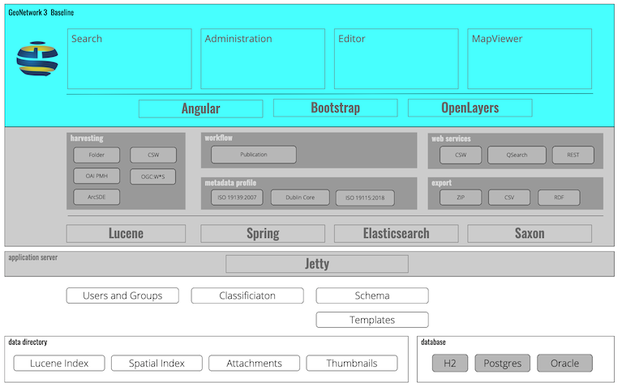

# GeoNetwork Overview

GeoNetwork is a modular application, managed using the spring framework, divided into clear application tiers.

GeoNetwork uses a wide range of technologies:

* [Angular](https://angular.io/) web framwork providing model-view-controller architecture with data model binding
* [Apache Lucene](https://lucene.apache.org) text index to facilitate searching
* [Bootstrap](https://getbootstrap.com/) front-end open source toolkit providing response page layout
* [Elasticsearch](https://www.elastic.co/elasticsearch/) full-text search
* [GeoTools](https://geotools.org/) Java GIS toolkit used to provide a spatial index
* [OpenLayers](http://openlayers.org) web mapping framework
* [Saxon](http://www.saxonica.com/) XSLT engine used extensively to process XML documents
* [Spring framework](https://spring.io/) Java web application framework used to "wire" components together

GeoNetwork configuration is managed via:

* Configuration is managed via [Hibernate Object/Relational Mapping](https://hibernate.org/orm/) with [H2 Database Engine](https://www.h2database.com/) default for local testing, [PostgreSQL](https://www.postgresql.org/) recommended for production. Additional dialects are available for environments restricted to Oracle or SQLServer.

* Data Directory for the management of thumbnails, attachments and other application files

## Architecture

GeoNetwork is a modular web application, managed using the spring framework, divided into clear application tiers.

The application is built on top of:

* Elasticsearch: full-text search
* Database: record persistance
* Data directory: attachments and application files

## Technologies

## Hibernate Object/Relational Mappping

Geonetwork Reference:

* [domain](../domain/README.md)

Reference:

* https://hibernate.org/orm/

### Java Enterprise Edition

GeoNetwork is a Java "web application", following Java Enterprise Edition standard (establishing Servlet and related interfaces, and the web-application-archive bundle).

Note: Java Enterprise Edition is in the process of renaming to Jakarata Enterprise Edition

The ``geonetwork.war`` requires an application server to operate:

* [Jetty](https://www.eclipse.org/jetty/) application server for standaline distribution.
   
  Jetty 9 is the last JavaEE compatible release.
   
* [Apache Tomcat](http://tomcat.apache.org/) application server for WAR distribution

  Apache Tomcat 9.x is the last JavaEE compatible release.

Reference:

* https://javaee.github.io (Legacy Java EE Home)

## Libraries

### mapfish-print-v2

The mapfish-print-v2 library is used for PDF generation, using a combinatino of GeoTools and OpenPDF library.

The library is used for thumbnail generation.

Reference:

* http://github.com/mapfish/mapfish-print-v2
* https://github.com/LibrePDF/OpenPDF
