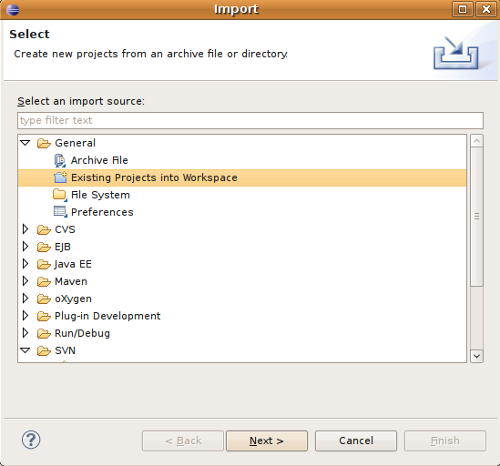

# Software development

## System Requirements

GeoNetwork is a Java application that runs as a servlet so the Java Runtime
Environment (JRE) must be installed in order to run it. You can get the JRE from http://www.oracle.com/technetwork/java/javase/downloads and you have to download the Java 6 Standard Edition (SE). GeoNetwork won’t run with Java 1.4. It will run with:

* Java 5 - but few people should be using that now as it is unsupported.
* Java 6 - most testing has taken place under Java 6, so we recommend Java 6.
* OpenJDK 7 - note: problems have been reported with OpenJDK 6.

Being written in Java, GeoNetwork can run on any
platform that supports Java, so it can run on Windows, Linux and Mac OSX. For
MacOSX, make sure you use version 10.4 (Tiger) or newer. Version 10.3 (Panther)
has only Java 1.4 so it cannot run GeoNetwork.

Next, you need a servlet container. GeoNetwork comes with an embedded container (Jetty)
which is fast and well suited for most applications. If you need a stronger one, you
can install Tomcat from the Apache Software Foundation (http://tomcat.apache.org).
It provides load balancing, fault tolerance and other production features. If you
work for an organisation, it is probable that you already use Tomcat.
The tested version is 6.0.x but GeoNetwork should work with all other versions (>= 5.5).

Regarding storage, you need a Database Management System (DBMS) like Oracle,
MySQL, Postgresql etc. GeoNetwork comes with an embedded DBMS (H2) which is
used by default during installation. This DBMS can be used for small or desktop
installations of no more than a few thousand metadata records with one or
two users. If you have heavier demands then you should use a professional, stand
alone DBMS.

GeoNetwork does not require a powerful machine. Good performance can be
obtained even with 1GB of RAM. The suggested amount is 2GB. For hard disk
space, you have to consider the space required for the application itself
(about 350 MB) and the space required for data, which can require 50 GB or
more. A simple disk of 250 GB should be OK.  You also need some space
for the search index which is located in ``GEONETWORK_DATA_DIR/index`` (by default GEONETWORK_DATA_DIR is ``INSTALL_DIR/web/geonetwork/WEB_INF/data``. However, even with a few thousand metadata records, the index is small so usually 500 MB of space is more than enough.

The software is run in different ways depending on the servlet container you are
using:

* *Tomcat* - GeoNetwork is available as a WAR file which you can put into the Tomcat webapps directory. Tomcat will deploy the WAR file when it is started. You can then use the Tomcat manager web application to stop/start GeoNetwork. You can also use the startup.* and shutdown.* scripts located in the Tomcat bin directory (.* means .sh or .bat depending on your OS) but if you have other web applications in the tomcat container, then they will also be affected.
* *Jetty* - If you use the provided container you can use the scripts in GeoNetwork’s bin directory. The scripts are start-geonetwork.* and stop-geonetwork.* and you must be inside the bin directory to run them. You can use these scripts just after installation.

## Tools

The following tools are required to be installed to setup a development environment for GeoNetwork:

* **Java** - Developing with GeoNetwork requires `Java Development Kit (JDK) <http://www.oracle.com/technetwork/java/javase/downloads/>`_ 1.6 or greater (scroll down to find 1.6) OR the `OpenJDK (version 7 or higher only) <http://openjdk.java.net/install/>`_ for Linux users.
* **Maven** - GeoNetwork uses `Maven <http://maven.apache.org/>`_ to manage the build process and the dependencies. Once is installed, you should have the mvn command in your path (on Windows systems, you have to open a shell to check).
* **Git** - GeoNetwork source code is stored and versioned in a Git repository on Github. Depending on your operating system a variety of git clients are avalaible. Check in http://git-scm.com/downloads/guis for some alternatives.  Good documentation can be found on the git website: http://git-scm.com/documentation and on the Github website https://help.github.com/.
* **Ant** - GeoNetwork uses `Ant <http://ant.apache.org/>`_ to build the installer.  Version 1.6.5 works but any other recent version should be OK. Once installed, you should have the ant command in your path (on Windows systems, you have to open a shell to check).
* **Sphinx** - To create the GeoNetwork documentation in a nice format `Sphinx <http://sphinx.pocoo.org/>`_  is used.
* **Python and closure** - To build Javascript:
   
   sudo easy_install http://closure-linter.googlecode.com/files/closure_linter-latest.tar.gz
   cd /path/to/closure-library-parent-dir
   git clone http://code.google.com/p/closure-library/
   cd closure-library
   wget http://closure-compiler.googlecode.com/files/compiler-latest.zip
   unzip compiler-latest.zip
 
# Check out source code

If you just want to quickly get the code the fastest way is to download the zip bundle: https://github.com/geonetwork/core-geonetwork/zipball/master

However, it is recommended that if you want to contribute back to Geonetwork you create a Github account, fork the Geonetwork repository and work on your fork.  This is a huge benefit because you can push your changes to your repository as much as you want and when a feature is complete you can make a 'Pull Request'.  Pull requests are the recommended method of contributing back to Geonetwork because Github has code review tools and merges are much easier than trying to apply a patch attached to a ticket.

The Geonetwork Repository is at: https://github.com/geonetwork/core-geonetwork.

Follow the instructions on the Github website to get started (make accounts, how to fork etc...) http://help.github.com/

Once you have the repository forked or cloned locally you can begin to work.

A clone contains all branches so you can list the branches with::

     $ git branch -a

Just look at last section (ignoring remotes/origin/).  To checkout a branch just::

     $ git checkout 2.8.x

Typically work is done on branches and merged back so when developing normally you will go change to the branch you want to work on, create a branch from there, work and then merge the changes back (or make a Pull Request on Github).  There are many great guides (See the links above) but here is a quick sequence illustrating how to make a change and commit the change.

     $ git checkout master
        # master is the 'trunk' and main development branch
        # the checkout command "checks out" the requested branch
     $ git checkout -b myfeature
        # the -b requests that the branch be created
        # ``git branch`` will list all the branches you have checked out locally at some point
        # ``git branch -a`` will list all branches in repository (checked out or not)
     # work work work
     $ git status
        # See what files have been modified or added
     $ git add <new or modified files>
        # Add all files to be committed ``git add -u`` will add all modified (but not untracked)
     $ git commit
        # Commit often.  it is VERY fast to commit
        # NOTE: doing a commit is a local operation.  It does not push the change to Github
     # more work
     # another commit
     $ git push origin myfeature
        # this pushed your new branch to Github now you are ready to make a Pull Request to get the new feature added to Geonetwork

Geonetwork uses git submodules in order to keep track of externals dependencies. It is necessary to init and update them after a repository clone or a branch change::

     $ git submodule update --init

## Build GeoNetwork

Once you checked out the code from Github repository, go inside the GeoNetwork’s root folder and execute the maven build command::

  $ mvn clean install -Dclosure.path=/path/to/closure-library

If the build is succesful you'll get an output like::
        
        [INFO] 
        [INFO] ------------------------------------------------------------------------
        [INFO] Reactor Summary:
        [INFO] ------------------------------------------------------------------------
        [INFO] GeoNetwork opensource ................................. SUCCESS [1.345s]
        [INFO] Caching xslt module ................................... SUCCESS [1.126s]
        [INFO] Jeeves modules ........................................ SUCCESS [3.970s]
        [INFO] ArcSDE module (dummy-api) ............................. SUCCESS [0.566s]
        [INFO] GeoNetwork web client module .......................... SUCCESS [23.084s]
        [INFO] GeoNetwork user interface module ...................... SUCCESS [15.940s]
        [INFO] Oaipmh modules ........................................ SUCCESS [1.029s]
        [INFO] GeoNetwork domain ..................................... SUCCESS [0.808s]
        [INFO] GeoNetwork core ....................................... SUCCESS [6.426s]
        [INFO] GeoNetwork CSW server ................................. SUCCESS [2.050s]
        [INFO] GeoNetwork health monitor ............................. SUCCESS [1.014s]
        [INFO] GeoNetwork harvesters ................................. SUCCESS [2.583s]
        [INFO] GeoNetwork services ................................... SUCCESS [3.178s]
        [INFO] GeoNetwork Web module ................................. SUCCESS [2:31.387s]
        [INFO] ------------------------------------------------------------------------
        [INFO] ------------------------------------------------------------------------
        [INFO] BUILD SUCCESSFUL
        [INFO] ------------------------------------------------------------------------
        [INFO] Total time: 3 minutes 35 seconds
        [INFO] Finished at: Sun Oct 27 16:21:46 CET 2013

and your local maven repository should contain the GeoNetwork artifacts created (``$HOME/.m2/repository/org/geonetwork-opensource``).

*Note:* Many Maven build options are available. Please refer to the maven documentation for any other options, `Maven: The Complete Reference <http://www.sonatype.com/books/mvnref-book/reference/public-book.html>`_

For instance, you might like to use following options :

    -- Skip test
    $ mvn install -Dmaven.test.skip=true

    -- Offline use
    $ mvn install -o

Please refer to the maven documentation for any other options, `Maven: The Complete Reference <http://www.sonatype.com/books/mvnref-book/reference/public-book.html>`_

### Run embedded jetty server

Maven comes with built-in support for Jetty via a `plug-in <http://docs.codehaus.org/display/JETTY/Maven+Jetty+Plugin>`_.

To run GeoNetwork with embedded jetty server you have to change directory to the root of the **web** module,
and then execute the following maven command::

    $ mvn jetty:run

After a moment, GeoNetwork should be accessible at: http://localhost:8080/geonetwork

### Source code documentation

The GeoNetwork Java source code is based on Javadoc. Javadoc is a tool for
generating API documentation in HTML format from doc comments in source code. To
see documentation generated by the Javadoc tool, go to:

* `GeoNetwork opensource
  Javadoc <../../../javadoc/geonetwork/index.html>`

### User, developer and widget API documentation

*Note:* Building the GeoNetwork documentation requires the following be installed:

        * `Sphinx <http://sphinx.pocoo.org/>`_, version 0.6 or greater (sphinx-doc on ubuntu/debian)
        * `TeX Live <http://www.tug.org/texlive>`_ (texlive-full on ubuntu/debian)
        * make utility

    apt-get install texlive-full
    easy_install Sphinx
    easy_install JSTools

In order to build the documentation::

  mvn clean install -Pwith-doc

## Creating the installer

To run the build script that creates the installer you need the Ant tool. You can generate an installer by running the ant command inside the **installer** directory::

    $ ant

    Buildfile: build.xml
    setProperties:
    ...
    BUILD SUCCESSFUL
    Total time: 31 seconds

Both platform independent and Windows specific installers are generated by
default.

Make sure you update version number and other relevant properties in the
``installer/build.xml`` file

You can also create an installer that includes a Java Runtime Environment
(JRE) for Windows. This will allow GeoNetwork to run on a compatible, embedded
JRE and thus avoid error messages caused by JRE incompatibilities on the PC.

Creating an installer with an embedded JRE requires you to first download and
unzip the JRE in a folder jre1.5.0_12 at the project root
level. Refer to the installer-config-win-jre.xml file for
exact configuration.

## Running tests

Build the application and run the integration tests in ``web-itests``

  $ mvn clean install -Pitests

### Packaging GeoNetwork using Maven

Using Maven, you have the ability to package GeoNetwork in two different ways :

* WAR files (geonetwork.war, geoserver.war)
* Binary ZIP package (with Jetty embedded)

The `Assembly Plugin <http://maven.apache.org/plugins/maven-assembly-plugin/>`_
is used to create the packages using ::

    $ mvn package assembly:assembly

The Assembly Plugin configuration is in the release module (See bin.xml and zip-war.xml).

## Eclipse setup

The easiest way to develop geoNetwork within eclipse is with the `m2e plugin <http://eclipse.org/m2e/>`_,
which comes by default on many eclipse installations.

### Import source code

In order to import the source code, follow instructions below :

* Press **File**> **Import** Menu item
* In new dialog Select **Maven**> **Existing Maven Projects**
* Press Next

* In **Select root directory** field enter where your code is:
 * example: C:\dev\geonetwork\trunk
* Select All projects and Press **Finish** button. If there appears another window, just continue without changing any option.

It will take some minutes while the m2e plugin downloads all the maven dependencies.

### Debugging into eclipse

* JRebel Plugin :

Using the `JRebel plugin <http://zeroturnaround.com/software/jrebel/>` is very useful for debugging on eclipse.

An example of the configuration file for JRebel may be the following::

     <?xml version="1.0" encoding="UTF-8"?>
     <application xmlns:xsi="http://www.w3.org/2001/XMLSchema-instance" xmlns="http://www.zeroturnaround.com" xsi:schemaLocation="http://www.zeroturnaround.com http://www.zeroturnaround.com/alderaan/rebel-2_0.xsd">

          <classpath>
     		<dir name="------/web/target/classes"/>
     	</classpath>

     	<web>
     		<link target="/">
     			<dir name="--------/web/src/main/webapp">
     			</dir>
     		</link>
             <link target="/">
                 <dir name="------/web-client/src/main/resources">
                 </dir>
             </link>
             <link target="/">
                 <dir name="-------/web/target/webapp">
                 </dir>
             </link>
             <link target="/">
                 <dir name="--------/web/target/geonetwork">
                 </dir>
             </link>
     	</web>

     </application>

* Tomcat Server :

Create a new Tomcat Server (6) on eclipse and add the geonetwork-main project as a web project.

* Remote Debugging :

 * `How do I configure Tomcat to support remote debugging? <http://wiki.apache.org/tomcat/FAQ/Developing#Q1>`
 * `How do I remotely debug Tomcat using Eclipse? <http://wiki.apache.org/tomcat/FAQ/Developing#Q2>`

### Code Quality Tools in Eclipse

In order to see the same code quality warnings in eclipse as maven will detect, Find Bugs and Checkstyle need to be installed
in your eclipse install and configured as follows::

* Start Eclipse
* Go to **Help > Eclipse Marketplace**
 * Install **findbugs**
  * Don't Restart
 * Install **checkstyle**
  * Now Restart
* Open preferences **Window > Preferences**
 *  Select *Java > Code Style > Code Templates*
  *  Select both Comments and Code elements
  *  Click **Import** and import **code_quality/codetemplates.xml**
 *  Select **Java > Code Style > Formatter**
  *  Click **Import** and import **code_quality/formatter.xml**
 *  Select **Java > Code Style > Clean Up**
  *  Click **Import** and import **code_quality/cleanup.xml**
 *  Select **Checkstyle**
  * Click **New**
  * Select **External Configuration**
  * Enter any name (IE Geonetwork)
  * For **location** choose **code_quality/checkstyle_checks.xml**
  * Press *OK*
  * Select New configuration
  * Press *Set as Default*
 * Select **Java > FindBugs**
  * Set **analysis effort** to **Maximum**
  * Set **Minimum rank to report** to **2**
  * Set **Minimum confidence to report** to **Medium**
  * Check(enable) all bug categories
  * Set all **Mark bugs with ... rank as** to **Warning**
  * Change to _Filter files_ tab
   * Add **code_quality/findbugs-excludes.xml** file to the **Exclude filter files**
 * Close Preferences
 * Right click on project in **Projects View** select **Checkstyle > Activate Checkstyle**
 * Rebuild full project ( **Project > Clean...** )
  * Checkstyle violations will show up as warnings
 * Right click on project in **Projects View** select **Find Bugs > Find Bugs**
   * FindBugs violations will show up as warnings

### Code Quality Tools and Maven

During the build process FindBugs and Checkstyle are ran.  If a violation is found then the build will fail.  Usually the easiest
way of resolving violations are to use eclipse and run check style or find bugs on the class or project with the failure.  Usually
a detailed report will be provided in eclipse along with suggested fixes.  If the violation is determined to be an intentional violation
the **code_quality/findbugs-excludes.xml** or **code_quality/checkstyle_suppressions.xml** should be updated to suppress the reporting
of the violation.  (See Find Bugs and Checkstyle sections for more details.)

Since the FindBugs and Checkstyle processes can be quite time consuming adding -DskipTests to the maven commandline will skip those
processes as well as tests.  For example:

    mvn install -DskipTests

Or if you want to run the tests but skip static analysis:

    mvn install -P-run-static-analysis

That disables the profile that executes the static analysis tasks.

### FindBugs

FindBugs is a tool that statically analyzes Java class files and searches for potential bugs.  It excels at finding
issues like unclosed reasources, inconsistent locking of resources, refering null known null-values.  It also checks for
bad practices like using default platform charset instead of a explicit charset.

Because bad practices are checked for, sometimes Findbugs detects issues that are intentional. In order to account for
these intentional violations Findbugs has exclude filter files which contain rules for which violations should be ignored.
In Geonetwork the excludes filter file can be found at **<root>/code_quality/findbugs-excludes.xml**.

For complete details of how to specify matches in the excludes file see http://findbugs.sourceforge.net/manual/filter.html
and look at the existing examples in the file.

The Maven build will fail if any violations are detected so it is important to run FindBugs on each project and fix or exclude
each violation that is reported.

### FindBugs Annotations (JSR 305)

In order to get the maximum benefit from the Findbugs (and eclipse) analysis the javax.annotation annotations can be used
to add metadata to methods, fields and parameters.  The most commonly used annotations are @CheckForNull and @Nonnull.  These
can be used on a parameter or return value to indicate the parameter or return value must not be null or may be null.  The
findbugs process will enforce these conditions and statically check that null is only ever correctly returned (in the
case of return values) or passed to a method (in the case of parameters).

Some resources for these annotations are:

* http://vard-lokkur.blogspot.ch/2012/03/findbugs-and-jsr-305.html
* http://www.infoq.com/news/2008/06/jsr-305-update
* http://www.klocwork.com/blog/static-analysis/jsr-305-a-silver-bullet-or-not-a-bullet-at-all/
* http://minds.coremedia.com/2012/10/31/jsr-305-nonnull-and-guava-preconditions/
* http://findbugs.sourceforge.net/manual/annotations.html (the package names are outof date
   and should be java.annotation instead of edu.umd.cs.findbugs.annotation but the descriptions are accurate)
